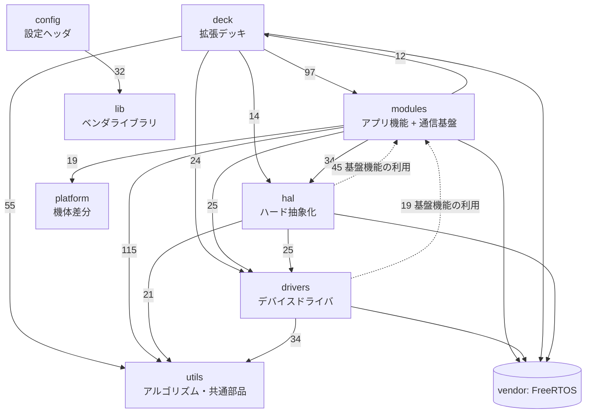
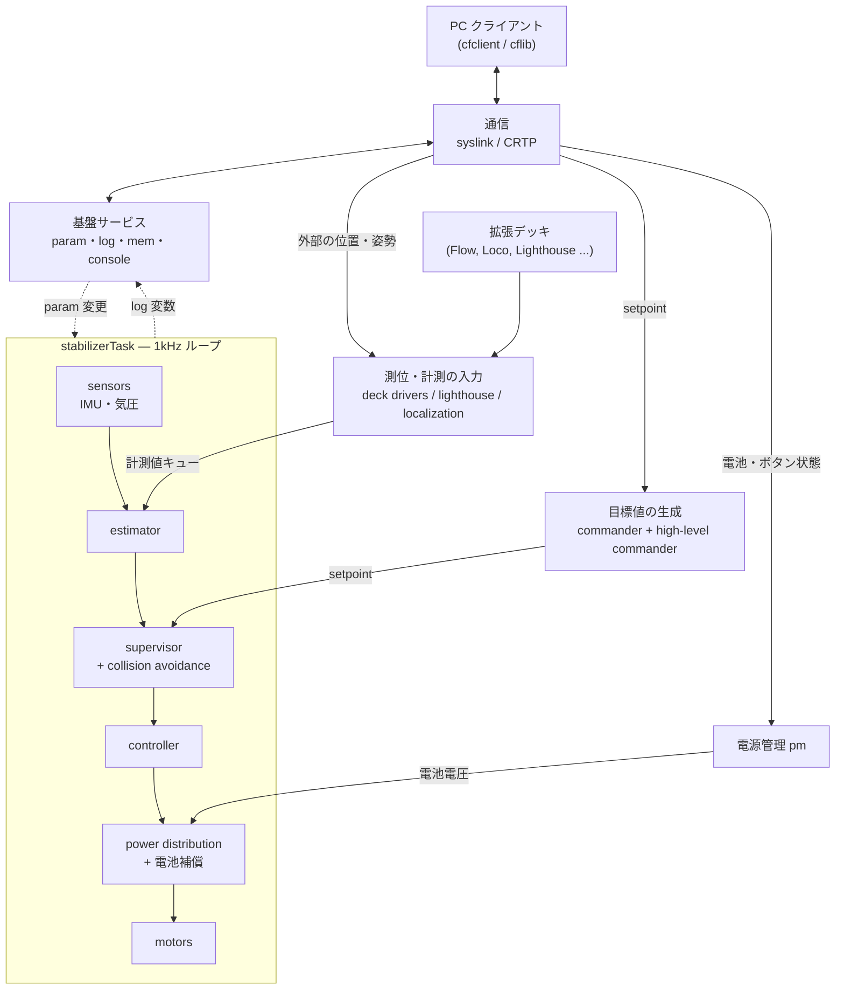
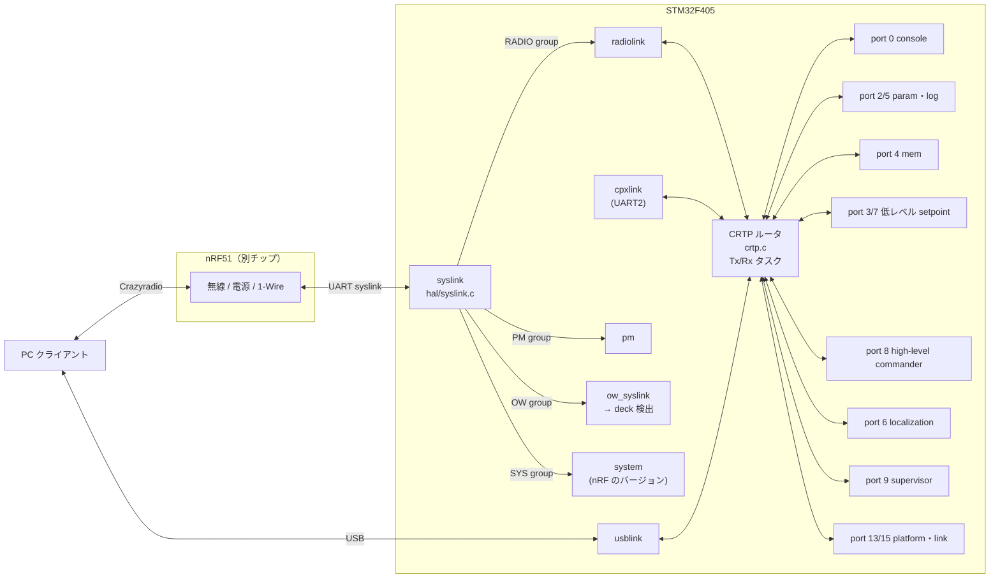
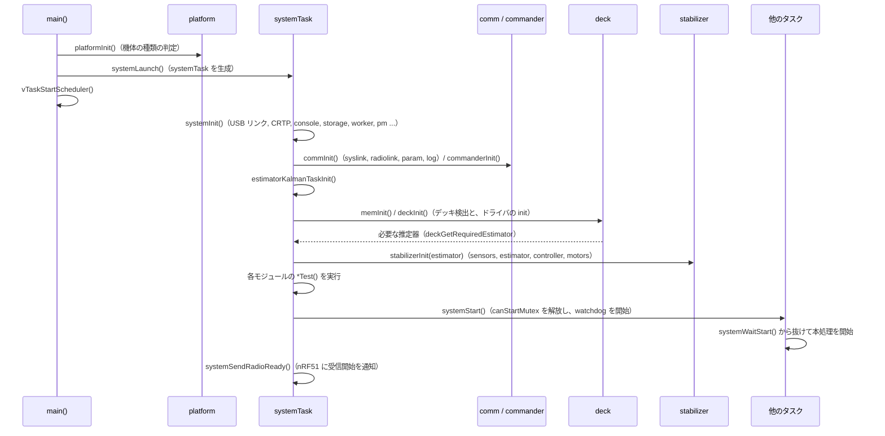

# アーキテクチャ概要

## 概要
crazyflie-firmware は STM32F405（Cortex-M4）上で FreeRTOS を動かす、ナノクアッドコプタ用のファームウェアである。
機能の中心は 1kHz で回る**スタビライザループ**（センサ → 状態推定 → 制御 → モータ）で、その周りに以下の機能が配置されている。

- **通信**: 無線・USB・CPX を経由した CRTP プロトコル
- **目標値の生成**: 低レベルコマンダとハイレベルコマンダ
- **デッキ**: 拡張ボードの自動検出とドライバ
- **基盤サービス**: param/log、メモリアクセス、永続ストレージ

cf2 では、無線と電源管理は別チップの **nRF51** が担当し、STM32 とは UART 上の独自プロトコル **syslink** でつながっている。

本書では、ディレクトリ構成（レイヤ）と、機能ブロック間の関係の全体像を示す。各ブロックの詳細は 01〜05 章に譲る。

## 構成ファイル（レイヤ）

`src/` 直下のディレクトリがおおむねレイヤに対応する。ファイル数は cf2 でビルドされるもの（`analysis/config/cf2/filelist.txt`）である。

| ディレクトリ | ファイル数 | 役割 | 代表的なファイル |
|---|---|---|---|
| `src/init` | 2 | リセットベクタと `main()` | `main.c`, `startup_stm32f40xx.S` |
| `src/platform` | 4 | 機体の種類ごとの差分（センサ構成、モータ配置、デバイス名）の吸収 | `platform_cf2.c` |
| `src/config` | （ヘッダのみ） | タスク優先度とスタックサイズ、FreeRTOS の設定 | `config.h`, `FreeRTOSConfig.h` |
| `src/lib` | 35 | ベンダ提供のライブラリ（STM32 StdPeriph, USB, FatFS, VL53L1, Segger RTT） | — |
| `src/drivers` | 39 | 周辺チップとペリフェラルのドライバ（IMU、気圧計、ToF、モータの PWM、UART、I2C、EEPROM） | `motors.c`, `i2cdev.c`, `uart_syslink.c`, `bosch/src/bmi088_*.c` |
| `src/hal` | 21 | ハード抽象化。センサの統合、syslink、無線/USB のリンク、電源管理、LED シーケンス、ストレージ | `sensors.c`, `syslink.c`, `radiolink.c`, `usblink.c`, `pm_stm32f4.c`, `storage.c` |
| `src/modules` | 91 | アプリ機能（スタビライザ、推定器、コントローラ、コマンダ、スーパーバイザ）と通信の基盤（CRTP, param, log, mem, console） | `system.c`, `stabilizer.c`, `crtp.c`, `commander.c` |
| `src/deck` | 48 | 拡張デッキの検出（backends）、共通 API（api）、各デッキのドライバ（drivers） | `core/deck.c`, `backends/*.c`, `drivers/src/*.c` |
| `src/utils` | 28 | アルゴリズム部品と共通ユーティリティ（PID、フィルタ、TDoA/Lighthouse の計算、KVE ストレージ、assert） | `pid.c`, `tdoa/tdoaEngine.c`, `kve/kve.c` |
| `vendor/` | — | 外部ライブラリ（FreeRTOS カーネル、CMSIS-DSP、libdw1000） | 設計対象外 |

> `src/modules` は名前に反して、アプリ機能だけでなく**システム全体で使う基盤機能**（`crtp`, `param`, `log`, `system`, `static_mem`, `worker`）も含んでいる。そのため下位レイヤ（hal/drivers）から modules への参照が多い（後述）。

## レイヤ間の依存関係

`#include` の関係を数えたもの（`python tools/include_deps.py --depth 1` の結果。数値はファイルとヘッダの組の数）。
矢印は「インクルードする側 → される側」を表す。10件未満の依存は省略した。

**下位から上位への依存（点線）の内訳**

| 方向 | 主に参照されているヘッダ | 性質 |
|---|---|---|
| hal → modules（45） | `static_mem.h`(10), `param.h`(7), `log.h`(5), `crtp.h`(5), `system.h`(5) | ほとんどが param/log の登録、静的メモリ確保、起動待ちなど、**基盤機能**の利用 |
| drivers → modules（19） | `static_mem.h`(5), `log.h`(4), `param.h`(3), `crtp.h`(2) | 同上 |
| modules → deck（12） | `deck.h`, `deck_core.h`, `aideck.h`, `usddeck.h` | `system.c` の `deckInit()`、`stabilizer.c` の uSD ロギングなど、**特定デッキとの直接連携** |

したがって、実際の構造は「modules = 最上位のアプリ層」ではなく、次のように読むのが実態に合う。

- **基盤サービス**（CRTP, param/log, system, static_mem, worker）: 全レイヤから使われる、横断的な層
- **アプリ機能**（stabilizer, estimator, controller, commander, supervisor ほか）: hal/drivers/deck の上に乗る層

## 機能ブロック図（全体）

全体を 2 枚の図に分けて示す。図 1 は機能ブロック間のデータの流れ、図 2 は外部との通信がどのように各機能へ振り分けられるかを表す。

### 図1: 機能ブロックとデータの流れ

太枠の 1kHz ループ（`stabilizerTask`）が中心で、上側の各ブロックがループに入力を供給する。

図は処理の段階を表しており、実装上の受け渡しを正確に描いたものではない。実際には次のように受け渡される。
- `estimator` から `controller` へは状態 `state` が直接渡される。`supervisor` は setpoint を書き換える（`supervisorOverrideSetpoint`）だけで、state には触れない。
- `sensors` の値は計測値キュー経由で `estimator` へ入るのに加え、`sensorData` として supervisor と controller にも直接渡される（`stabilizer.c:322`〜`356`）。

### 図2: 通信経路の振り分け

- CRTP ルータは、同時に**1 本のリンクだけ**を使う（`crtpSetLink()`）。既定は radiolink で、次の契機で切り替わる。
  - usblink へ: PC が USB のベンダ要求（`wIndex = 0x01`）で CRTP の使用を開始したとき（`usb.c:336`〜`338`）。USB をつないだだけでは切り替わらない。USB がリセットされるか、その他のコマンドを受けると radiolink に戻る（`usb.c:317`, `:357`）。
  - cpxlink へ: CPX で `CPX_ENABLE_CRTP_BRIDGE` を受信したとき。値が 0 なら radiolink に戻る（`cpx.c:135`〜`142`）。
- 受信したパケットは、ポートごとに登録されたキューまたはコールバックに振り分けられる（`crtp.c:178`〜`183`）。

根拠:
- スタビライザループの処理順序: `src/modules/src/stabilizer.c:317`〜`387`
- syslink のグループごとの振り分け: `src/hal/src/syslink.c:77`〜`98`
- CRTP のポート定義: `src/modules/interface/crtp.h:42`〜`52`
- ポートごとの受信登録（`crtpRegisterPortCB` / `crtpInitTaskQueue`）: `crtp_commander.c:47`〜`48`、`crtp_commander_high_level.c:473`、`log.c:241`、`param_task.c:78`、`crtp_mem.c:107`、`crtp_localization_service.c:171`、`crtp_supervisor.c:68`〜`71`、`platformservice.c:99`、`crtpservice.c:73`
- リンクの切り替え: `src/modules/src/crtp.c:243`、`src/hal/src/usb.c:317`〜`357`、`src/modules/src/cpx/cpx.c:138`〜`141`
- 推定器への計測値の入力元: `estimatorEnqueue*` の呼び出し元（下表）

### 推定器への計測値の入力元

推定器は、計測値キュー（`measurementsQueue`、`src/modules/src/estimator/estimator.c:24`）を通じて各所から計測値を受け取る。

| 入力元 | 計測値の種類 |
|---|---|
| `hal/src/sensors_bmi088_bmp3xx.c`（CF2.1 のオンボード IMU・気圧計） `hal/src/sensors_mpu9250_lps25h.c`（CF2.0） | ジャイロ、加速度、気圧 |
| `deck/drivers/src/flowdeck_v1v2.c` | オプティカルフロー |
| `modules/src/range.c` | ToF 距離 |
| `deck/drivers/src/lpsTwrTag.c`, `lpsTdoa2Tag.c`, `lpsTdoa3Tag.c`（Loco） | 距離（TWR）、TDoA、絶対高度 |
| `modules/src/lighthouse/lighthouse_position_est.c` | スイープ角、位置、ヨー誤差 |
| `modules/src/crtp_localization_service.c`（外部の MoCap など） | 位置、姿勢 |

### 目標値（setpoint）の入力元

`commander` は複数の入力元から優先度つきで setpoint を受け取り、スタビライザループが最新のものを取り出す（`stabilizer.c:338`）。
優先度の値が大きいほど優先される（`src/modules/interface/commander.h:35`〜`41`）。

| 入力元 | 呼び出し位置 | 優先度 |
|---|---|---|
| high-level commander（ループ内で軌道を評価） | `src/modules/src/stabilizer.c:336` | `COMMANDER_PRIORITY_HIGHLEVEL` = 1 |
| 低レベル commander（CRTP port 3/7） | `src/modules/src/crtp_commander.c:117`, `:122` | `COMMANDER_PRIORITY_CRTP` = 2 |
| 外部の受信機（`extrx`、CPPM など） | `src/modules/src/extrx.c:264` | `COMMANDER_PRIORITY_EXTRX` = 3 |

つまり、PC から低レベルの setpoint を 1 回でも送ると、ハイレベルコマンダの軌道より優先される。ハイレベルコマンダに戻すには `commanderRelaxPriority()` が必要である（`crtp_commander.c:102`、`crtp_commander_high_level.c:367` のコメント）。

## 起動の流れ（概要）

詳細は `01_runtime/startup.md` に書く。ここでは、全体構成の理解に必要な骨格だけを示す。

根拠: `src/init/main.c:47`〜`62`、`src/modules/src/system.c:106`〜`153`（`systemInit`）、`:168`〜`339`（`systemTask`）、`:343`〜`360`（`systemStart` / `systemWaitStart`）

ポイント:
- **全タスクは `systemWaitStart()` で待機**し、`systemTask` の自己テストが通ると一斉に動き出す（`canStartMutex` による一斉スタート）。
- 自己テストが失敗すると `system.selftestPassed` param が 0 のまま停止する。PC から param で 1 を書き込むと、強制的に起動できる（`system.c:314`）。
- **デッキの検出結果が推定器の選択に影響する**（`deckGetRequiredEstimator()` → `stabilizerInit(estimator)`、`system.c:209`〜`210`）。

## 拡張と切り替えの仕組み

このファームウェアでは、機能の差し替えが 2 種類の方法で実装されている。どちらも**静的解析（Doxygen の呼び出しグラフ）では追えない**ので、ここで一覧にしておく。

### 1. 関数ポインタのテーブル（実行時の切り替え）

| 対象 | テーブル | 選択方法 | 根拠 |
|---|---|---|---|
| センサ実装 | `sensorImplementations[]` | 機体の設定（`platformConfigGetSensorImplementation()`） | `src/hal/src/sensors.c:74`, `:156` |
| 状態推定器 | `estimatorFunctions[]`（None / Complementary / Kalman / UKF / OutOfTree） | param の `stabilizer.estimator` またはデッキの要求 | `src/modules/src/estimator/estimator.c:61`〜`98`, `:166` |
| コントローラ | `controllerFunctions[]`（PID / Mellinger / INDI / Brescianini / Lee / OutOfTree） | param の `stabilizer.controller` | `src/modules/src/controller/controller.c:26`〜`34`, `:84` |
| CRTP のリンク | `struct crtpLinkOperations`（radiolink / usblink / cpxlink） | PC からの USB ベンダ要求、CPX のブリッジ有効化メッセージ | `src/modules/src/crtp.c:243`, `src/hal/src/usb.c:317`〜`357`, `src/modules/src/cpx/cpx.c:138`〜`141` |
| 機体の種類 | `platform_cf2.c` の設定テーブル（CF20 / CF21）。CF2.1+ の差分（プロペラの推力モデル）は Kconfig の `CONFIG_CRAZYFLIE_21_PLUS` で `platform_defaults_cf2.h:56`〜`95` の定数として吸収される | 起動時に MCU の OTP 領域から機種の文字列を読み、`deviceType` が一致する項目を採用する。テーブルの項目そのものは `CONFIG_SENSORS_*` によってビルド時に取捨される | `src/platform/src/platform_cf2.c:37`〜`54`, `src/platform/src/platform.c:72`〜`94`, `platform_stm32f4.c:42` |

推定器とコントローラは、ループの先頭で `updateStateEstimatorAndControllerTypes()` によって param の変化を検出し、**飛行中でも切り替わる**（`stabilizer.c:229`〜`239`）。

### 2. リンカセクションへの自動登録（ビルド時の登録）

マクロで定義した構造体を専用のリンカセクションに配置し、起動時にセクションの先頭から末尾までを走査する。
ファイルを Kbuild に追加するだけで機能が組み込まれ、中央の登録処理を変更する必要がない。

| セクション | 登録マクロ | 走査する側 | 根拠 |
|---|---|---|---|
| `.param` | `PARAM_GROUP_START` / `PARAM_ADD*` | param サブシステム | `tools/make/F405/linker/sections_FLASH.ld:51`〜`54` |
| `.log` | `LOG_GROUP_START` / `LOG_ADD*` | log サブシステム | `sections_FLASH.ld:57`〜`60` |
| `.deckDriver` | `DECK_DRIVER()` | deck core | `sections_FLASH.ld:63`〜`66`, `src/deck/core/deck_drivers.c:42`〜`55` |
| `.eventtrigger` | `EVENTTRIGGER()` | eventtrigger | `sections_FLASH.ld:75`〜`78` |

## 外部とのインタフェース

| 相手 | 物理的な経路 | 論理プロトコル | STM32 側の窓口 |
|---|---|---|---|
| PC（Crazyradio 経由） | 2.4GHz 無線 → nRF51 → UART | CRTP over syslink | `hal/src/syslink.c` → `radiolink.c` |
| PC（USB） | STM32 の USB OTG FS | CRTP | `hal/src/usblink.c` |
| nRF51（電源、ボタン、1-Wire） | UART（syslink） | syslink の PM / OW / SYS グループ | `pm_stm32f4.c`, `ow_syslink.c`, `system.c` |
| 拡張デッキ（検出） | 1-Wire（nRF51 経由）/ I2C1（DeckCtrl） | デッキのメモリフォーマット | `deck/backends/deck_backend_onewire.c`, `deck_backend_deckctrl.c` |
| 拡張デッキ（データ） | SPI / I2C / UART / GPIO / アナログ | デッキごとに異なる | `deck/api/*.c` |
| AI デッキなど（ESP32 / GAP8） | UART2 | CPX | `modules/src/cpx/` |
| モータ | TIM の PWM 出力 | ブラシモータの PWM（cf2） | `drivers/src/motors.c` |

## 公式ドキュメントとの差異
- `docs/functional-areas/sensor-to-control/index.md` では、コントローラは 3 種類（PID, INDI, Mellinger）、推定器は 2 種類（Complementary, Kalman）とされている。
  しかしソースでは、コントローラに **Brescianini と Lee** が加わって 5 種類ある（`controller.c:28`〜`32`）。推定器にも **Error State UKF** が加わって 3 種類ある（`estimator.c:85`〜`89`。ただし `CONFIG_ESTIMATOR_UKF_ENABLE` は cf2 の既定では無効）。

## 未解決事項
- `platformInit()` で機種の文字列がどのテーブル項目にも一致しないと、`main()` は無限ループで停止する（`main.c:52`〜`56`）。OTP に書かれる文字列のフォーマットは未確認。**（推測）** `platformParseDeviceTypeString()` が先頭の `"0;"` を検査しているので、`"0;CF21;..."` のような形式と考えられる（`platform.c:48`〜`68`）（→ `01_runtime/startup.md`）。
- リンクが切り替わる前に、切り替え前のリンクで送信待ちだったパケットがどう扱われるかは未確認（→ `02_dataflow/communication.md`）。
