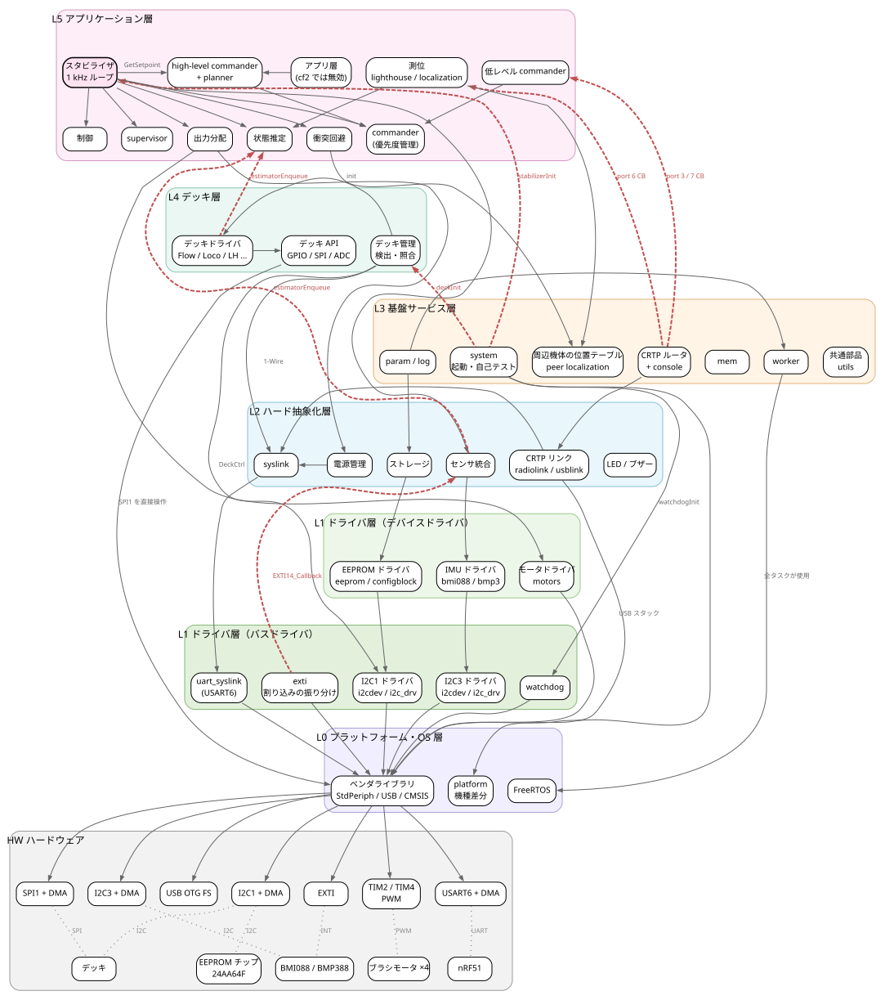
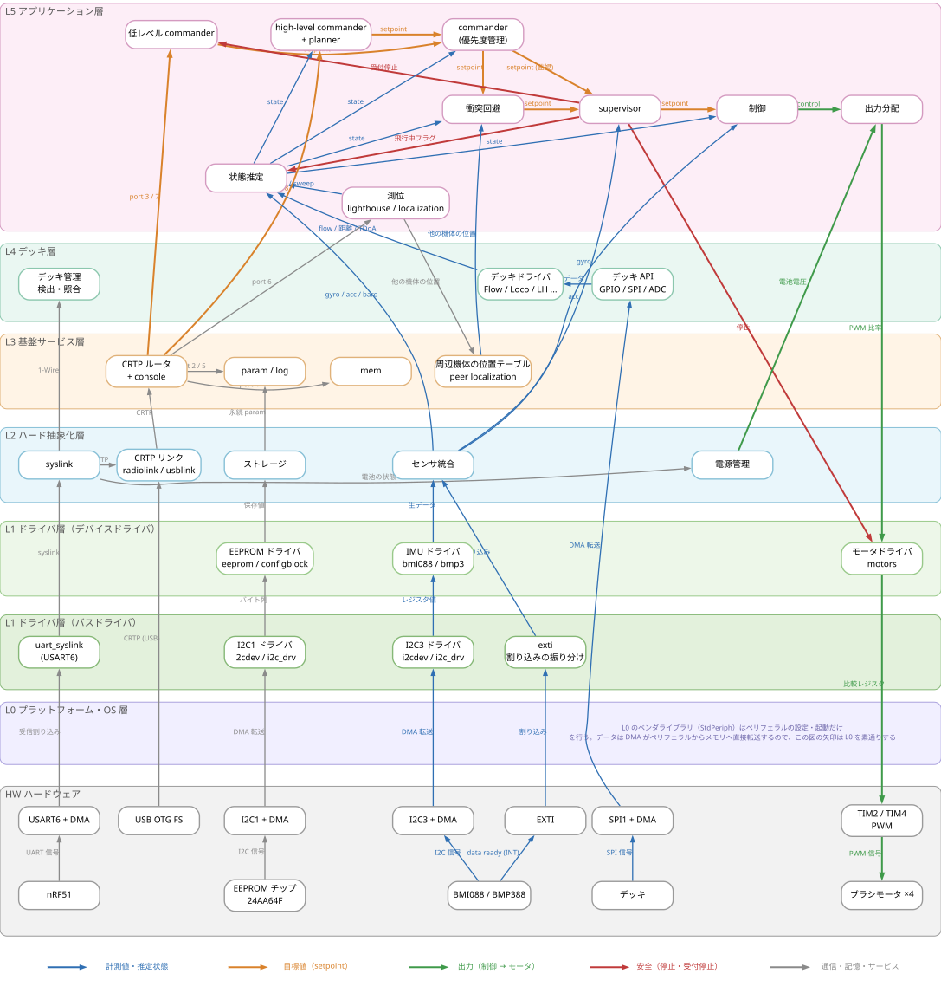
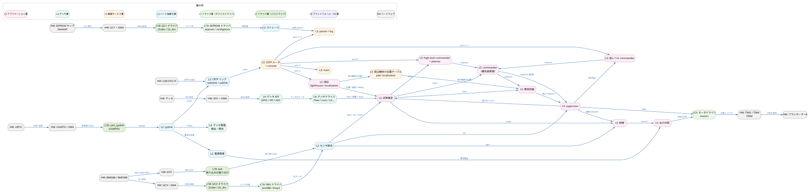
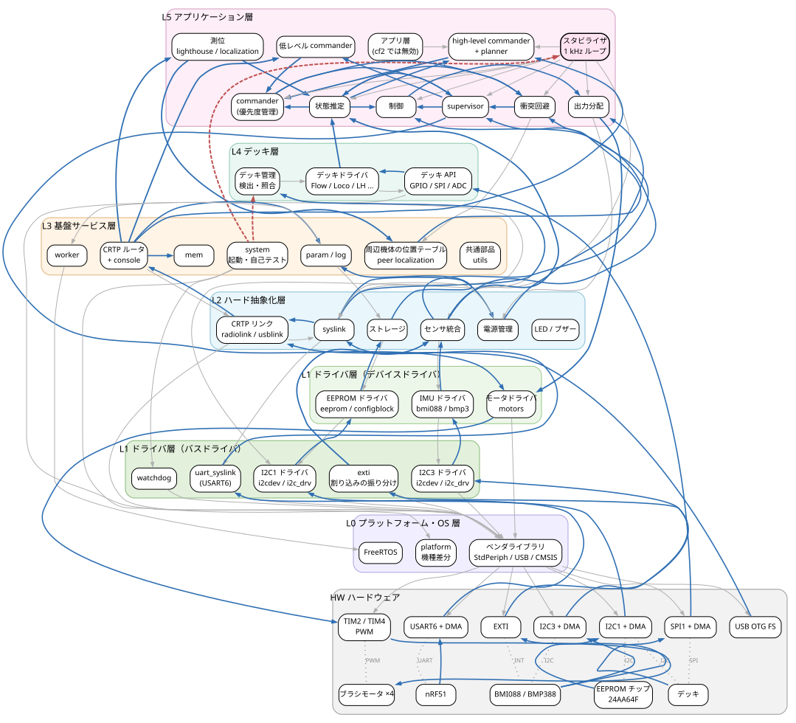
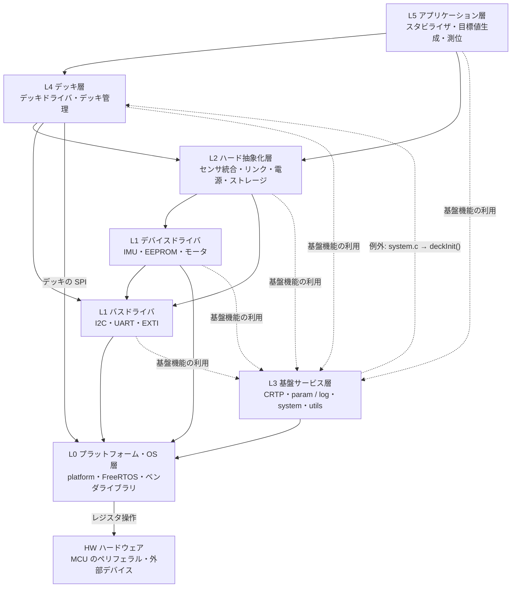

# 階層構造

ディレクトリ構成ではなく、実際の依存関係（`#include` の集計と呼び出し関係）にもとづいて、cf2 のファームウェアを 6 つのソフトウェアの層（L0〜L5）に整理し、その下にハードウェア（HW）を置いたもの。L1 はデバイスドライバとバスドライバの 2 段に分けている。
依存の集計の根拠は [architecture.md](architecture.md) の「レイヤ間の依存関係」を参照。

## 階層図

```
crazyflie-firmware（cf2）
│
├─ L5 アプリケーション層 ─── 飛行機能そのもの
│   ├─ スタビライザ（1 kHz 制御ループ）      stabilizer.c
│   │   ├─ 状態推定                          estimator/, kalman_core/
│   │   ├─ 安全監視                          supervisor*.c
│   │   ├─ 衝突回避                          collision_avoidance.c
│   │   ├─ 制御                              controller/
│   │   └─ 出力分配                          power_distribution_quadrotor.c
│   ├─ 目標値生成
│   │   ├─ commander（優先度管理）           commander.c
│   │   ├─ 低レベル commander                crtp_commander*.c
│   │   └─ high-level commander / planner    crtp_commander_high_level.c, planner.c
│   ├─ 測位                                  lighthouse/, crtp_localization_service.c
│   └─ アプリ層（外部のアプリ、cf2 では無効）  app_handler.c
│
├─ L4 デッキ層 ─── 拡張ボード
│   ├─ デッキドライバ（Flow, Loco, Lighthouse ...）  deck/drivers/
│   ├─ デッキ管理（検出・照合・競合の検査）         deck/core/, deck/backends/
│   └─ デッキ用の周辺機能の API（GPIO, SPI ...）    deck/api/
│
├─ L3 基盤サービス層 ─── 全層から使われる共通機能
│   ├─ 通信: CRTP ルータ, console, link / platform サービス   crtp.c, console.c ...
│   ├─ param / log / mem                                      param_*.c, log.c, mem.c
│   ├─ 周辺機体の位置テーブル（最大 10 機）                    peer_localization.c
│   ├─ システム: 起動・自己テスト・一斉スタート, worker        system.c, worker.c
│   └─ 共通部品: static_mem, PID, フィルタ, KVE, TDoA / Lighthouse の計算   utils/
│
├─ L2 ハード抽象化層（HAL）─── デバイスを機能として見せる
│   ├─ センサ統合（IMU・気圧計）       sensors*.c
│   ├─ 通信リンク: syslink, radiolink, usblink   syslink.c, radiolink.c, usblink.c
│   ├─ 電源管理                         pm_stm32f4.c
│   ├─ 永続ストレージ                   storage.c
│   └─ LED シーケンス, ブザー            ledseq.c, buzzer.c
│
├─ L1 ドライバ層
│   ├─ デバイスドライバ ─── 1 つのチップのレジスタの意味を解釈する
│   │   ├─ IMU・気圧計: BMI088, BMP388          drivers/bosch/src/bmi088_*.c, bmp3.c
│   │   ├─ EEPROM, 設定ブロック                  drivers/src/eeprom.c, utils/src/configblockeeprom.c
│   │   ├─ モータ（PWM の比率 → 比較レジスタ）   drivers/src/motors.c
│   │   └─ その他のチップ: VL53L1x, PMW3901 ...   drivers/src/
│   └─ バスドライバ ─── バスの上でバイト列を運ぶ
│       ├─ I2C: 汎用 API と転送（排他・DMA・割り込み）   drivers/src/i2cdev.c, i2c_drv.c（I2C3 / I2C1 の 2 系統）
│       ├─ UART: syslink 用, デッキ用                     drivers/src/uart_syslink.c, uart1.c, uart2.c
│       └─ 外部割り込みの振り分け, ウォッチドッグ         drivers/src/exti.c, watchdog.c
│
├─ L0 プラットフォーム・OS 層
│   ├─ 起動と機種差分        init/, platform/, config/
│   ├─ RTOS                  vendor/FreeRTOS
│   └─ ベンダライブラリ      lib/（STM32 StdPeriph, USB, FatFS）, vendor/CMSIS
│
└─ HW ハードウェア
    ├─ MCU 内のペリフェラル: USART6, USB OTG FS, I2C1, I2C3, SPI1, EXTI, TIM2 / TIM4, DMA
    └─ MCU 外のデバイス:     nRF51, EEPROM（24AA64F）, BMI088 / BMP388, デッキ, ブラシモータ
```

パスは `crazyflie-firmware/src/` からの相対パス（`vendor/` はリポジトリのルート直下）。

- **I2C のバスドライバは、バスごとに別のブロックとして描く**。コードは共通（`i2cdev.c` / `i2c_drv.c`）だが、I2C3（センサ）と I2C1（EEPROM・デッキ）は別のバスで、データも混ざらない。
- **デッキの SPI は L1 を経由しない**。デッキ用の SPI（`deck/api/deck_spi.c`）は L4 のデッキ API が SPI1 を直接操作している。
- **ペリフェラルと HAL の間でデータを運ぶのは DMA**。L0 のベンダライブラリ（StdPeriph）は、ペリフェラルの設定と転送の起動だけを行う。

## ブロック図（要素と関係）

同じ要素について、関係の見方を変えた 4 枚の図を用意した。目的に応じて使い分ける。

| 図 | 答えられる問い | 矢印の意味 |
|---|---|---|
| 図 A: 呼び出し・依存 | 「このモジュールは何を使っているか」「どこが層の原則に反しているか」 | 誰が誰の関数を呼ぶか |
| 図 B: データフロー（層の配置） | 「データがどの層を通って流れるか」 | どのデータがどこへ渡るか（流れの種類で色分け） |
| 図 B-2: データフロー（流れの向き） | 「ここを変えたら何に影響するか」 | 同上。左から右へたどる |
| 図 C: 重ね合わせ | 両方を 1 枚で俯瞰する | A と B の両方 |

**注意**: 図 A だけを見ると、出力を持たない要素があるように見える。たとえば「衝突回避」は、スタビライザから呼ばれて setpoint をポインタ経由で書き換えるだけなので、呼び出しの矢印は入ってくるだけである。しかし、書き換えた setpoint は supervisor を経て制御、モータへと渡るので、アルゴリズムを変えると機体の動きに影響する。影響の範囲は図 B で確認する。

### 図 A: 呼び出し・依存



| 線 | 意味 |
|---|---|
| 灰色の実線 | 呼び出し・依存（上位 → 下位、または同じ層） |
| 赤い点線 | 層の原則に反する呼び出し（下位 → 上位）: `system` からの初期化、デッキドライバとセンサから推定器への計測値の投入、CRTP のコールバック |

### 図 B: データフロー

層の上下の配置を保ったまま、データの受け渡しだけを描いた。入力は左側を HW から上へ、判断は L5 の中を左から右へ、出力は右側を上から HW へ下る（U 字形）。データを受け渡さないブロック（スタビライザのループ本体、worker など）は省いた。L0 はデータの経路に入らない（DMA が直接転送する）ので、帯だけを描いている。

入出力ごとの縦の経路（HW → バスドライバ → デバイスドライバ → HAL）:

| 入出力 | HW（MCU 外） | HW（MCU 内） | バスドライバ | デバイスドライバ | L2 以上 |
|---|---|---|---|---|---|
| IMU のデータ | BMI088 / BMP388 | I2C3 + DMA | I2C3 ドライバ | IMU ドライバ | センサ統合 |
| IMU の割り込み | BMI088（INT） | EXTI | exti | — | センサ統合 |
| EEPROM | 24AA64F | I2C1 + DMA | I2C1 ドライバ | EEPROM ドライバ | ストレージ |
| nRF51 | nRF51 | USART6 + DMA | uart_syslink | — | syslink |
| USB | （PC） | USB OTG FS | （USB スタック: L0） | — | CRTP リンク |
| デッキ（SPI） | デッキ | SPI1 + DMA | — | — | デッキ API（L4） |
| モータ | ブラシモータ | TIM2 / TIM4 | — | モータドライバ | 出力分配 |



| 線の色 | 流れ |
|---|---|
| 青 | 計測値・推定状態（センサ・デッキ・測位 → 状態推定 → 判断） |
| 橙（太線） | 目標値（通信 → commander → 衝突回避 → supervisor → 制御） |
| 緑（太線） | 出力（制御 → 出力分配 → モータ、電池電圧 → 出力分配） |
| 赤（太線） | 安全（supervisor によるモータの停止、受付停止、飛行中フラグ） |
| 灰 | 通信・記憶・サービス |

### 図 B-2: データフロー（流れの向きに並べた版）

層の配置をやめ、データの流れの向き（左 → 右）に並べたもの。各ブロックの色と「L5:」などの接頭辞が層を表す。ある機能を変えたときの影響の範囲を、左から右へたどるのに向く。



主な流れ:
- **制御の流れ**: センサ統合 → 状態推定 → commander / 衝突回避 → supervisor → 制御 → 出力分配 → モータ
- **setpoint の流れ**: CRTP → 低レベル / high-level commander → commander → supervisor（監視）→ 衝突回避（修正）→ supervisor（上書き）→ 制御
- **他の機体の位置**: CRTP port 6 → 測位 → 周辺機体の位置テーブル → 衝突回避
- **安全の流れ**: supervisor → モータ（停止）、supervisor → 低レベル commander（受付停止）

### 図 C: 重ね合わせ



| 線 | 意味 |
|---|---|
| 灰色の細線 | 呼び出しだけ（データは渡らない、または呼び出し元が結果を使わない） |
| 青の実線 | データの受け渡し（呼び出しと同じ向きのものは 1 本にまとめた）。ラベルは図 B を参照 |
| 赤い点線 | 層の原則に反する呼び出し |

線が多いため、細部は図 A・B で確認することを勧める。

### 図の生成
- 4 枚とも `python tools/gen_layer_diagrams.py` で生成する。図 B は、ブロックの位置をスクリプトの `POS_DATAFLOW` で座標指定し（Graphviz の `neato`）、層の帯を SVG に後から書き足している。ブロックを足したときは座標も足す。要素と関係の定義はスクリプトの中にあり、データフローの各矢印には根拠のソースの位置をコメントで付けている。`.dot` と `.svg` は生成物なので直接編集しない。
- Mermaid では「層の配置を上から下に保ったまま、矢印だけを上向きにする」ことができないため、これらの図は Graphviz で描いている。
- 矢印は主な関係だけに絞っている。param / log による設定値の読み書き（ほぼ全モジュールが対象）は省略した。全ての依存の集計は [architecture.md](architecture.md) を参照。

## 層の間の関係（概要）



実線は通常の依存（上位 → 下位）、点線は横断的な依存と例外を表す。L2 からバスドライバへの直接の依存は、syslink → uart_syslink や、センサ統合が IMU ドライバ用に定義したバスアダプタ（`bmi088_burst_read` → `i2cdevReadReg8`）である。

## 読み方の注意
- **ディレクトリと層は一致しない。** `src/modules/` には L5（スタビライザなど）と L3（CRTP、param、log など）が混在している。
- **L3 は横断的な層である。** L1 や L2 から L3 への参照（例: ドライバが param / log を登録する、`static_mem` でタスクを確保する）は多数あるが、設計上の逸脱ではなく、基盤機能の利用である（hal → modules 45 件、drivers → modules 19 件の大半）。
- **厳密な階層ではない箇所がある。**
  - L5 のスタビライザが、L4 の特定のデッキ（micro-SD のログ）を直接呼ぶ（`src/modules/src/stabilizer.c:373`〜`380`）。
  - L3 の `system.c` が、L4 の `deckInit()` を呼び、その結果（必要な推定器）を L5 の初期化に渡す（`src/modules/src/system.c:207`〜`210`）。
- **実行時の切り替えは、層をまたぐ依存を静的に見えなくしている。**
  - 関数ポインタ: センサ実装、推定器、コントローラ、CRTP のリンク
  - リンカセクションへの登録: デッキドライバ、検出バックエンド、param / log、eventtrigger
  - 詳細は [architecture.md](architecture.md) の「拡張と切り替えの仕組み」。

## 関連文書
- 機能の一覧: [function_list.md](function_list.md)
- ディレクトリ構成と依存の集計: [architecture.md](architecture.md)
- 外部との関係: [system_context.md](system_context.md)
