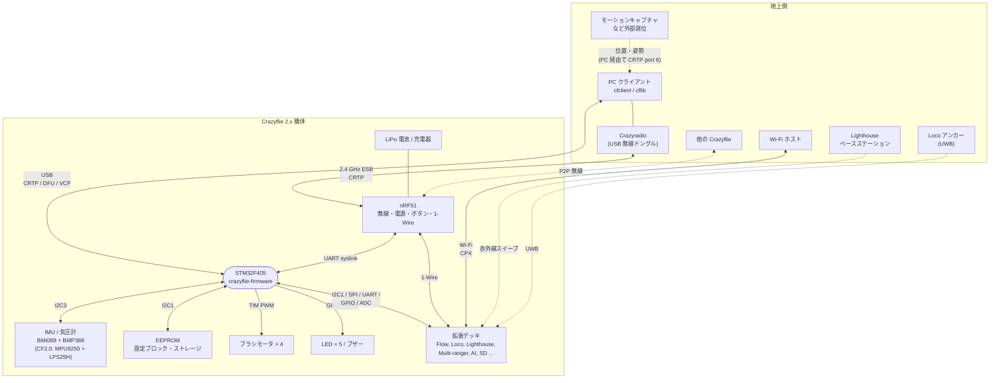

# システムコンテキスト

## 概要
本書は、STM32 上のファームウェア（crazyflie-firmware）を 1 つの箱とみなし、その外側にある機器・ソフトウェアとのやり取りを整理する。
機体の中でも、nRF51（無線・電源管理用の別チップ）と拡張デッキは、このファームウェアから見れば「外部」である。

内部の構成は [architecture.md](architecture.md) を参照。

## コンテキスト図

## 外部アクタとインタフェース

| アクタ | 役割 | 経路 | プロトコル | 主な窓口（ファームウェア側） |
|---|---|---|---|---|
| PC クライアント（cfclient / cflib） | 操縦、param / log、ファームウェア更新、軌道のアップロード | Crazyradio → nRF51 → UART、または USB | CRTP | `hal/src/radiolink.c`, `usblink.c`, `modules/src/crtp.c` |
| Crazyradio | PC 側の無線ドングル | 2.4 GHz（Nordic ESB） | CRTP（ACK ペイロードで下り） | nRF51 のファームウェア（別リポジトリ） |
| nRF51 | 無線、電源スイッチとボタン、充電・電池電圧、1-Wire マスタ | USART6 | syslink | `hal/src/syslink.c`, `pm_stm32f4.c`, `ow_syslink.c` |
| IMU・気圧計 | 加速度・角速度・気圧 | I2C3（400 kHz） | デバイス固有 | `hal/src/sensors_bmi088_bmp3xx.c`, `drivers/bosch/` |
| EEPROM | 無線設定などの設定ブロック、param の永続化 | I2C1 | デバイス固有 | `drivers/src/eeprom.c`, `utils/src/configblockeeprom.c`, `hal/src/storage.c` |
| モータ | 推力 | TIM の PWM | — | `drivers/src/motors.c` |
| LED・ブザー | 状態表示 | GPIO / PWM | — | `drivers/src/led.c`, `hal/src/ledseq.c`, `hal/src/buzzer.c` |
| 拡張デッキ | センサ・測位・カメラ・記録などの拡張 | 検出: 1-Wire（nRF51 経由）/ DeckCtrl（I2C1）。データ: SPI / I2C1 / UART1・2 / GPIO / ADC | デッキごと | `deck/` |
| Wi-Fi ホスト | AI デッキ経由のカメラ画像・CRTP | Wi-Fi → ESP32 → UART2 | CPX | `modules/src/cpx/` |
| 外部測位（MoCap など） | 位置・姿勢の供給 | PC → CRTP port 6 | CRTP localization | `modules/src/crtp_localization_service.c` |
| Lighthouse ベースステーション | 赤外線スイープによる測位 | Lighthouse デッキ（FPGA → UART1） | — | `deck/drivers/src/lighthouse.c`, `modules/src/lighthouse/` |
| Loco アンカー | UWB による測位 | Loco デッキ（DW1000、SPI） | TWR / TDoA2 / TDoA3 | `deck/drivers/src/locodeck.c`, `lps*Tag.c` |
| 他の Crazyflie | 機体間通信 | nRF51 の P2P | P2P | `hal/src/radiolink.c`（`p2pRegisterCB`） |

根拠: 各行の窓口のファイル。I2C の速度は `src/drivers/src/i2c_drv.c:60`〜`63`、センサのバスは `sensors_bmi088_bmp3xx.c:193`、syslink は [../02_dataflow/communication.md](../02_dataflow/communication.md)。

## 利用シナリオ別のデータの流れ

| シナリオ | 入力 | 機体内の流れ | 出力 |
|---|---|---|---|
| 手動操縦 | PC のジョイスティック → CRTP port 3 / 7 | commander → スタビライザ | モータ |
| 自律飛行（high-level） | PC からの軌道（port 4）とコマンド（port 8） | planner → commander → スタビライザ | モータ |
| 測位（Flow） | 床面の画像と距離 | Flow デッキ → 計測値キュー → Kalman | 推定位置 |
| 測位（Lighthouse / Loco） | ベースステーション / アンカーの信号 | デッキ → 計測値キュー → Kalman | 推定位置 |
| 測位（MoCap） | 外部カメラの測位結果 → PC → port 6 | localization → 計測値キュー → Kalman | 推定位置 |
| テレメトリ | PC からの log の設定（port 5） | ソフトウェアタイマ → worker → CRTP | log のデータ |
| 設定変更 | param の読み書き（port 2） | param → 各モジュールの変数（必要なら EEPROM に永続化） | — |
| ファームウェア更新 | PC → Crazyradio / USB | ブートローダ（nRF51 経由、または USB DFU） | — |

詳細は [../02_dataflow/](../02_dataflow/) の各章を参照。

## 範囲外
- nRF51 のファームウェア（crazyflie2-nrf-firmware）
- 機体側のブートローダ（crazyflie2-stm-bootloader、nRF51 のブートローダ）
- PC 側のソフトウェア（cfclient / cflib）
- AI デッキ（ESP32 / GAP8）のファームウェア

## 未解決事項
- CF2.1 のオンボードのセンサが BMI088 + BMP388 である点は、ドライバの名前（`sensors_bmi088_bmp3xx`）からの判断で、回路図では確認していない。
- CF2.1+（`CONFIG_CRAZYFLIE_21_PLUS=y`）のファームウェア上の差分は、プロペラの推力モデルの定数だけであることを確認した（→ [../03_functions/power_distribution.md](../03_functions/power_distribution.md)）。その他のハードウェア上の差分は未確認。
