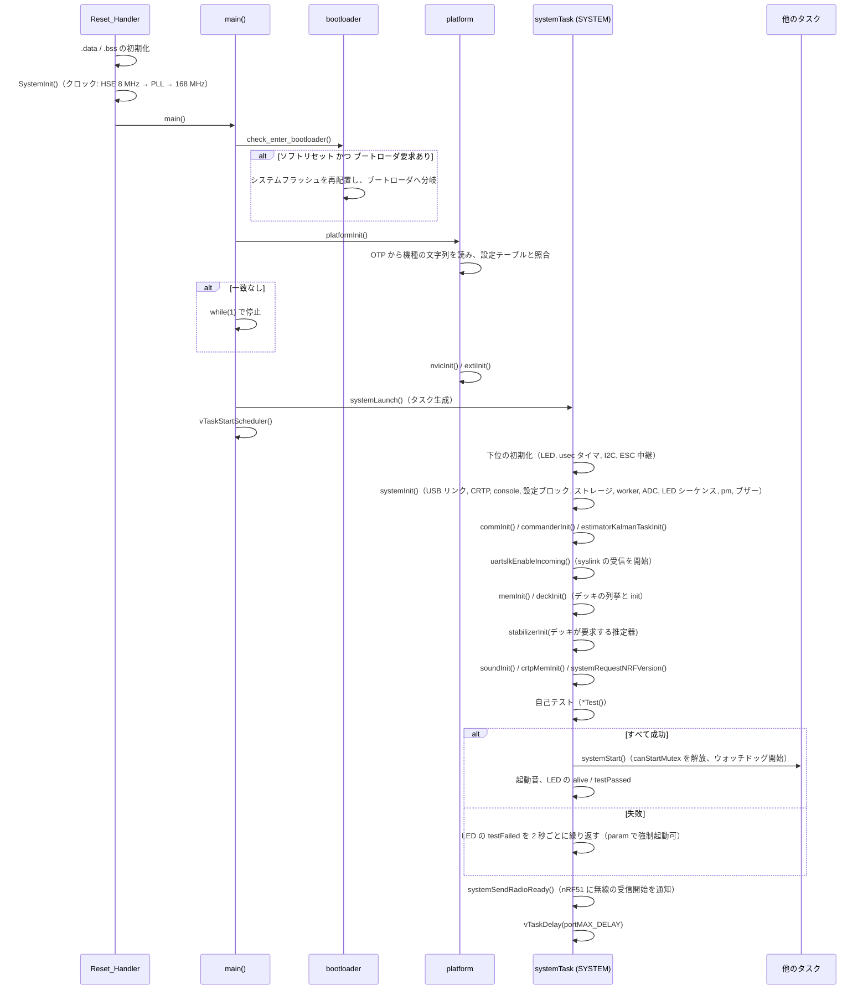
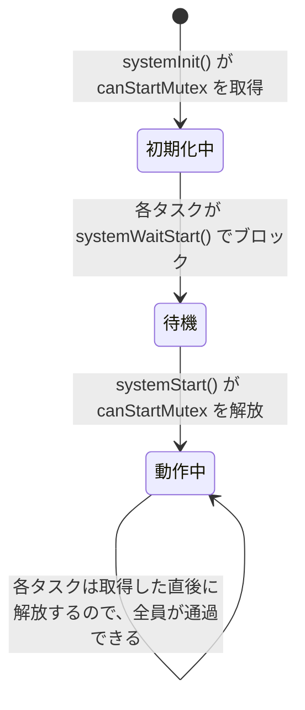

# 起動シーケンス

## 概要
リセットから飛行可能になるまでの流れは、次の 5 段階に分けられる。

| 段階 | 実行者 | 主な処理 |
|---|---|---|
| 1. リセット | `Reset_Handler`（アセンブリ） | データ・BSS の初期化、`SystemInit()`（クロック）、`main()` の呼び出し |
| 2. `main()` | スケジューラ起動前 | ブートローダへの分岐の判定、機種の判定、NVIC / EXTI の初期化、`systemTask` の生成、スケジューラの開始 |
| 3. `systemTask` の初期化 | `SYSTEM` タスク | 各モジュールの `*Init()`（通信、コマンダ、推定器、デッキ、スタビライザ） |
| 4. 自己テスト | `SYSTEM` タスク | 各モジュールの `*Test()`。すべて成功したら `systemStart()` |
| 5. 一斉スタート | 全タスク | `systemWaitStart()` で待っていたタスクが動き出す。スタビライザはセンサの較正を待ってからループを開始する |

## 構成ファイル
| ファイル | 役割 |
|---|---|
| `src/init/startup_stm32f40xx.S` | リセットベクタ、`Reset_Handler` |
| `src/init/main.c` | `main()` |
| `src/modules/src/bootloader.c` | ソフトウェアリセット後のブートローダへの分岐 |
| `src/platform/src/platform.c`, `platform_cf2.c`, `platform_stm32f4.c` | 機種の判定とハードウェアの初期化 |
| `src/modules/src/system.c` | `systemTask`、自己テスト、一斉スタート、アイドルフック |
| `src/drivers/src/watchdog.c` | 独立ウォッチドッグ（IWDG） |

## 全体の流れ

根拠: `src/init/startup_stm32f40xx.S:88`〜`152`、`src/init/main.c:47`〜`62`、`src/modules/src/system.c:168`〜`339`

## 段階ごとの詳細

### 1〜2. リセットから `main()` まで

**ブートローダへの分岐**（`src/modules/src/bootloader.c:65`〜`84`）
- USB の DFU 要求（[../02_dataflow/communication.md](../02_dataflow/communication.md) の USB リンク）などで `enter_bootloader()` が呼ばれると、RAM 上の決まった位置に「ブートローダに入る」という状態を書いて、ソフトウェアリセットする。
- 次の起動の `main()` の先頭で `check_enter_bootloader()` がその状態を読む。**キーが一致し、かつ直前のリセットがソフトウェアリセット**なら、システムフラッシュ（STM32 の内蔵ブートローダ）に分岐する。状態は読んだ直後に無効化されるので、次のリセットでは通常起動に戻る。

**機種の判定**（`src/platform/src/platform.c:33`〜`94`）
- `platformGetDeviceTypeString()` で MCU の OTP 領域から機種の文字列を読み、`platform_cf2.c` の設定テーブル（CF20 / CF21）の `deviceType` と照合する（`platform_stm32f4.c:42`〜`53`）。
- 一致しなければ `main()` は `while(1)` で停止する（`main.c:52`〜`56`）。**別の機種用のファームウェアを書き込んでも、モータなどを誤って駆動しない**ための保護である。
- `DEVICE_TYPE_STRING_FORCE` を定義すると、OTP を読まずに機種を固定できる（`platform.c:73`〜`84`）。

**ハードウェアの初期化**（`platform_cf2.c` の `platformInitHardware()`）
- 割り込みコントローラ（`nvicInit()`）と外部割り込み（`extiInit()`）だけを初期化する。その他の周辺機能は、各モジュールの `*Init()` の中で初期化される。

### 3. `systemTask` の初期化

初期化の順序には、次の依存関係がある。

| 順序 | 処理 | 理由・依存 |
|---|---|---|
| 最初 | `ledInit()`、充電 LED の点灯 | 起動中であることを示す |
| 早期 | `usecTimerInit()`、`i2cdevInit(I2C3)` / `(I2C1)` | センサ（I2C3）とデッキ・EEPROM（I2C1）の前提 |
| `systemInit()` の最初 | `canStartMutex` を取得 | **一斉スタートの準備**。後で `systemStart()` が解放する（`system.c:111`〜`112`） |
| `systemInit()` の早期 | `usblinkInit()`、`debugInit()`、`crtpInit()`、`consoleInit()` | `DEBUG_PRINT` を早くから使えるようにするため（`system.c:120` のコメント） |
| `systemInit()` | `configblockInit()` → `storageInit()` | 設定ブロック（EEPROM）と永続ストレージ。無線の設定などを読む |
| `commInit()` | syslink、radiolink、CRTP のサービス、log、param、localization | param / log のテーブルはリンカセクションから構築される |
| `estimatorKalmanTaskInit()` | `KALMAN` タスク | デッキの初期化より前 |
| `uartslkEnableIncoming()` | syslink の受信を開始 | **デッキの 1-Wire 読み出しに nRF51 との通信が必要**なので、`deckInit()` より前に有効にする（`system.c:203`〜`205`） |
| `memInit()` → `deckInit()` | メモリサブシステム、デッキの列挙とドライバの `init` | デッキが必要とする推定器が決まる |
| `stabilizerInit(estimator)` | センサ、推定器、コントローラ、出力分配、モータ、`STABILIZER` タスク | デッキの結果を使う（`system.c:209`〜`210`） |
| デッキの結果による設定 | 低干渉の無線モード | デッキが要求し、かつアンテナが近い機体なら設定（`system.c:211`〜`214`） |

根拠: `system.c:168`〜`222`, `:106`〜`153`

**デッキの列挙**（`src/deck/core/deck.c:44`〜`70`, `src/deck/core/deck_info.c:69`〜`173`）
1. `deckDriverCount()`: リンカセクション `.deckDriver` にあるドライバの数を数える。
2. `deckInfoInit()` → `enumerateDecks()`: 検出バックエンド（1-Wire、DeckCtrl）を順に初期化し、`getNextDeck()` で見つかったデッキの情報（VID / PID など）を集める。
3. 各デッキについて、VID / PID が一致するドライバを探し、`driver->init()` を呼ぶ。デッキのタスクはここで生成される。
4. ドライバが要求する推定器を登録する。**複数のデッキが異なる推定器を要求するとエラー**（`deck_info.c:243`〜`267`）。

詳細は `04_interfaces/deck_api.md`。

### 4. 自己テスト

次の `*Test()` の結果の AND が自己テストの結果になる（`system.c:224`〜`292`）。

| テスト | 内容（主なもの） |
|---|---|
| `systemTest()` | LED シーケンス、pm、worker、ブザーの初期化済み確認 |
| `configblockTest()` | 設定ブロックの読み出し |
| `storageTest()` | 永続ストレージ |
| `commTest()` | radiolink、CRTP、サービス、console、param |
| `commanderTest()` | 初期化済み確認 |
| `stabilizerTest()` | センサ、推定器、コントローラ、出力分配、モータ、衝突回避 |
| `estimatorKalmanTaskTest()` | Kalman タスクの初期化済み確認 |
| `deckTest()` | 各デッキのドライバの `test()` |
| `soundTest()`, `memTest()`, `crtpMemTest()` | 初期化済み確認 |
| `watchdogNormalStartTest()` | 直前のリセットが**ウォッチドッグによるものなら警告** |
| `cfAssertNormalStartTest()` | 直前のリセットが**ASSERT によるものなら警告** |
| `peerLocalizationTest()` | 初期化済み確認 |

**失敗したとき**（`system.c:304`〜`327`）:
- `systemTest()` 自体は成功している場合: LED で失敗を示しながら 2 秒ごとにループする。PC から param `system.selftestPassed` に 1 を書くと、強制的に `systemStart()` する（`:314`〜`319`）。
- `systemTest()` も失敗している場合: SYS LED を点灯したまま、何もしない。
- どちらの場合も、`systemSendRadioReady()` は呼ばれない。その場合、**（コメントによれば）** nRF51 はタイムアウト後に無線を有効にするので、デバッグのための接続はできる（`system.c:330`〜`335`）。

### 5. 一斉スタート

- `systemWaitStart()` は、まず `systemInit()` が終わるまで 2 tick ごとにポーリングし、その後 `canStartMutex` を取得して即座に解放する（`system.c:351`〜`360`）。
- `systemStart()` は `canStartMutex` を解放し、`CONFIG_DEBUG` でなければ**ウォッチドッグを開始**する（`system.c:343`〜`349`）。

**スタビライザの開始**（`src/modules/src/stabilizer.c:289`〜`316`）
1. `systemWaitStart()` を抜けた後、`sensorsAreCalibrated()` が真になるまで 1 ms ごとに待つ。較正は、**ジャイロのバイアスが求まること**（静止中に 512 サンプルの分散がしきい値以下になること）である（`sensors_bmi088_bmp3xx.c:83`〜`89`, `:287`〜`289`, `:316`）。つまり**機体を静止させないと制御ループが始まらない**。
2. `RATE_SUPERVISOR` タスクを生成し、ESC をリセットし、最初の IMU の割り込みに同期してからループに入る。

## ウォッチドッグとアサート

| 仕組み | 動作 | 根拠 |
|---|---|---|
| 独立ウォッチドッグ（IWDG） | LSI クロック、プリスケーラ 32、リロード値 188。タイムアウトは約 100 ms（LSI のばらつきで最長約 353 ms） | `src/drivers/src/watchdog.c:51`〜`72` |
| ウォッチドッグのリセット | **アイドルフック**で 80 ms ごとにリセットする。つまり、どのタスクかが CPU を占有してアイドルタスクが 100 ms 以上動けないと、リセットされる | `system.c:412`〜`422`, `src/drivers/interface/watchdog.h:33` |
| 省電力 | アイドルフックで `WFI` 命令を実行（デバッグビルド以外） | `system.c:429`〜`433` |
| アサート | `ASSERT` の失敗時の情報を保持し、次回起動時に `cfAssertNormalStartTest()` で報告する。param `system.assertInfo` でログに出力できる | `system.c:285`〜`288`, `:424`〜`427`, `:482` |
| ループの監視 | `RATE_SUPERVISOR` が、スタビライザが 2 秒間止まったら `ASSERT` する | [tasks.md](tasks.md) |

## 設定・パラメータ

| 種別 | 名前 | 説明 |
|---|---|---|
| param | `system.selftestPassed` | 自己テストの結果（読み取り専用だが、失敗時に 1 を書くと強制起動）（`system.c:477`） |
| param | `system.assertInfo` | 0 以外でアサート情報をダンプ |
| param | `system.doAssert` | 0 以外で意図的にアサート（デバッグ用） |
| param | `cpu.flash`, `cpu.id0`〜`id2` | フラッシュ容量と MCU の固有 ID（読み取り専用） |
| Kconfig | `CONFIG_DEBUG` | 有効ならウォッチドッグを開始しない |

## 公式ドキュメントとの差異
- `docs/development/systemtask.md` は `systemTask()` でタスクを初期化する手順だけを示しており、デッキの列挙が推定器の選択に影響する点や、センサ較正の完了までスタビライザが待つ点は書かれていない。

## 未解決事項
- 自己テストに失敗したときに動いているタスクの全体整理は未実施。確認済みなのは次の点である。`CRTP-RX`（`crtp.c:170`〜`200`）と `PARAM`（`param_task.c:76`〜`120`）は `systemWaitStart()` を呼ばないので、失敗中でも param の書き込みは届く。一方、`STABILIZER`、`SENSORS`、`KALMAN`、`PWRMGNT` やデッキのタスクの多くは `systemWaitStart()` で止まったままになる。
- ブートローダ状態の RAM 上の位置（`BL_STATE_PTR`）と、リセットで消えない理由（リンカスクリプトの `NOINIT` 領域と推測）は未確認。
- `deckInit()` が長くかかる理由（`system.c:204` のコメント）の詳細は未確認。
