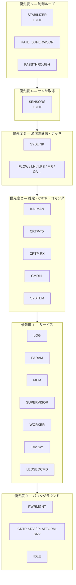
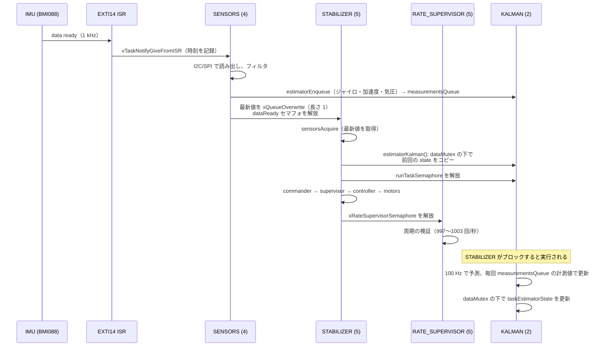
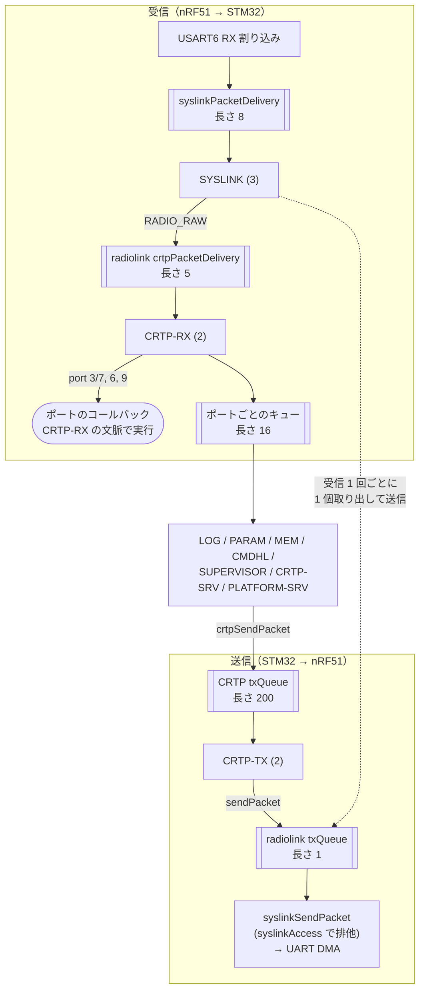
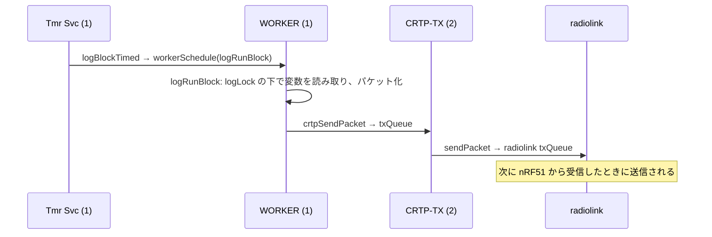

# FreeRTOS タスクとタスク間通信

## 概要
ファームウェアは FreeRTOS の上で、約 20 個の常駐タスクと、接続されたデッキに応じて追加されるタスクで動く。
タスク間の受け渡しには、キュー、セマフォ、タスク通知、ソフトウェアタイマ、worker キューが使われる。

設計上の要点は次の 4 つである。

1. **制御ループは IMU の割り込みで駆動される。** IMU の data-ready 割り込み → `SENSORS` タスク → `STABILIZER` タスクと、1kHz でリレーされる。タイマによる周期起動ではない。
2. **重い処理は優先度の低いタスクに逃がす。** Kalman フィルタは `STABILIZER`（優先度 5）とは別の `KALMAN` タスク（優先度 2）で計算される。スタビライザは、前回計算された状態をコピーするだけで処理を返す。
3. **CRTP の受信は、ポートごとのキューかコールバックに振り分けられる。** setpoint のように遅延させたくないものは、`CRTP-RX` タスクの文脈で直接コールバックが呼ばれる。param や log のように時間がかかるものは、専用タスクがキューから取り出して処理する。
4. **無線の送信は受信に同期する。** nRF51 からパケットを 1 つ受信するたびに、送信待ちのパケットを 1 つだけ返す。したがって、下り（PC への送信）の帯域は上り（PC からの受信）の頻度で決まる。

## FreeRTOS の設定

| 項目 | 値 | 根拠 |
|---|---|---|
| tick 周波数 | 1000 Hz（1 tick = 1 ms） | `src/config/FreeRTOSConfig.h:77`〜`78` |
| プリエンプション | 有効 | `FreeRTOSConfig.h:73` |
| 優先度の数 | 6（0〜5、5 が最高） | `FreeRTOSConfig.h:93` |
| 最小スタック（`configMINIMAL_STACK_SIZE`） | 150 ワード（600 バイト） | `src/config/config.h:55` |
| ヒープ | 30000 バイト。ただしタスクの多くは `STATIC_MEM_*` マクロで静的に確保される | `config.h:53`, `FreeRTOSConfig.h:159` |
| タイマサービスタスク | 有効。優先度 1、スタック 600 ワード | `FreeRTOSConfig.h:87`〜`91` |
| アイドルフック | 有効。ウォッチドッグのリセットと `WFI` による省電力 | `FreeRTOSConfig.h:74`, `src/modules/src/system.c:412`〜`434` |
| スタックオーバーフロー検査 | 方式 1 | `FreeRTOSConfig.h:85` |

タスクの優先度・スタックサイズ・名前は `src/config/config.h:64`〜`218` に集約して定義されている。
ただし一部のデッキドライバ（bcCam など）は、ドライバのソース内で独自に定義している。

## タスク一覧（cf2）

スタックはワード数（1 ワード = 4 バイト）。「待ち受け」は、タスクがループの中でブロックして待つ対象である。

### 常駐タスク（デッキに関係なく常に存在する）

| タスク名 | 関数 | 優先度 | スタック | 生成箇所 | 待ち受け・周期 |
|---|---|---|---|---|---|
| `STABILIZER` | `stabilizerTask` | 5 | 450 | `src/modules/src/stabilizer.c:189` | `sensorsWaitDataReady()`（IMU のデータ準備完了）。**1 kHz** |
| `RATE_SUPERVISOR` | `rateSupervisorTask` | 5 | 150 | `stabilizer.c:311`（`STABILIZER` が起動後に生成） | `xRateSupervisorSemaphore`（ループ 1 周ごとに解放される）。2 秒来なければ `ASSERT` |
| `PASSTHROUGH` | `passthroughTask` | 5 | 300 | `src/modules/src/vcp_esc_passthrough.c:77` | タスク通知（USB 仮想 COM ポート経由の ESC 設定の中継） |
| `SENSORS` | `sensorsTask` | 4 | 300 | `src/hal/src/sensors_bmi088_bmp3xx.c:565`（CF2.1）/ `sensors_mpu9250_lps25h.c:498`（CF2.0） | IMU の割り込み（EXTI14）からのタスク通知。**1 kHz** |
| `SYSLINK` | `syslinkTask` | 3 | 300 | `src/hal/src/syslink.c:118` | `syslinkPacketDelivery` キュー（USART6 の割り込みが投入） |
| `SYSTEM` | `systemTask` | 2 | 300 | `src/modules/src/system.c:102`（`main` から生成） | 初期化と自己テストを終えると `vTaskDelay(portMAX_DELAY)` で永久に停止 |
| `CRTP-TX` | `crtpTxTask` | 2 | 150 | `src/modules/src/crtp.c:94` | CRTP の `txQueue`（長さ 200） |
| `CRTP-RX` | `crtpRxTask` | 2 | 300 | `crtp.c:95` | 現在のリンクの `receivePacket()`（radiolink では最大 100 ms 待つ） |
| `KALMAN` | `kalmanTask` | 2 | 450 | `src/modules/src/estimator/estimator_kalman.c:207` | `runTaskSemaphore`（Kalman が選択されていれば、スタビライザから 1 kHz で解放される）。予測ステップは **100 Hz** |
| `CMDHL` | `crtpCommanderHighLevelTask` | 2 | 300 | `src/modules/src/crtp_commander_high_level.c:312` | CRTP port 8 のキュー |
| `LOG` | `logTask` | 1 | 300 | `src/modules/src/log.c:229` | CRTP port 5 のキュー |
| `PARAM` | `paramTask` | 1 | 300 | `src/modules/src/param_task.c:66` | CRTP port 2 のキュー |
| `MEM` | `memTask` | 1 | 300 | `src/modules/src/crtp_mem.c:93` | CRTP port 4 のキュー |
| `SUPERVISOR` | `supervisorTask` | 1 | 300 | `src/modules/src/crtp_supervisor.c:72` | CRTP port 9 のキュー。情報要求だけを処理する。コマンドは同じポートに登録されたコールバックが `CRTP-RX` の文脈で処理する（`crtp_supervisor.c:68`〜`82`） |
| `WORKER` | `workerTask` | 1 | 300 | `src/modules/src/worker.c:59` | `workerQueue`（長さ 5） |
| `LEDSEQCMD` | `lesdeqCmdTask` | 1 | 150 | `src/hal/src/ledseq.c:245` | `ledseqCmdQueue`（長さ 10） |
| `Tmr Svc` | （FreeRTOS 内部） | 1 | 600 | FreeRTOS カーネル | ソフトウェアタイマのコールバックを実行する（後述） |
| `PWRMGNT` | `pmTask` | 0 | 150 | `src/hal/src/pm_stm32f4.c:132` | `vTaskDelay(100)`。**10 Hz** |
| `CRTP-SRV` | `crtpSrvTask` | 0 | 150 | `src/modules/src/crtpservice.c:59` | CRTP port 15（link）のキュー |
| `PLATFORM-SRV` | `platformSrvTask` | 0 | 150 | `src/modules/src/platformservice.c:85` | CRTP port 13（platform）のキュー |
| `IDLE` | （FreeRTOS 内部） | 0 | — | FreeRTOS カーネル | アイドルフックでウォッチドッグのリセット（`system.c:412`） |

補足:
- `KALMAN` タスクは、`CONFIG_ESTIMATOR_KALMAN_ENABLE=y`（cf2 の既定）なら、選択されている推定器に関係なく生成される（`system.c:195`〜`197`）。ただし `runTaskSemaphore` を解放する `estimatorKalman()` は Kalman が選択されているときしか呼ばれないので、Complementary の選択中は待機したままになる。
- `SENSORS` タスクの実体は、センサ実装のテーブル（`src/hal/src/sensors.c:74`）から実行時に 1 つだけ選ばれる。

### デッキ接続時に生成されるタスク

デッキドライバの `.init` が呼ばれたときに生成される。`.init` はデッキが検出されたときだけ、関数ポインタ経由で呼ばれる（→ `04_interfaces/deck_api.md`）。

| デッキ | タスク名 | 関数 | 優先度 | スタック | 生成箇所 | 待ち受け・周期 |
|---|---|---|---|---|---|---|
| Flow v1/v2 | `FLOW` | `flowdeckTask` | 3 | 300 | `src/deck/drivers/src/flowdeck_v1v2.c:178`, `:224` | `vTaskDelay(10)`。**100 Hz** |
| Lighthouse | `LH` | `lighthouseCoreTask` | 3 | 300 | `src/deck/drivers/src/lighthouse.c:63` | UART1 で受信するデッキ（FPGA）のフレーム |
| Loco | `LPS` | `uwbTask` | 3 | 450 | `src/deck/drivers/src/locodeck.c:626` | DW1000 の割り込み（EXTI5/11）からのタスク通知、またはアルゴリズムが指定するタイムアウト |
| Multi-ranger | `MR` | `mrTask` | 3 | 300 | `src/deck/drivers/src/multiranger.c:172` | 100 ms 周期 |
| OA | `OA` | `oaTask` | 3 | 300 | `src/deck/drivers/src/oa.c:110` | 50 ms 周期 |
| Active marker | `ACTIVEMARKER-DECK` | `task` | 3 | 150 | `src/deck/drivers/src/activeMarkerDeck.c:103` | `vTaskDelay` による可変周期 |
| Z-ranger | `ZRANGER` | `zRangerTask` | 2 | 300 | `src/deck/drivers/src/zranger.c:68` | センサの測定時間（timing budget）の周期 |
| Z-ranger v2 | `ZRANGER2` | `zRanger2Task` | 2 | 300 | `src/deck/drivers/src/zranger2.c:100` | 25 ms 周期 |
| bcCam | `bcCamUart` | `bcCamUartTask` | 2 | 600 | `src/deck/drivers/src/bccam_uart_service.c:1182` | `request_queue` のポーリングと、タスク通知（10 ms のタイムアウト） |
| micro-SD | `USDLOG` | `usdLogTask` | 1 | 300 | `src/deck/drivers/src/usddeck.c:468` | 設定されたログ周波数で周期実行 |
| micro-SD | `USDWRITE` | `usdWriteTask` | 0 | 450 | `usddeck.c:722`（`USDLOG` タスクが生成） | バッファのミューテックス。ファイルへの書き込み |
| Color LED（上 / 下） | `COLORLED-DECK`（インスタンスごと） | `task` | 1 | 150 | `src/deck/drivers/src/color_led_deck.c:240` | 周期実行 |
| AI deck | `CPX` | `cpx` | 1 | 150 | `src/modules/src/cpx/cpx.c:166` | CPX の内部ルータ（受信待ち） |
| AI deck | `ROUTER FROM UART2`, `ROUTER FROM INTERNAL` | `router_from_uart`, `router_from_internal` | 1 | 150 | `src/modules/src/cpx/cpx_external_router.c:132`〜`133` | UART2 側 / 内部側からの CPX パケット |
| AI deck | `AI-DECK ESP RX`, `AI-DECK ESP TX` | `CPX_UART_RX`, `CPX_UART_TX` | 1 | 150 | `src/modules/src/cpx/cpx_uart_transport.c:280`〜`282` | UART2 のストリームバッファ / `uartTxQueue` とイベントグループ |

AI deck の CPX 関連タスクは、すべて `aideckInit()` から生成される（`aideck.c:381` の `.init`）。

### cf2 ではビルドされるが生成されないタスク

| タスク | 生成箇所 | 生成されない理由 |
|---|---|---|
| `EXTRX` | `src/modules/src/extrx.c:139` | `extRxInit()` を呼ぶ側（CPPM デッキ）が cf2 ではビルドされない |
| `PCA9685` | `src/drivers/src/pca9685.c:197` | `pca9685startAsyncTask()` の呼び出し元が cf2 のビルドに存在しない |
| `DTR_P2P` | `src/modules/src/p2pDTR/DTR_handlers.c:48` | アプリ層から `dtrEnableProtocol()` を呼んだときだけ生成される。cf2 ではアプリ層が無効（`CONFIG_APP_ENABLE` が未設定） |
| `PROXIMITY` | `src/hal/src/proximity.c:179` | `PROXIMITY_ENABLED` がどこでも定義されていない（`src/hal/interface/proximity.h:36` でコメントアウト） |
| `RADIOTEST`, `spinMotors` | `src/deck/drivers/src/test/radiotest.c:118`〜`120` | テスト用デッキ（VID/PID = 0）。`CONFIG_DECK_FORCE` で強制しない限り検出されない |

> 注: Doxygen の呼び出しグラフには `systemTask` → `proximityInit` の呼び出しが現れるが、実際には `#ifdef PROXIMITY_ENABLED` で無効になっている（`system.c:218`）。Doxygen の解析結果は、`#ifdef` を確認してから採用する必要がある。

## 優先度の構成

常駐タスクを優先度の順に並べたもの。上ほど優先される。

読み取れる設計意図（**（推測）** を含む）:
- 制御ループ（5）とセンサ取得（4）が最優先で、通信（3、2）はその隙間で動く。**（推測）** 通信が詰まっても姿勢制御が乱れないようにするためと考えられる。
- `SYSLINK`（3）が `CRTP-RX`（2）より高いのは、UART の受信キュー（長さ 8）があふれないよう、nRF51 からのパケットを速やかに引き取るためと考えられる **（推測）**。
- `KALMAN`（2）は `STABILIZER`（5）より低い。Kalman の計算が 1 ms に収まらなくても、スタビライザループの周期は守られる。そのぶん、スタビライザが使う状態は最新の計算結果より遅れることがある（下記「制御周期の同期」）。

## 制御周期の同期（1 kHz）

IMU の割り込みから、スタビライザと Kalman が動くまでの受け渡し。

根拠:
- 割り込みからタスクへの通知: `src/drivers/src/exti.c:181` → `src/hal/src/sensors.c:226`（`EXTI14_Callback`）→ `sensors_bmi088_bmp3xx.c:994`〜`998`
- センサタスクの出力: `sensors_bmi088_bmp3xx.c:334`〜`375`（`estimatorEnqueue`、`xQueueOverwrite`、`xSemaphoreGive(dataReady)`）
- スタビライザ側: `stabilizer.c:319`〜`322`, `:329`, `:386`
- Kalman の受け渡し: `estimator_kalman.c:225`, `:244`〜`249`, `:261`, `:281`〜`283`, `:289`〜`299`
- 周期の監視: `stabilizer.c:263`〜`283`, `:309`

ポイント:
- **状態の二重化**: Kalman タスクは内部の `coreData` で計算し、結果を `taskEstimatorState` に書き出す。スタビライザは `dataMutex` を短時間だけ取り、それをコピーする。Kalman の計算中にスタビライザが長く待たされることはない。
- **周期の監視**: `RATE_SUPERVISOR` はループの周期が 1 秒あたり 997〜1003 回に収まっているかを検証し、外れると警告する。2 秒間ループが回らなければ `ASSERT` で停止させる。センサがサスペンド中の場合は除く（`stabilizer.c:276`〜`280`）。
- **気圧計**は IMU と同じタスクで、間引いて 50 Hz で読まれる（`sensors_bmi088_bmp3xx.c:63`〜`65`）。

## 通信のタスク連携

CRTP パケットの受信と送信に関わるタスクとキュー（radiolink を使う場合）。

根拠:
- 受信: `src/drivers/src/uart_syslink.c:445`（ISR → キュー）、`syslink.c:67`〜`75`、`src/hal/src/radiolink.c:167`〜`183`、`crtp.c:170`〜`200`
- 送信: `crtp.c:143`〜`168`、`radiolink.c:234`〜`251`（`txQueue` に最大 100 ms 待って投入）、`radiolink.c:178`〜`183`（受信時に 1 個取り出して送信）、`syslink.c:143`〜`165`（`syslinkAccess` で排他）
- キューの長さ: `crtp.c:73`〜`74`、`radiolink.c:48`〜`49`、`uart_syslink.c:64`

ポイント:
- **送信は受信に同期する**: nRF51 が PC から無線パケットを受けて STM32 に渡すと、`SYSLINK` タスクがその場で `txQueue`（長さ 1）から 1 個取り出して返送する（`radiolink.c:178`〜`183`）。**（推測）** Crazyradio の ACK ペイロードで下りのデータを返す方式に対応していると考えられる。そのため、PC がポーリングを止めると、下りの送信も止まる。
- **送信の詰まり方**: radiolink の `txQueue` が埋まっていると、`radiolinkSendCRTPPacket()` は最大 100 ms 待って失敗する。`CRTP-TX` は失敗すると 10 ms 待って再試行するので、未送信のパケットは CRTP の `txQueue`（長さ 200）に溜まる。
- **コールバックは `CRTP-RX` の文脈で実行される**: setpoint（port 3/7）はコールバックで処理される（`crtp_commander.c:47`〜`48`）。キューを経由しないぶん遅延が小さいが、コールバックが遅いと受信全体が止まる。
- **受信キューへの投入はブロックする**: ポートのキューが満杯だと、`CRTP-RX` は空くまで待つ（`crtp.c:182`〜`183`「should never drop a packet」）。たとえば `PARAM` タスクが詰まると、setpoint の受信も止まる **（推測: 設計上のリスク）**。
- USB（usblink）の場合は、`usblink` の `crtpPacketDelivery`（長さ 16）と `usb.c` の `usbDataTx`（長さ 8）が radiolink のキューの代わりになる。送信が受信に同期する制約はない。

## ソフトウェアタイマと worker

周期的な処理の一部は、専用のタスクではなく FreeRTOS のソフトウェアタイマで実装されている。
タイマのコールバックは `Tmr Svc` タスク（優先度 1）で動くため、重い処理は `WORKER` タスクに委譲される。

| タイマ | 周期 | コールバックの処理 | 根拠 |
|---|---|---|---|
| `logTimer`（ログブロックごと、最大 16 個） | ログブロックごとに設定 | `workerSchedule(logRunBlock)` で `WORKER` に委譲 | `log.c:377`, `:544` |
| `ledseqTimer`（LED ごと） | シーケンスに依存 | LED シーケンスを進める | `ledseq.c:239` |
| `SoundTimer` | 10 ms | ブザーの音の生成 | `src/modules/src/sound_cf2.c:352` |
| `sysLoadMonitorTimer` | 1 s | CPU 負荷の統計 | `src/modules/src/sysload.c:61` |
| `syslinkTimer` | 1 s | syslink のデバッグ統計 | `syslink.c:120` |
| `queueMonitorTimer` | — | キューの監視（`CONFIG_DEBUG_QUEUE_MONITOR` のときだけ） | `src/modules/src/queuemonitor.c:73` |
| デッキのタイマ（`ringTimer`, `ledTimer`, `usdTimer`） | 50 ms / 200 ms / — | LED リング、Lighthouse の LED、SD カード | `ledring12.c:1121`, `lighthouse.c:67`, `usddeck.c:825` |

`WORKER` タスクを使う処理（`workerSchedule()` の呼び出し元）:

| 呼び出し元 | 委譲される処理 |
|---|---|
| `log.c:518`, `:544` | ログブロックの値の収集と送信（`logRunBlock`） |
| `pm_stm32f4.c:291` | 電源 OFF 前の終了処理（`pmGracefulShutdown`） |
| `lighthouse_storage.c:95`, `crtp_localization_service.c:314` | Lighthouse の較正データの永続化 |
| `platformservice.c:170` | ユーザへの通知（LED・音） |
| `ledring12.c:1086` | LED リングの更新 |
| `deckctrl_dfu_memory.c:163`, `:167` | DeckCtrl の DFU の有効化 |

### ログ送信の流れ

**（推測）** log の変数は `STABILIZER` などが書き込み、`WORKER` が非同期に読み出す。変数ごとの排他はしていないので、1 つのログブロックの中の値が、同じ制御周期のものである保証はない。

## 主な同期オブジェクト

cf2 のビルドに含まれるキュー、セマフォ、イベントグループのうち、機能間の受け渡しに使われる主なもの。
全件は、`analysis/config/cf2/filelist.txt` のファイル（`src/lib` を除く）を `STATIC_MEM_QUEUE_ALLOC|xQueueCreate|xSemaphoreCreate|vSemaphoreCreateBinary|xEventGroupCreate|xTimerCreate` で検索すると抽出できる。

### キュー

| キュー | 長さ × 要素 | 書き込み側 → 読み出し側 | 根拠 |
|---|---|---|---|
| `measurementsQueue` | 20 × `measurement_t` | センサ、デッキ、Lighthouse、localization → 推定器（Kalman） | `src/modules/src/estimator/estimator.c:25` |
| `setpointQueue` / `priorityQueue` | 1 × `setpoint_t` / 1 × `int` | 各コマンダ → `STABILIZER`（上書き・peek で、最新値だけを保持） | `src/modules/src/commander.c:52`〜`54`, `:84`〜`102` |
| `accelerometerDataQueue` ほか 4 本 | 1 × 各データ | `SENSORS` → `STABILIZER`（上書き） | `sensors_bmi088_bmp3xx.c:110`〜`116` |
| CRTP `txQueue` | 200 × `CRTPPacket` | 各サービス → `CRTP-TX` | `crtp.c:91` |
| CRTP `queues[port]` | 16 × `CRTPPacket` | `CRTP-RX` → 各ポートのタスク | `crtp.c:109` |
| radiolink `crtpPacketDelivery` / `txQueue` | 5 / 1 | `SYSLINK` ↔ `CRTP-RX` / `CRTP-TX` | `radiolink.c:55`〜`58` |
| `syslinkPacketDelivery` | 8 × `SyslinkPacket` | USART6 ISR → `SYSLINK` | `uart_syslink.c:64` |
| usblink `crtpPacketDelivery` / `usbDataTx` | 16 / 8 | USB ISR ↔ `CRTP-RX` / `CRTP-TX` | `usblink.c:48`, `usb.c:67` |
| `workerQueue` | 5 × `worker_work` | 各所 → `WORKER` | `worker.c:46` |
| `ledseqCmdQueue` | 10 | 各所 → `LEDSEQCMD` | `ledseq.c:244` |

### セマフォとミューテックス

| オブジェクト | 種類 | 用途 | 根拠 |
|---|---|---|---|
| `canStartMutex` | ミューテックス | 全タスクの一斉スタート（`systemWaitStart()`） | `system.c:111`, `:343`〜`360` |
| `dataReady` | バイナリ | `SENSORS` → `STABILIZER` の 1 kHz 同期 | `sensors_bmi088_bmp3xx.c:573` |
| `runTaskSemaphore` / `dataMutex` | バイナリ / ミューテックス | `STABILIZER` → `KALMAN` の起動と、状態の受け渡し | `estimator_kalman.c:202`〜`205` |
| `xRateSupervisorSemaphore` | バイナリ | ループの生存と周期の監視 | `stabilizer.c:310` |
| `syslinkAccess` | バイナリ（旧 API の `vSemaphoreCreateBinary` で生成） | syslink の送信の排他。ミューテックスではないので、優先度継承は働かない | `syslink.c:116`, `:143`〜`165` |
| `uartBusy` / `waitUntilSendDone` | バイナリ | UART の DMA 送信の排他と完了待ち（UART1/2/syslink それぞれ） | `uart_syslink.c:163`〜`165` ほか |
| `isBusFreeMutex` / `isBusFreeSemaphore` | ミューテックス / バイナリ | I2C バスの排他と転送完了待ち | `src/drivers/src/i2c_drv.c:318`〜`319` |
| `logLock` | ミューテックス | log の設定データの保護 | `log.c:213` |
| `lockTraj` | ミューテックス | high-level commander の軌道データの保護 | `crtp_commander_high_level.c:314` |
| `storageMutex` / `eepromMutex` | ミューテックス | 永続ストレージと EEPROM へのアクセス | `src/hal/src/storage.c:135`, `src/drivers/src/eeprom.c:67` |
| `spiMutex` | ミューテックス | デッキの SPI バスの排他 | `src/deck/api/deck_spi.c:102` |

## 公式ドキュメントとの差異
- `docs/development/systemtask.md` は、新しいタスクを `system.c` の `systemTask()` から初期化する手順を説明している。しかし実際には、多くのタスクが `systemTask` の直下ではなく、`commInit()`、`stabilizerInit()`、デッキドライバの `.init` などの中から生成される。また、`SENSORS` タスクのように関数ポインタのテーブル経由で生成されるものもある。

## 未解決事項
- `syslinkAccess` はバイナリセマフォなので、優先度の低いタスク（例: `PWRMGNT`、優先度 0）が送信中に、優先度の高いタスクが待たされる優先度逆転が起こりうる。実害があるかは未評価。
- 各タスクのスタック使用量の実測値（`uxTaskGetStackHighWaterMark`）は未取得。実機がないため、静的解析の範囲では確認できない。
- `PASSTHROUGH` タスクが優先度 5（スタビライザと同じ）である理由は未確認（→ ESC 設定の中継で、タイミングに厳しい可能性）。
- `KALMAN` が 1 ms 以内に 1 周を終えられない場合、`runTaskSemaphore`（バイナリ）の解放が重なって、何回分かが失われる。そのときの推定精度への影響は未評価（→ `02_dataflow/control_loop.md`）。
- log の変数が制御周期の途中で読まれる可能性（上記の推測）の検証（→ `04_interfaces/param_log.md`）。
