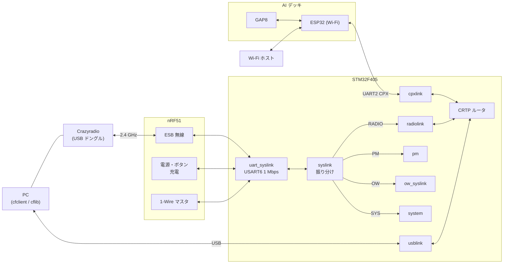

# 通信経路（無線・USB・CPX と CRTP）

## 概要
機体と外部の通信は、次の 3 層で構成される。

| 層 | 役割 | 実装 |
|---|---|---|
| 物理リンク | 無線（nRF51 経由）、USB、CPX（AI デッキの ESP32 / GAP8 経由） | `hal/src/syslink.c`, `radiolink.c`, `usblink.c`, `modules/src/cpx/` |
| CRTP ルータ | 1 本のリンクを選んで送受信し、受信パケットをポート（16 個）に振り分ける | `modules/src/crtp.c` |
| サービス | ポートごとの機能（console, param, setpoint, mem, log, localization, ...） | `modules/src/*` |

CRTP ルータは**同時に 1 本のリンクだけ**を使う。既定は無線（radiolink）で、PC からの要求で USB や CPX に切り替わる。

nRF51 と STM32 の間は、UART 上の独自プロトコル **syslink** でつながっている。syslink は無線の CRTP パケットだけでなく、電源管理、1-Wire（デッキのメモリ）、システム情報も運ぶ。

タスクとキューの構成は [../01_runtime/tasks.md](../01_runtime/tasks.md) の「通信のタスク連携」を参照。

## 構成ファイル
| ファイル | 役割 |
|---|---|
| `src/drivers/src/uart_syslink.c` | USART6 の送受信、syslink のフレーミングとチェックサム |
| `src/hal/src/syslink.c` | syslink パケットのグループごとの振り分け、送信の排他 |
| `src/hal/src/radiolink.c` | 無線の CRTP リンク（syslink の RADIO グループ） |
| `src/hal/src/usblink.c`, `usb.c` | USB の CRTP リンク、USB デバイスのスタック |
| `src/modules/src/cpx/*.c` | CPX プロトコル（ルータ、UART2 トランスポート、CRTP ブリッジ） |
| `src/modules/src/crtp.c` | CRTP ルータ |
| `src/modules/src/crtpservice.c` | port 15（link）: エコー、ソース、シンク |
| `src/modules/src/platformservice.c` | port 13（platform）: バージョン、アーム、アプリチャネルなど |
| `src/modules/src/console.c` | port 0（console）: `DEBUG_PRINT` の出力先 |

## 全体の経路



## syslink（nRF51 ↔ STM32）

### フレーム形式
```
+------+------+------+--------+-----------------+-------+-------+
| 0xBC | 0xCF | type | length | data (≤ 64 byte) | ck[0] | ck[1] |
+------+------+------+--------+-----------------+-------+-------+
```
- 開始バイト 2 個、種類、長さ、データ、チェックサム 2 バイト（`src/hal/interface/syslink.h:32`〜`36`）。
- チェックサムは種類・長さ・データに対するフレッチャー型の 2 バイト和（`ck0 += c; ck1 += ck0`、`uart_syslink.c:481`〜`492`, `:433`〜`438`）。
- USART6、1 Mbps（`uart_syslink.c:200`）。
- 受信は割り込み（またはオプションの DMA: `CONFIG_SYSLINK_RX_DMA`）で 1 バイトずつ状態遷移し、完成したパケットを `syslinkPacketDelivery` キューに入れる（`uart_syslink.c:475`〜`549`）。
- 送信は `syslinkSendPacket()` で、`syslinkAccess` セマフォで排他して DMA で送る（`syslink.c:143`〜`165`）。

### パケットの種類
種類の上位 4 ビットがグループで、`syslinkRouteIncommingPacket()` がグループごとに振り分ける（`syslink.c:77`〜`98`）。

| グループ | 主な種類 | 方向 | STM32 側の処理 |
|---|---|---|---|
| RADIO（0x0_） | `RAW`（CRTP）、`RAW_BROADCAST`、`RSSI`、`P2P_BROADCAST`、`READY`、`CHANNEL` / `DATARATE` / `ADDRESS` / `POWER`（設定） | 双方向 | `radiolinkSyslinkDispatch()` |
| PM（0x1_） | `BATTERY_VOLTAGE`、`BATTERY_STATE`、`ONOFF_SWITCHOFF`、`SHUTDOWN_REQUEST` / `ACK`、`LED_ON` / `OFF`、`DECKCTRL_DFU`、`ONOFF_STM_OFF` | 双方向 | `pmSyslinkUpdate()` |
| OW（0x2_） | `SCAN`、`GETINFO`、`READ`、`WRITE` | 双方向 | `owSyslinkReceive()` |
| SYS（0x3_） | `NRF_VERSION` | 双方向 | `systemSyslinkReceive()` |
| DEBUG（0xF_） | `PROBE` | nRF → STM | `debugSyslinkReceive()` |

根拠: `src/hal/interface/syslink.h:41`〜`79`

## 無線リンク（radiolink）

### 受信
- `SYSLINK_RADIO_RAW` を受けると、CRTP パケットとして `crtpPacketDelivery`（長さ 5）に入れる。キューが満杯なら**捨てる**（`CONFIG_RADIO_ASSERT_ON_QUEUE_FULL` のときだけ ASSERT）（`radiolink.c:167`〜`175`）。
- ブロードキャスト（`RAW_BROADCAST`）も同じキューに入れるが、応答は返さない（`:184`〜`194`）。

### 送信（受信に同期）
- CRTP ルータからの送信パケットは、radiolink の `txQueue`（長さ 1）に入れるだけで、すぐには送らない（`radiolink.c:234`〜`251`）。
- nRF51 から `RADIO_RAW` を受信するたびに、`txQueue` から 1 個取り出して送る（`:178`〜`183`）。
- **（推測）** nRF51 は Crazyradio からのパケットに ESB の ACK で応答しており、STM32 から返されたパケットは次の ACK のペイロードとして PC に届くと考えられる。そのため、下り（機体 → PC）の帯域は PC からのパケットの頻度で決まる。cflib が何も送るものがないときに空パケットでポーリングしているのは、このためと考えられる。

### 接続状態
- 最後に受信してから `CONFIG_RADIO_ACTIVITY_TIMEOUT_MS`（cf2 では 1000 ms）以内なら「接続中」（`radiolink.c:75`〜`76`）。log の `radio.isConnected` で見られる。
- 起動時に、チャネル・データレート・アドレスを設定ブロック（EEPROM）から読んで nRF51 に設定する（`radiolink.c:101`〜`103`）。

## USB リンク（usblink）
- USB デバイス（STM32 の OTG FS）のベンダインタフェースで CRTP を送受信する。受信は ISR から `crtpPacketDelivery`（長さ 16）へ、送信は `usbDataTx`（長さ 8）経由（`usblink.c:48`, `usb.c:67`, `:645`, `:816`）。
- PC がベンダ要求 `wIndex = 0x01` を送ると、CRTP ルータのリンクが usblink に切り替わる。`0x02` は DFU ブートローダへの再起動、その他は radiolink に戻す（`usb.c:331`〜`358`）。
- 仮想 COM ポート（VCP）のインタフェースもあり、ESC 設定の中継（`PASSTHROUGH` タスク）に使われる。

## CPX（AI デッキ）
CPX は、AI デッキの ESP32・GAP8、Wi-Fi のホスト、STM32 の間でパケットを中継するプロトコルである。

| 項目 | 内容 |
|---|---|
| 宛先 / 送信元 | `CPX_T_STM32`(1)、`CPX_T_ESP32`(2)、`CPX_T_WIFI_HOST`(3)、`CPX_T_GAP8`(4) |
| 機能 | `SYSTEM`(1)、`CONSOLE`(2)、`CRTP`(3)、`WIFI_CTRL`(4)、`APP`(5)、`TEST`(0x0E)、`BOOTLOADER`(0x0F) |
| ヘッダ | 宛先 3 ビット、送信元 3 ビット、最終パケットフラグ 1 ビット、機能 6 ビット、バージョン 2 ビット |
| 物理層 | UART2（cf2 では 576000 bps: `CONFIG_CPX_UART2_BAUDRATE`） |

根拠: `src/modules/interface/cpx/cpx.h:30`〜`67`

- 外部ルータ（`cpx_external_router.c`）は、UART2 から来たパケットの宛先を見て、STM32 宛てなら内部ルータへ、それ以外なら UART2 に送り返す（`:99`〜`106`）。
- 内部ルータ（`cpx_internal_router.c`）は、機能が CRTP のものを CRTP 用のキューに、それ以外を汎用のキューに振り分ける（`:75`〜`84`）。
- `CPX_F_SYSTEM` の `CPX_ENABLE_CRTP_BRIDGE` を受けると、CRTP ルータのリンクが cpxlink に切り替わり、Wi-Fi 経由で CRTP が使えるようになる（`cpx.c:135`〜`142`）。

## CRTP

### パケット形式
```
+--------------------------+-------------------+
| header (1 byte)          | data (≤ 30 byte)  |
| port:4 | reserved:2 | ch:2 |                   |
+--------------------------+-------------------+
```
- ポート 4 ビット（0〜15）、チャネル 2 ビット（0〜3）、データは最大 30 バイト（`src/modules/interface/crtp.h:55`〜`76`, `CRTP_MAX_DATA_SIZE`）。
- `CRTP_HEADER_COMPAT` を定義すると、旧形式のビット配置になる（`crtp.h:63`〜`70`）。

### ポートの割り当て
| ポート | 名前 | 受信の方式 | 処理するモジュール |
|---|---|---|---|
| 0 | CONSOLE | （送信のみ） | `console.c` |
| 2 | PARAM | キュー → `PARAM` タスク | `param_task.c`, `param_logic.c` |
| 3 | SETPOINT | コールバック | `crtp_commander.c` → `crtp_commander_rpyt.c` |
| 4 | MEM | キュー → `MEM` タスク | `crtp_mem.c`, `mem.c` |
| 5 | LOG | キュー → `LOG` タスク | `log.c` |
| 6 | LOCALIZATION | コールバック | `crtp_localization_service.c` |
| 7 | SETPOINT_GENERIC | コールバック | `crtp_commander.c` → `crtp_commander_generic.c` |
| 8 | SETPOINT_HL | キュー → `CMDHL` タスク | `crtp_commander_high_level.c` |
| 9 | SUPERVISOR | コールバック（コマンド）+ キュー（情報要求） | `crtp_supervisor.c` |
| 13 | PLATFORM | キュー → `PLATFORM-SRV` タスク | `platformservice.c` |
| 15 | LINK | キュー → `CRTP-SRV` タスク | `crtpservice.c` |

根拠: `crtp.h:42`〜`52`、各モジュールの `crtpRegisterPortCB` / `crtpInitTaskQueue`（[../00_overview/architecture.md](../00_overview/architecture.md) 図 2 の根拠を参照）

各ポートのチャネルとパケット形式の詳細は `04_interfaces/crtp_ports.md` にまとめる。

### ルータの動作
- **受信**（`crtp.c:170`〜`200`）: 現在のリンクの `receivePacket()` で 1 個受け取り、ポートにキューがあれば投入（満杯なら**空くまでブロック**）、コールバックがあれば呼ぶ。両方登録されていれば両方行う。
- **送信**（`crtp.c:143`〜`168`, `:205`〜`223`）: 各モジュールは `crtpSendPacket()`（待たない）か `crtpSendPacketBlock()`（空くまで待つ）で `txQueue`（長さ 200）に入れる。`CRTP-TX` タスクがリンクの `sendPacket()` を成功するまで 10 ms 間隔で再試行する。
- **リンクの切り替え**（`crtp.c:243`〜`253`）: 旧リンクを無効化し、新リンクを有効化する。

### link サービス（port 15）
| チャネル | 名前 | 動作 |
|---|---|---|
| 0 | `linkEcho` | 受け取ったパケットをそのまま返す（遅延の測定など） |
| 1 | `linkSource` | 最大長のパケットを返す（下りの帯域試験） **（推測）** |
| 2 | `linkSink` | 受け取って捨てる（上りの帯域試験） |

根拠: `src/modules/src/crtpservice.c:40`〜`43`, `:80`〜`92`

### platform サービス（port 13）
チャネルとコマンドで、プラットフォームの操作と情報取得を行う（`platformservice.c:106`〜`206`）。

| 分類 | コマンド |
|---|---|
| プラットフォームのコマンド | 連続波の出力（無線の試験）、アーム / アーム解除、クラッシュからの復帰、ユーザへの通知 |
| バージョン | CRTP プロトコルのバージョン、ファームウェアのバージョン、機種名 |
| アプリチャネル | アプリ層との任意データの送受信（`app_channel.c`。cf2 ではアプリ層は無効） |

## P2P 通信
- nRF51 経由で機体同士が直接通信する仕組み。`SYSLINK_RADIO_P2P_BROADCAST` を受けると、登録されたコールバック（`p2pRegisterCB`）を呼ぶ（`radiolink.c:199`〜`213`, `:229`〜`232`）。
- 利用者はアプリ層（`app_api`）や p2pDTR（トークンリング）で、cf2 の既定の構成では使われない。

## 設定・パラメータ

| 種別 | 名前 | 説明 |
|---|---|---|
| Kconfig | `CONFIG_RADIO_ACTIVITY_TIMEOUT_MS` | 1000。接続中と判定する時間 |
| Kconfig | `CONFIG_RADIO_ASSERT_ON_COM_PROBLEM` | y |
| Kconfig | `CONFIG_ENABLE_CPX`, `CONFIG_ENABLE_CPX_ON_UART2`, `CONFIG_CPX_UART2_BAUDRATE` | y, y, 576000 |
| 設定ブロック | 無線のチャネル・データレート・アドレス | EEPROM に保存（→ `03_functions/storage_mem.md`） |
| log | `radio.rssi`, `radio.isConnected`, `radio.numRxBc`, `radio.numRxUc` | 無線の状態（`radiolink.c:287`〜`303`） |
| param | `syslink.*` | syslink のデバッグ用の設定（`syslink.c:198`〜`203`） |

## 公式ドキュメントとの差異
- `docs/functional-areas/crtp/index.md` との照合は、`04_interfaces/crtp_ports.md` で行う。

## 未解決事項
- 無線の送信が受信に同期する方式の根拠は STM32 側のコードだけで、nRF51 のファームウェア（別リポジトリ）は確認していない。
- CRTP のリンクを切り替えるとき、旧リンクの送信待ちのパケット（radiolink の `txQueue` など）が破棄されるか、残るかは未確認。
- `linkSource` の動作の詳細は未確認。
