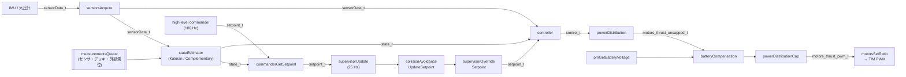
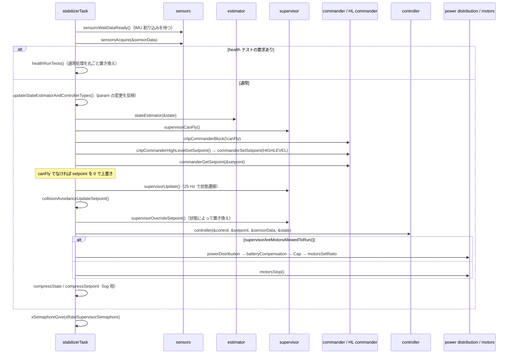

# 制御ループのデータフロー（センサ → モータ）

## 概要
`stabilizerTask` は IMU の割り込みに同期して 1 kHz で回り、1 周の中で次の処理を順に呼び出す。
センサ取得 → 状態推定 → 目標値の取得 → 安全監視（supervisor）→ 衝突回避 → 制御 → 出力分配 → 電池補償 → モータ出力。

各処理は `stabilizerStep`（ループの回数）を受け取り、`RATE_DO_EXECUTE(周波数, step)` で自分の実行周期まで間引く。
1 kHz のループの中に、500 Hz / 250 Hz / 100 Hz / 25 Hz の処理が同居する構造である。

タスクの同期（IMU 割り込み → `SENSORS` → `STABILIZER` → `KALMAN`）は [../01_runtime/tasks.md](../01_runtime/tasks.md) を参照。

## 構成ファイル
| ファイル | 役割 |
|---|---|
| `src/modules/src/stabilizer.c` | ループ本体と各処理の呼び出し順序 |
| `src/modules/interface/stabilizer_types.h` | ループ内を流れるデータ型（`sensorData_t`, `state_t`, `setpoint_t`, `control_t` ほか）と周期の定数 |
| `src/hal/src/sensors.c`, `sensors_bmi088_bmp3xx.c` | センサ値の取得 |
| `src/modules/src/estimator/estimator.c` | 推定器の選択と計測値キュー |
| `src/modules/src/commander.c` | setpoint の保持 |
| `src/modules/src/supervisor.c` | 飛行可否の判定と setpoint の上書き |
| `src/modules/src/collision_avoidance.c` | 他の機体との衝突回避（既定は無効） |
| `src/modules/src/controller/controller.c` | コントローラの選択 |
| `src/modules/src/power_distribution_quadrotor.c` | 制御出力から 4 モータへの分配と上限処理 |
| `src/drivers/src/motors.c` | 電池電圧の補償と PWM 出力 |

## ブロック図

根拠: `src/modules/src/stabilizer.c:317`〜`387`（ループ本体）, `:255`〜`261`（`controlMotors`）

## 1 周の処理の流れ

## ループ内を流れるデータ

| データ | 型 | 単位・内容 | 生成 → 消費 | 定義 |
|---|---|---|---|---|
| センサ値 | `sensorData_t` | 加速度 [G]、角速度 [deg/s]、地磁気 [gauss]、気圧（`baro_t`: mbar, ℃, 海抜 m）、割り込み時刻 [µs] | sensors → estimator, supervisor, controller | `stabilizer_types.h:165`〜`175` |
| 推定状態 | `state_t` | 姿勢（オイラー角 [deg]、**ピッチの符号が反転した旧座標系**）、クォータニオン、位置 [m]、速度 [m/s]、加速度 [G]（z は重力を除く） | estimator → commander, controller | `stabilizer_types.h:177`〜`183` |
| 目標値 | `setpoint_t` | 姿勢、角速度、クォータニオン、推力、位置、速度、加速度、ジャーク と、軸ごとのモード（`modeDisable` / `modeAbs` / `modeVelocity`） | commander → supervisor → controller | `stabilizer_types.h:245`〜`275` |
| 制御出力 | `control_t` | 3 つのモードの共用体（下表） | controller → power distribution | `stabilizer_types.h:187`〜`223` |
| モータ推力（上限前） | `motors_thrust_uncapped_t` | 4 モータの int32 | power distribution → 電池補償 → cap | `stabilizer_types.h:225`〜`233` |
| モータ PWM | `motors_thrust_pwm_t` | 4 モータの uint16（0〜65535 の比率） | cap → motors | `stabilizer_types.h:235`〜`243` |

### `control_t` の 3 つのモード

| モード | 内容 | 使うコントローラ | 分配の方法 |
|---|---|---|---|
| `controlModeLegacy` | roll / pitch / yaw（int16）+ thrust（float） | PID、Mellinger、INDI（`controller_pid.c:79`, `controller_mellinger.c:133`, `controller_indi.c:150`） | X 型のミキシング。`m1 = T - r/2 + p/2 + y` ほか（`power_distribution_quadrotor.c:84`〜`93`） |
| `controlModeForceTorque` | 推力 [N] + トルク [Nm] × 3 | Brescianini、Lee（`controller_brescianini.c:404`, `controller_lee.c:179`） | アーム長と推力トルク比でモータごとの力に変換し、負の値は 0 に切り上げ（`:95`〜`117`） |
| `controlModeForce` | モータごとの正規化推力（0〜1） | 組み込みのコントローラでは未使用（Out-of-tree 用 **（推測）**） | 0〜1 に切り詰め（`:126`〜`140`） |

## 実行周期

1 kHz のループの中で、各処理が `RATE_DO_EXECUTE` で間引かれる（`stabilizer_types.h:364`〜`377`）。

| 処理 | 周期 | 根拠 |
|---|---|---|
| ループ本体、センサ取得、出力分配、モータ | 1000 Hz | `RATE_MAIN_LOOP`（`stabilizer_types.h:371`） |
| PID の姿勢制御（角度と角速度） | 500 Hz | `ATTITUDE_RATE`（`:372`）, `controller_pid.c:85`, `:119` |
| Complementary の姿勢推定 | 250 Hz | `estimator_complementary.c:46`, `:91` |
| PID の位置制御、Complementary の位置推定、Kalman の予測 | 100 Hz | `POSITION_RATE`（`:373`）, `controller_pid.c:115`, `estimator_complementary.c:114`, `estimator_kalman.c:119` |
| high-level commander の軌道評価 | 100 Hz | `RATE_HL_COMMANDER`（`:374`） |
| 気圧計の読み出し | 50 Hz | `sensors_bmi088_bmp3xx.c:63` |
| supervisor の状態遷移 | 25 Hz | `RATE_SUPERVISOR`（`:375`）, `supervisor.c:589` |

間引かれた処理は、実行されない周では出力の構造体を**書き換えずに返る**（`stabilizer.c:285`〜`287` のコメント）。
たとえば PID の角速度制御は 500 Hz なので、モータへの出力（1 kHz）は同じ `control` が 2 回使われる。

## 各段の要点

### 1. センサ取得
- `sensorsAcquire()` は、センサタスクが上書きキュー（長さ 1）に置いた最新値を取り出すだけで、I2C/SPI の通信はしない（`sensors_bmi088_bmp3xx.c:260`〜`275`）。
- 同じ値は `estimatorEnqueue()` で推定器の計測値キューにも入る（`:334`〜`363`）。Kalman はキューから、Complementary はキューからジャイロと加速度を取り出して使う（`estimator_complementary.c:70`）。

### 2. 状態推定
- 起動時の推定器は次の優先順位で決まる（`estimator.c:108`〜`140`, `src/deck/core/deck_info.c:243`〜`267`）。
  1. デッキが要求する推定器（Flow, Lighthouse, Loco のドライバは Kalman を要求する: `flowdeck_v1v2.c:204`, `lighthouse.c:95`, `locodeck.c:675`）
  2. Kconfig の `CONFIG_ESTIMATOR_*`
  3. 既定値の Complementary（`estimator.c:19`）
- **デッキ同士が別の推定器を要求すると、エラーになる**（`deck_info.c:255`）。
- 飛行中でも param の `stabilizer.estimator` で切り替えられる。切り替えはループの先頭で行われる（`stabilizer.c:229`〜`233`）。

### 3. 目標値の取得
- supervisor が「飛行不可」と判定している間は、CRTP の setpoint の受け付けを止め（`crtpCommanderBlock`）、取り出した setpoint も 0 で上書きする（`stabilizer.c:332`〜`343`）。
- 詳細は [setpoint.md](setpoint.md)。

### 4. 安全監視（supervisor）
- `supervisorUpdate()` は 25 Hz で条件を集め、状態を遷移させる（`supervisor.c:588`〜`610`）。集める条件は、アーム状態、飛行中か、転倒、setpoint の途絶（0.5 秒で警告、2 秒でタイムアウト）、緊急停止（CRTP・param・ウォッチドッグ）、クラッシュ、デッキの故障など（`:461`〜`538`）。
- `supervisorOverrideSetpoint()` は状態に応じて setpoint を置き換える（`:612`〜`642`）。
  - 通常の飛行状態: 変更しない。
  - `WarningLevelOut`（setpoint が 0.5 秒途絶）: 水平位置の制御を切り、姿勢を水平（roll = pitch = 0、yaw の角速度 = 0）にする。高度はそのまま。
  - それ以外（ロック、クラッシュなど）: ヌルの setpoint（全て 0）に置き換える。
- さらにモータ出力の直前で `supervisorAreMotorsAllowedToRun()` を確認し、許可されない状態なら `motorsStop()` を呼ぶ（`stabilizer.c:360`〜`367`, `supervisor.c:644`〜`651`）。**setpoint の上書きとモータの停止の二重の安全策**になっている。
- 状態遷移の詳細は `03_functions/supervisor.md`。

### 5. 衝突回避
- 周辺機体の位置テーブル（`peerLocalization`）にある他の機体の位置を使って、setpoint を修正する。既定では無効で、param の `colAv.enable` で有効化する（`collision_avoidance.c:271`, `:311`, `:398`）。

### 6. 制御
- 既定のコントローラは PID（`controller.c:14`）。param の `stabilizer.controller` で飛行中でも切り替えられる。
- PID はカスケード構成: 位置制御（100 Hz）→ 姿勢角の制御（500 Hz）→ 角速度の制御（500 Hz）（`controller_pid.c:115`〜`149`）。詳細は `03_functions/controller.md`。
- PID は推力が 0 のとき、roll / pitch / yaw の出力も 0 にする（`controller_pid.c:163`〜`168`）。

### 7. 出力分配・電池補償・上限処理
1. `powerDistribution()`: 制御モードに応じて 4 モータの推力に分配する。
2. `batteryCompensation()`: 電池電圧にローパスフィルタ（係数 0.01）をかけ、モータごとに補償する（`stabilizer.c:208`〜`219`）。補償の中身は、推力 [N] からモータ電圧への 3 次多項式の逆関数で、比率 = モータ電圧 ÷ 電池電圧 になる（`motors.c:180`〜`222`）。電圧が 2 V 未満のときや推力が最小値未満のときは 0 を返す。
3. `powerDistributionCap()`: 最大のモータが上限（65535）を超えたら、**全モータから同じ量を引く**。これによって、推力より姿勢のトルクの差が優先される。下限はアイドル推力（param `powerDist.idleThrust`、永続化可）で切り上げる（`power_distribution_quadrotor.c:160`〜`190`, `:216`）。
4. `motorsSetRatio()`: TIM の比較レジスタに書き込み、PWM を出力する（`motors.c:702`〜`753`）。

### 8. health テスト
- param の `health.startPropTest` / `health.startBatTest` が立つと、その周からループの通常処理を `healthRunTests()` に置き換えて、プロペラと電池の試験をする（`stabilizer.c:324`〜`325`, `src/modules/src/health.c:150`〜`165`, `:359`〜`364`）。

## 設定・パラメータ

| 種別 | 名前 | 既定値（cf2） | 説明 |
|---|---|---|---|
| param | `stabilizer.estimator` | 0（自動） | 0: 自動、1: Complementary、2: Kalman、3: UKF |
| param | `stabilizer.controller` | 0（自動 = PID） | 1: PID、2: Mellinger、3: INDI、4: Brescianini、5: Lee |
| param | `powerDist.idleThrust` | 0（cf2 では `CONFIG_MOTORS_DEFAULT_IDLE_THRUST` が未定義のため。`power_distribution_quadrotor.c:42`〜`46`） | モータの最小出力（永続化可）。0 より大きくするにはアームが必須（`:39`〜`40` の `#error`） |
| param | `colAv.enable` | 0 | 衝突回避の有効化 |
| param | `health.startPropTest` / `startBatTest` | 0 | health テストの開始 |
| Kconfig | `CONFIG_ENABLE_THRUST_BAT_COMPENSATED` | y | 電池電圧の補償 |
| Kconfig | `CONFIG_CONTROLLER_AUTO_SELECT` / `CONFIG_ESTIMATOR_AUTO_SELECT` | y | 自動選択 |
| log | `ctrltarget.*` | — | 現在の setpoint（位置・速度・加速度） |
| log | `stateEstimateZ.*` など | — | `compressState()` で圧縮した状態（mm, mm/s, 圧縮クォータニオン） |

## 公式ドキュメントとの差異
- `docs/functional-areas/sensor-to-control/index.md` の図は、センサ → 推定 → 制御 → 出力分配の直線的な流れだけを示している。ソースでは、推定と制御の間に supervisor による setpoint の置き換えと、衝突回避が入る。
- 同ページでは、電池補償はブラシモータのプラットフォームの機能として説明されている。ソースでは、補償は `stabilizer.c` の共通処理から呼ばれ、有効かどうかは Kconfig（`CONFIG_ENABLE_THRUST_BAT_COMPENSATED`）で決まる。

## 未解決事項
- `state_t.attitude` の pitch は「旧 CF2 座標系で反転」とコメントされている（`stabilizer_types.h:178`）。どのモジュールがこの反転を前提にしているか（PID は `-sensors->gyro.y` を使う: `controller_pid.c:142`）の全体整理は未実施（→ `03_functions/controller.md`）。
- `batteryCompensation` の電圧のローパス係数のコメントは「0.2 で約 10 ステップ」だが、実際の係数は 0.01 で、コメントと値が一致していない（`stabilizer.c:211`）。
- Kalman が 1 ms 以内に終わらない場合、スタビライザは古い state を使い続ける。その遅延の実測値は未取得。
- cf2 の設定では `CONFIG_MOTORS_ESC_PROTOCOL_ONESHOT125=y` になっているが、cf2 はブラシモータである。ESC プロトコルの設定がブラシモータの出力に影響するかは未確認（→ `03_functions/power_distribution.md`）。
