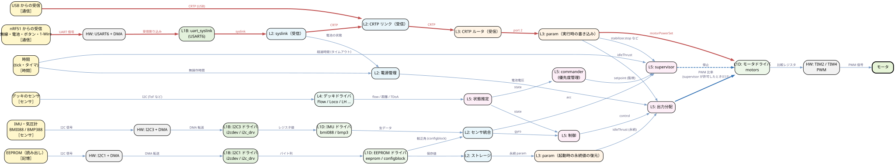

# 入出力の経路（入力 → 判断 → 出力）

## 概要
マイコンの制御は、おおむね「入力（センサ、記憶、通信、時間）→ 判断（アプリケーション層）→ 出力（アクチュエータ、表示、記憶、通信）」の形をとる。
本書では、このモデルでファームウェアを点検する。全ての入力源から全ての出力先までの経路を機械的に列挙し、**判断ブロック（L5）を通らない経路**と、**supervisor の許可を経ずにモータに届く経路**を洗い出す。

分析は静的解析にもとづく。経路はデータフローのグラフ上で「つながりうる」ことを示すもので、実際にその順で値が伝わる条件（param の値、状態など）までは評価していない。

## 入力源と出力先
| 種類 | 入力源 | 出力先 |
|---|---|---|
| センサ | IMU・気圧計（データは I2C3、合図は EXTI の割り込み）、デッキのセンサ | — |
| アクチュエータ・表示 | — | モータ、LED・ブザー |
| 記憶 | EEPROM（読み出し） | EEPROM（書き込み） |
| 通信 | nRF51 からの受信（無線・電池・ボタン・1-Wire）、USB からの受信 | nRF51 への送信（テレメトリ・シャットダウン応答）、USB への送信 |
| 時間 | tick・タイマ（タイムアウト、周期、データの鮮度） | — |

「時間」は見落としやすい入力である。supervisor のタイムアウト、衝突回避での他の機体の位置の鮮度（5 秒で破棄）、log の周期は、センサの値ではなく経過時間をきっかけに動く。

## 分析のしかた
- グラフは、[../00_overview/layers.md](../00_overview/layers.md) の図 B（データフロー）の定義に、入出力・param の書き込み・log・時間の矢印を加えたもの（下の「分析に使った矢印」）。
- 双方向のブロック（syslink、CRTP リンク、CRTP ルータ、param / log）は、受信側と送信側、実行時の書き込みと起動時の復元に分けた。分けないと、送信したパケットが受信側に回り込むような、実在しない経路が現れる。
- 起動時に EEPROM から復元されるのは、永続化フラグ（`PARAM_PERSISTENT`）のある param だけとした。
- **ゲート**: supervisor が通す・止めるを決める矢印（出力分配 → モータドライバ、各 commander → commander）には、その旨の属性を付けた。
- 入力源と出力先は、HW 層の外部デバイス（BMI088、EEPROM、nRF51、デッキ、モータ）と USB ペリフェラルである。経路には、ペリフェラル・バスドライバ・デバイスドライバの段も含まれる（[../00_overview/layers.md](../00_overview/layers.md) の「入出力ごとの縦の経路」）。
- 再生成: `python tools/io_paths.py`（以下の「AUTO-GENERATED」より下と、図は自動生成）
- **矢印の点検（2026-09-28）**: 全ての矢印について、受け取る側が実際にそのデータを**読んでいる**ことをソースで確認した。引数として渡るだけで使われないもの（例: 衝突回避に渡る `sensorData`）は矢印にしない。この点検で、誤りの削除 1 本、漏れの追加 2 本、ラベルの修正 1 本を行った（下の「矢印の点検結果」）。

## 結論

### 1. supervisor を経ずにモータに届く経路は 1 本だけ

| 線 | 意味 |
|---|---|
| 青の太線 | supervisor が許可したときだけ通る（`supervisorAreMotorsAllowedToRun()`） |
| 青の点線 | supervisor による停止 |
| 赤の太線 | supervisor を経ない経路 |

- センサ、デッキ、記憶、時間からの経路は、すべて「出力分配 → モータドライバ」の矢印を通り、supervisor の許可の下にある。モータドライバから先（TIM2 / TIM4 → モータ）は全ての経路で共通である。
- 例外は、**通信（無線または USB）→ CRTP → param の書き込み → モータ**の経路（param `motorPowerSet`）だけである。モータのドライバが出力の直前で値を置き換えるので、supervisor が停止を指示していても効く（[../03_functions/power_distribution.md](../03_functions/power_distribution.md)）。
- 見落としやすい経路として、**nRF51 が測った電池電圧が、電源管理と出力分配を経て、モータの PWM を変える**経路がある（電池補償）。これは supervisor の許可の下にある。

### 2. 判断を通らない経路の多くは、通って当然のもの
下の「判断ブロック（L5）を通らない経路」の表では、20 組のうち大半がテレメトリ（センサの値 → log → 送信）、表示（LED）、通信の応答である。確認が必要なのは次のものだけである。

| 分類 | 経路 | 評価 |
|---|---|---|
| 要確認（安全） | 通信 → param → モータ | 上記のとおり |
| 確認（永続化） | 通信 → param → ストレージ → EEPROM | PC の要求で param を永続化する正規の機能。永続化できる param の範囲は param の定義で制限されている |

電源オフの経路は、cf2 では確認不要になった。STM32 側からの自動電源オフ（危険電圧・無操作）は `CONFIG_PM_AUTO_SHUTDOWN` が無効のためビルドされず、電源管理から nRF51 へ送られるのは、nRF51 からのシャットダウン要求への応答（ACK）だけである（[../03_functions/power_management.md](../03_functions/power_management.md)）。

### 3. 線は一方通行ではない（このグラフの限界）
このグラフは入力から出力への有向グラフとして扱っているが、実際には次のループがある。
- **物理を介したループ**: モータ → 機体の運動 → IMU。制御ループは閉ループである。
- **内部状態のループ**: 推定器の状態、supervisor の状態、planner の軌道、衝突回避の「前回の安全な目標位置」は、前回の自分の出力を次の入力にする。

これらのループはグラフの矢印としては表していない。経路の列挙は「1 周期の中での影響の伝わり方」を見るものと考える。

## 矢印の点検結果（2026-09-28）

| 矢印 | 対応 | 根拠 |
|---|---|---|
| センサ統合 → 衝突回避（sensorData） | **削除**。引数として渡るが、アルゴリズム本体で一度も参照されない | `src/modules/src/collision_avoidance.c:97`〜`253` |
| センサ統合 → supervisor | ラベルを `sensorData` から `acc` に変更。転倒の判定で加速度だけを使う | `supervisor.c:311`〜`321` |
| 状態推定 → high-level commander（state） | **追加**。軌道が止まっている間、次の軌道の起点として推定位置・速度・ヨーを使う | `crtp_commander_high_level.c:359`〜`362` |
| 時間 → 衝突回避（位置の鮮度） | **追加**。受信から 5 秒以上経った他の機体の位置を捨てる | `collision_avoidance.c:315`〜`331` |
| 電源管理 → syslink（送信） | ラベルを「電源オフ要求」から「シャットダウン応答（ACK）」に変更。自動電源オフは cf2 では無効 | `pm_stm32f4.c` の `pmSystemShutdown` / `pmGracefulShutdown`、`CONFIG_PM_AUTO_SHUTDOWN` |

上記以外の矢印（図 B の残り 36 本と、この分析で追加した残りの矢印）は、受け取る側が実際にデータを読んでいることを確認した。

## 未解決事項
- 分析のグラフは主な矢印だけで作っており、網羅していない。とくに param による書き込み先は代表的なものだけである（全ての param の書き込み先を入れると、param から全モジュールへの矢印になる）。
- デッキのアクチュエータ（LED リング、Buzzer など）は、出力先として入れていない。

<!-- AUTO-GENERATED BELOW: python tools/io_paths.py -->

### 入力源 × 出力先

各セルは、最短経路で通る判断ブロック（L5）。`—` は経路なし。**⚠** は L5 を 1 つも通らずに届く経路があることを示す。

| 入力源 \ 出力先 | モータ | LED・ブザー | EEPROM（書き込み） | nRF51 への送信 | USB への送信 |
|---|---|---|---|---|---|
| IMU・気圧計 | supervisor | ⚠ （直接） | — | ⚠ （直接） | ⚠ （直接） |
| デッキのセンサ | 状態推定, commander, supervisor | — | — | 状態推定 | 状態推定 |
| EEPROM（読み出し） | supervisor | ⚠ （直接） | ⚠ （直接） | ⚠ （直接） | ⚠ （直接） |
| nRF51 からの受信 | ⚠ 出力分配 | ⚠ （直接） | ⚠ 測位 | ⚠ （直接） | ⚠ （直接） |
| USB からの受信 | ⚠ （直接） | ⚠ （直接） | ⚠ 測位 | ⚠ （直接） | ⚠ （直接） |
| 時間 | supervisor | ⚠ （直接） | — | ⚠ （直接） | ⚠ （直接） |

### 判断ブロック（L5）を通らない経路

分類: **要確認（安全）** = アクチュエータに届く、**確認（永続化）** = EEPROM への書き込みに届く、通常 = テレメトリ・表示・応答など、判断を通らないのが自然なもの。

| 分類 | 入力源 | 出力先 | 経路（例） |
|---|---|---|---|
| **要確認（安全）** | nRF51 からの受信 | モータ | nRF51 からの受信 → USART6 + DMA → uart_syslink → syslink（受信） → CRTP リンク（受信） → CRTP ルータ（受信） → param（実行時の書き込み） → モータドライバ → TIM2 / TIM4 → モータ |
| **要確認（安全）** | USB からの受信 | モータ | USB からの受信 → CRTP リンク（受信） → CRTP ルータ（受信） → param（実行時の書き込み） → モータドライバ → TIM2 / TIM4 → モータ |
| **確認（永続化）** | EEPROM（読み出し） | EEPROM（書き込み） | EEPROM（読み出し） → I2C1 + DMA → I2C1 ドライバ → EEPROM ドライバ → ストレージ → EEPROM（書き込み） |
| **確認（永続化）** | nRF51 からの受信 | EEPROM（書き込み） | nRF51 からの受信 → USART6 + DMA → uart_syslink → syslink（受信） → CRTP リンク（受信） → CRTP ルータ（受信） → param（実行時の書き込み） → ストレージ → EEPROM（書き込み） |
| **確認（永続化）** | USB からの受信 | EEPROM（書き込み） | USB からの受信 → CRTP リンク（受信） → CRTP ルータ（受信） → param（実行時の書き込み） → ストレージ → EEPROM（書き込み） |
| 通常 | IMU・気圧計 | LED・ブザー | IMU・気圧計 → I2C3 + DMA → I2C3 ドライバ → IMU ドライバ → センサ統合 → LED・ブザー |
| 通常 | IMU・気圧計 | nRF51 への送信 | IMU・気圧計 → I2C3 + DMA → I2C3 ドライバ → IMU ドライバ → センサ統合 → log → CRTP ルータ（送信） → CRTP リンク（送信） → syslink（送信） → nRF51 への送信 |
| 通常 | IMU・気圧計 | USB への送信 | IMU・気圧計 → I2C3 + DMA → I2C3 ドライバ → IMU ドライバ → センサ統合 → log → CRTP ルータ（送信） → CRTP リンク（送信） → USB への送信 |
| 通常 | EEPROM（読み出し） | LED・ブザー | EEPROM（読み出し） → I2C1 + DMA → I2C1 ドライバ → EEPROM ドライバ → センサ統合 → LED・ブザー |
| 通常 | EEPROM（読み出し） | nRF51 への送信 | EEPROM（読み出し） → I2C1 + DMA → I2C1 ドライバ → EEPROM ドライバ → syslink（送信） → nRF51 への送信 |
| 通常 | EEPROM（読み出し） | USB への送信 | EEPROM（読み出し） → I2C1 + DMA → I2C1 ドライバ → EEPROM ドライバ → センサ統合 → log → CRTP ルータ（送信） → CRTP リンク（送信） → USB への送信 |
| 通常 | nRF51 からの受信 | LED・ブザー | nRF51 からの受信 → USART6 + DMA → uart_syslink → syslink（受信） → CRTP リンク（受信） → LED・ブザー |
| 通常 | nRF51 からの受信 | nRF51 への送信 | nRF51 からの受信 → USART6 + DMA → uart_syslink → syslink（受信） → 電源管理 → syslink（送信） → nRF51 への送信 |
| 通常 | nRF51 からの受信 | USB への送信 | nRF51 からの受信 → USART6 + DMA → uart_syslink → syslink（受信） → 電源管理 → log → CRTP ルータ（送信） → CRTP リンク（送信） → USB への送信 |
| 通常 | USB からの受信 | LED・ブザー | USB からの受信 → CRTP リンク（受信） → LED・ブザー |
| 通常 | USB からの受信 | nRF51 への送信 | USB からの受信 → CRTP リンク（受信） → CRTP ルータ（受信） → param（実行時の書き込み） → 電源管理 → syslink（送信） → nRF51 への送信 |
| 通常 | USB からの受信 | USB への送信 | USB からの受信 → CRTP リンク（受信） → CRTP ルータ（受信） → param（実行時の書き込み） → CRTP ルータ（送信） → CRTP リンク（送信） → USB への送信 |
| 通常 | 時間 | LED・ブザー | 時間 → 電源管理 → LED・ブザー |
| 通常 | 時間 | nRF51 への送信 | 時間 → 電源管理 → syslink（送信） → nRF51 への送信 |
| 通常 | 時間 | USB への送信 | 時間 → log → CRTP ルータ（送信） → CRTP リンク（送信） → USB への送信 |

### モータに届く経路

モータドライバ（`DEV_MOT`、supervisor のゲートがかかる地点）に入る矢印ごとに、supervisor による制御の有無と、各入力源からの最短経路を示す。モータドライバから先は、全ての経路で共通（モータドライバ → TIM2 / TIM4 → モータ）。

| モータドライバへの矢印 | supervisor による制御 | 入力源ごとの最短経路 |
|---|---|---|
| 出力分配 → モータドライバ（PWM 比率） | あり: `supervisorAreMotorsAllowedToRun()`（`stabilizer.c:360-367`） | IMU・気圧計: IMU・気圧計 → I2C3 + DMA → I2C3 ドライバ → IMU ドライバ → センサ統合 → 制御 → 出力分配 → モータドライバ デッキのセンサ: デッキのセンサ → デッキドライバ → 状態推定 → 制御 → 出力分配 → モータドライバ EEPROM（読み出し）: EEPROM（読み出し） → I2C1 + DMA → I2C1 ドライバ → EEPROM ドライバ → ストレージ → param（起動時の永続値の復元） → 出力分配 → モータドライバ nRF51 からの受信: nRF51 からの受信 → USART6 + DMA → uart_syslink → syslink（受信） → 電源管理 → 出力分配 → モータドライバ USB からの受信: USB からの受信 → CRTP リンク（受信） → CRTP ルータ（受信） → param（実行時の書き込み） → 出力分配 → モータドライバ 時間: 時間 → 電源管理 → 出力分配 → モータドライバ |
| supervisor → モータドライバ（停止） | （停止の指示そのもの） | IMU・気圧計: IMU・気圧計 → I2C3 + DMA → I2C3 ドライバ → IMU ドライバ → センサ統合 → supervisor → モータドライバ デッキのセンサ: デッキのセンサ → デッキドライバ → 状態推定 → commander → supervisor → モータドライバ EEPROM（読み出し）: EEPROM（読み出し） → I2C1 + DMA → I2C1 ドライバ → EEPROM ドライバ → センサ統合 → supervisor → モータドライバ nRF51 からの受信: nRF51 からの受信 → USART6 + DMA → uart_syslink → syslink（受信） → CRTP リンク（受信） → CRTP ルータ（受信） → param（実行時の書き込み） → supervisor → モータドライバ USB からの受信: USB からの受信 → CRTP リンク（受信） → CRTP ルータ（受信） → param（実行時の書き込み） → supervisor → モータドライバ 時間: 時間 → supervisor → モータドライバ |
| param（実行時の書き込み） → モータドライバ（motorPowerSet） | **なし** | nRF51 からの受信: nRF51 からの受信 → USART6 + DMA → uart_syslink → syslink（受信） → CRTP リンク（受信） → CRTP ルータ（受信） → param（実行時の書き込み） → モータドライバ USB からの受信: USB からの受信 → CRTP リンク（受信） → CRTP ルータ（受信） → param（実行時の書き込み） → モータドライバ |

### 分析に使った矢印

図 B（`tools/gen_layer_diagrams.py` の `DATA`）の 53 本を、双方向のブロック（syslink、CRTP リンク、CRTP ルータ、param / log）を向きごとに分けて書き直し、入出力・param・log・時間の 44 本を加えた 98 本。追加分は次のとおり。

| 元 | 先 | データ | 根拠 |
|---|---|---|---|
| デッキのセンサ | デッキドライバ | I2C (ToF など) | `zranger2.c, multiranger.c` |
| EEPROM ドライバ | センサ統合 | 較正角 (configblock) | `sensors_bmi088_bmp3xx.c:550` |
| EEPROM ドライバ | syslink（送信） | 無線の設定 (nRF51 へ) | `radiolink.c:101-103` |
| 時間 | supervisor | 経過時間 (タイムアウト) | `supervisor.c:594` |
| 時間 | 電源管理 | 無操作時間 | `pm_stm32f4.c:496` |
| 時間 | log | log の周期 | `log.c:377` |
| 時間 | high-level commander | 軌道の時刻 | `crtp_commander_high_level.c:351 (usecTimestamp)` |
| 時間 | 衝突回避 | 他の機体の位置の鮮度 (5 秒) | `collision_avoidance.c:315-331` |
| param（実行時の書き込み） | 制御 | ゲイン | `pid_rate.* など` |
| param（実行時の書き込み） | 状態推定 | kalman.* | `estimator_kalman.c:533` |
| param（実行時の書き込み） | supervisor | stabilizer.stop など | `supervisor.c:699` |
| param（実行時の書き込み） | 衝突回避 | colAv.enable | `collision_avoidance.c:398` |
| param（実行時の書き込み） | 出力分配 | idleThrust | `power_distribution_quadrotor.c:216` |
| param（実行時の書き込み） | 低レベル commander | flightmode.* | `crtp_commander_rpyt.c:239` |
| param（実行時の書き込み） | 電源管理 | 電圧しきい値 | `pm_stm32f4.c:563` |
| param（実行時の書き込み） | モータドライバ | motorPowerSet | `motors.c:702-738` |
| param（起動時の永続値の復元） | 制御 | ゲイン (永続) | `controller の PARAM_PERSISTENT` |
| param（起動時の永続値の復元） | 状態推定 | kalman.* (永続) | `estimator_kalman.c:549-617` |
| param（起動時の永続値の復元） | supervisor | supervisor.* (永続) | `supervisor.c:745-766` |
| param（起動時の永続値の復元） | 出力分配 | idleThrust (永続) | `power_distribution_quadrotor.c:216` |
| param（起動時の永続値の復元） | 電源管理 | 電圧しきい値 (永続) | `pm_stm32f4.c:567-571` |
| センサ統合 | log | acc / gyro / baro | `stabilizer.c:617-708` |
| 状態推定 | log | stateEstimate | `stabilizer.c:732` |
| 制御 | log | controller | `controller_pid.c` |
| 出力分配 | log | motor | `stabilizer.c:891` |
| supervisor | log | supervisor | `supervisor.c:707` |
| 電源管理 | log | pm | `pm_stm32f4.c:511` |
| 測位 | log | lighthouse / locSrv | `lighthouse_core.c:648` |
| log | CRTP ルータ（送信） | log データ | `log.c:559` |
| param（実行時の書き込み） | CRTP ルータ（送信） | param の応答 | `param_logic.c` |
| mem | CRTP ルータ（送信） | メモリの読み出し | `crtp_mem.c` |
| CRTP ルータ（送信） | CRTP リンク（送信） | 送信パケット | `crtp.c:143-168` |
| CRTP リンク（送信） | syslink（送信） | RADIO_RAW | `radiolink.c:234-251` |
| CRTP リンク（送信） | USB への送信 | 送信パケット | `usb.c:816` |
| syslink（送信） | nRF51 への送信 | syslink | `syslink.c:143-165` |
| 電源管理 | syslink（送信） | シャットダウン応答 (ACK) | `pm_stm32f4.c:pmGracefulShutdown` |
| param（実行時の書き込み） | ストレージ | param の永続化 | `param_logic.c:716` |
| 測位 | ストレージ | Lighthouse の較正・位置 | `lighthouse_storage.c:65-76` |
| ストレージ | EEPROM（書き込み） | 書き込み | `storage.c:92-98` |
| 電源管理 | LED・ブザー | 充電・低電圧 | `pm_stm32f4.c:446-463` |
| CRTP リンク（受信） | LED・ブザー | 通信表示 | `radiolink.c:177` |
| センサ統合 | LED・ブザー | 較正完了 | `sensors_bmi088_bmp3xx.c:757` |
| system | LED・ブザー | 自己テスト結果 | `system.c:301-311` |
| CRTP ルータ（受信） | LED・ブザー | ユーザ通知 (port 13) | `platformservice.c:223` |
