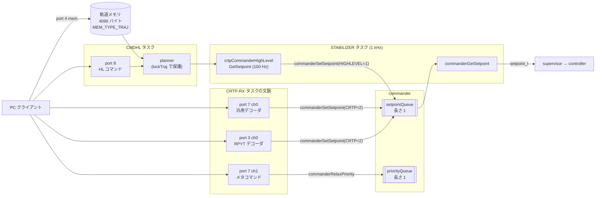
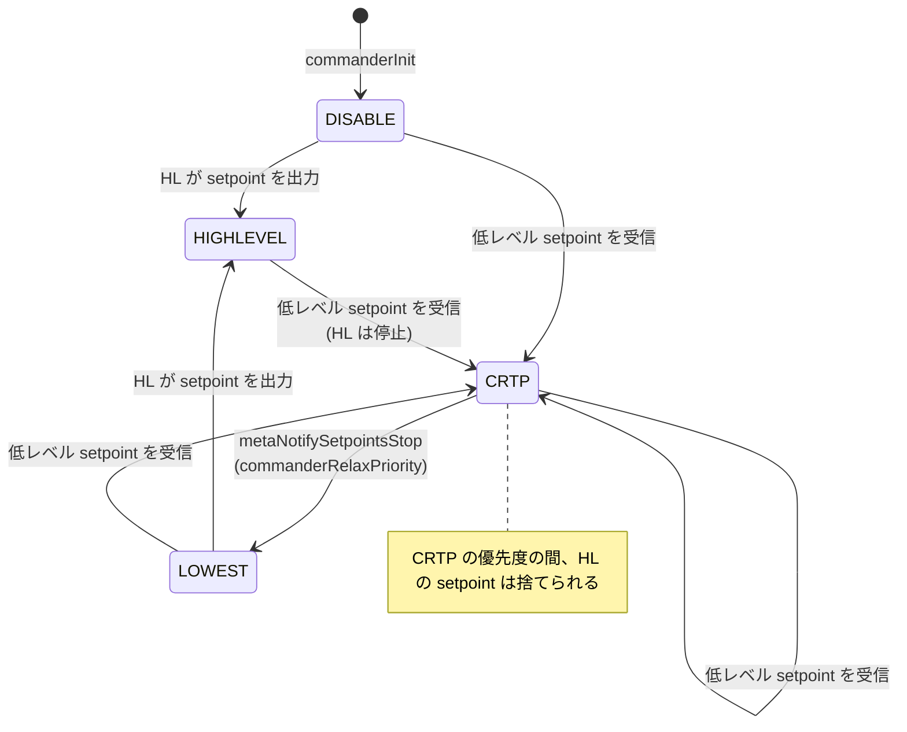

# 目標値（setpoint）の経路

## 概要
目標値（`setpoint_t`）は複数の入力元から `commander` に集まり、**優先度つきの 1 要素の上書きキュー**に保持される。
スタビライザループは毎周期そこから最新の setpoint を peek して使う。

入力元は 3 種類ある。
- **低レベル commander**: PC が CRTP で setpoint を連続送信する。
- **high-level commander**: 機体内のプランナが、離陸・移動・着陸・軌道を多項式で生成する。
- **外部受信機（extrx）**: CPPM など。cf2 では生成されない（[../01_runtime/tasks.md](../01_runtime/tasks.md)）。

優先度の高い入力元が 1 回でも setpoint を書き込むと、それ以下の優先度の入力元は無視される。これは明示的に「優先度を緩める」まで続く。

## 構成ファイル
| ファイル | 役割 |
|---|---|
| `src/modules/src/commander.c` | setpoint と優先度の保持、優先度の判定 |
| `src/modules/src/crtp_commander.c` | CRTP port 3 / 7 の受信コールバックと、メタコマンド |
| `src/modules/src/crtp_commander_rpyt.c` | port 3（旧形式 roll/pitch/yaw/thrust）のデコード |
| `src/modules/src/crtp_commander_generic.c` | port 7（汎用 setpoint、12 種類）のデコード |
| `src/modules/src/crtp_commander_high_level.c` | port 8 のコマンド処理、プランナの駆動、軌道メモリ |
| `src/modules/src/planner.c`, `pptraj.c`, `pptraj_compressed.c` | 軌道の生成と評価（7 次多項式） |
| `src/modules/src/extrx.c` | 外部受信機からの setpoint（cf2 では無効） |

## ブロック図

根拠: `src/modules/src/crtp_commander.c:47`〜`48`, `:111`〜`129`、`src/modules/src/crtp_commander_high_level.c:312`, `:345`〜`412`, `:473`、`src/modules/src/stabilizer.c:335`〜`338`

## 優先度の仕組み

| 優先度 | 定数 | 値 | 入力元 |
|---|---|---|---|
| 無効 | `COMMANDER_PRIORITY_DISABLE` | 0 | 起動直後の初期値 |
| 最低 | `COMMANDER_PRIORITY_LOWEST` / `COMMANDER_PRIORITY_HIGHLEVEL` | 1 | high-level commander |
| CRTP | `COMMANDER_PRIORITY_CRTP` | 2 | 低レベル commander（port 3 / 7） |
| 外部受信機 | `COMMANDER_PRIORITY_EXTRX` | 3 | extrx |

根拠: `src/modules/interface/commander.h:35`〜`41`

`commanderSetSetpoint(setpoint, priority)` の動作（`commander.c:74`〜`91`）:
1. 現在の優先度を peek する。
2. `priority >= 現在の優先度` のときだけ、setpoint に**現在時刻のタイムスタンプを付けて**上書きし、優先度も上書きする。それより低い優先度の入力は黙って捨てられる。
3. 書き込んだ優先度が HIGHLEVEL より高ければ、**high-level commander を停止**する（`crtpCommanderHighLevelStop()`）。プランナは現在の軌道を忘れる。

`commanderRelaxPriority()`（`commander.c:93`〜`98`）:
- 優先度を LOWEST（1）に戻し、high-level commander に現在の state を伝える（`crtpCommanderHighLevelTellState`）。これにより、ハイレベルの軌道が現在位置から滑らかに再開できる **（推測）**。
- PC からは port 7 ch1 のメタコマンド `metaNotifySetpointsStop` で呼び出す（`crtp_commander.c:97`〜`103`）。

## setpoint のタイムアウト
commander 自身はタイムアウトを判定しない。setpoint のタイムスタンプを使って、**supervisor** が判定する（`src/modules/src/supervisor.c:481`〜`487`）。

| setpoint の経過時間 | 条件ビット | 結果（→ `03_functions/supervisor.md`） |
|---|---|---|
| 500 ms 超 | `SUPERVISOR_CB_COMMANDER_WDT_WARNING` | 水平に保って高度を維持（`WarningLevelOut` 状態） |
| 2000 ms 超 | `SUPERVISOR_CB_COMMANDER_WDT_TIMEOUT` | モータ停止に向かう |

根拠: `supervisor.c:58`〜`59`, `:625`〜`635`

high-level commander は 100 Hz で setpoint を出し続けるので、HL で飛行中はタイムアウトしない。低レベル commander では、**PC が setpoint を送り続ける必要がある**。

## 入力元 1: 低レベル commander（port 3 / 7）

受信は `CRTP-RX` タスクの文脈で、コールバックとして即座に処理される（キューを経由しない）。

### port 3: 旧形式（RPYT）
roll / pitch / yaw / thrust を送る。param の `flightmode.*` によって、setpoint のモードが次のように変わる（`crtp_commander_rpyt.c:125`〜`230`, `:239`〜`279`）。

| param | 効果 |
|---|---|
| `flightmode.althold` | 推力の入力を z 方向の速度として解釈する（中央値 32767 が 0） |
| `flightmode.poshold` | roll/pitch の入力を x/y 方向の速度として解釈する |
| `flightmode.posSet` | 絶対位置を指定する |
| `flightmode.stabModeRoll` / `stabModePitch` / `stabModeYaw` | 各軸を角度（ANGLE）または角速度（RATE）で解釈する |
| `flightmode.yawMode` | ヨーの基準（**（推測）** 機体座標かワールド座標か） |

**推力ロック**（`crtp_commander_rpyt.c:130`〜`141`）: commander の優先度が DISABLE（= 起動後に一度も setpoint を受けていない）の間は推力がロックされる。**推力 0 のパケットを一度受け取るまで**、推力は 0 として扱われる。起動直後にジョイスティックが倒れたままでも、急に回り出さないための安全策である。

### port 7: 汎用 setpoint
チャネル 0 の先頭バイトで種類を指定する（`crtp_commander_generic.c` の `enum packet_type`）。

| 値 | 種類 | 値 | 種類 |
|---|---|---|---|
| 0 | `stopType`（停止） | 6 | `fullStateType`（位置・速度・加速度・姿勢・角速度） |
| 1 | `legacyVelocityWorldType` | 7 | `positionType`（位置 + ヨー） |
| 2 | `legacyZDistanceType` | 8 | `velocityWorldType`（ワールド座標の速度） |
| 3 | `cppmEmuType`（CPPM の模擬） | 9 | `zDistanceType` |
| 4 | `altHoldType` | 10 | `hoverType`（水平速度 + 高度） |
| 5 | `legacyHoverType` | 11 | `manualType` |

チャネル 1 はメタコマンドで、現在は `metaNotifySetpointsStop`（0）だけが定義されている（`crtp_commander.c:82`〜`108`）。

## 入力元 2: high-level commander（port 8）

### コマンド
port 8 のパケットは `CMDHL` タスクがキューから取り出して処理する（`crtp_commander_high_level.c:470`〜`485`）。

| 値 | コマンド | 備考 |
|---|---|---|
| 0 | `COMMAND_SET_GROUP_MASK` | 非推奨（param `hlCommander.groupmask` を使う） |
| 1, 2 | `COMMAND_TAKEOFF`, `COMMAND_LAND` | 非推奨（`_2` を使う） |
| 3 | `COMMAND_STOP` | |
| 4 | `COMMAND_GO_TO` | 非推奨 |
| 5 | `COMMAND_START_TRAJECTORY` | 非推奨 |
| 6 | `COMMAND_DEFINE_TRAJECTORY` | 軌道メモリ上の位置と区間数を登録 |
| 7, 8 | `COMMAND_TAKEOFF_2`, `COMMAND_LAND_2` | |
| 9, 10 | `COMMAND_TAKEOFF_WITH_VELOCITY`, `COMMAND_LAND_WITH_VELOCITY` | |
| 11 | `COMMAND_SPIRAL` | |
| 12 | `COMMAND_GO_TO_2` | |
| 13 | `COMMAND_START_TRAJECTORY_2` | |

複数機での使い分けのため、コマンドにはグループマスクがあり、自機のグループに含まれるコマンドだけを実行する **（推測: `isInGroup` の存在から）**。

### 軌道メモリ
- PC は CRTP の mem ポート（port 4）で、軌道データ（多項式の区間の列）を `trajectories_memory`（4096 バイト）に書き込む。メモリの種類は `MEM_TYPE_TRAJ`（`crtp_commander_high_level.c:84`〜`89`, `:117`〜`122`, `:308`）。
- `COMMAND_DEFINE_TRAJECTORY` で、メモリ上のオフセットと区間数を軌道 ID に対応づけ、`COMMAND_START_TRAJECTORY_2` で実行する（`:1028`〜`1033`）。
- 形式は通常の多項式（`pptraj.c`）と圧縮形式（`pptraj_compressed.c`）の 2 種類（→ `docs/functional-areas/trajectory_formats.md`）。

### setpoint の生成
`STABILIZER` タスクから 100 Hz で `crtpCommanderHighLevelGetSetpoint()` が呼ばれる（`crtp_commander_high_level.c:345`〜`412`）。
1. `lockTraj` の下で `plan_current_goal()` により、現在時刻の目標（位置・速度・加速度・ヨーなど）を評価する。
2. プランナが無効なら何も出さない。停止中ならヌルの setpoint を返す。
3. 有効な評価結果があれば、x/y/z を絶対位置（`modeAbs`）、yaw を絶対角、roll/pitch を無効にした setpoint を作り、`commanderSetSetpoint(HIGHLEVEL)` で commander に渡す（`stabilizer.c:335`〜`336`）。
4. supervisor が飛行不可と判定している間は、HL の setpoint を commander に渡さない（`stabilizer.c:335` の `canFly &&`）。

## 入力元 3: 外部受信機（extrx）
- CPPM などの RC 受信機の信号を setpoint に変換し、最高の優先度（3）で書き込む（`src/modules/src/extrx.c:264`）。
- cf2 では、`extRxInit()` を呼ぶ CPPM デッキがビルドされないので動作しない。

## 設定・パラメータ

| 種別 | 名前 | 説明 |
|---|---|---|
| param | `flightmode.althold` / `poshold` / `posSet` / `yawMode` / `stabModeRoll` / `stabModePitch` / `stabModeYaw` | RPYT の解釈 |
| param | `hlCommander.vtoff` / `vland` | 離陸・着陸の既定速度 |
| param | `hlCommander.groupmask` | 自機のグループ |
| param | `commander.enHighLevel` | 非推奨。何の効果もない（`commander.c:149`〜`157`） |
| log | `ctrltarget.*` / `ctrltargetZ.*` | スタビライザが使った setpoint |

## 公式ドキュメントとの差異
- `docs/functional-areas/sensor-to-control/commanders_setpoints.md` との詳細な照合は未実施。

## 未解決事項
- 低レベル commander から HL に戻るには、`commanderRelaxPriority()` の呼び出しが必要だが、cflib がどの操作でメタコマンドを送るかは、ファームウェアの範囲外なので未確認。
- `commanderSetSetpoint` は「potential race but without effect on functionality」とコメントされている（`commander.c:83`）。setpoint と優先度の 2 つのキューを別々に上書きするので、2 つの入力元がほぼ同時に書き込むと、setpoint と優先度が別の入力元のものになりうる。影響の評価は未実施。
- `yawModeUpdate()`（`crtp_commander_rpyt.c:221`）の各モードの意味は未確認。
- 各 HL コマンドのパケット形式は [../04_interfaces/crtp_ports.md](../04_interfaces/crtp_ports.md) にまとめた。`COMMAND_SPIRAL` の軌道生成の中身は未確認。
