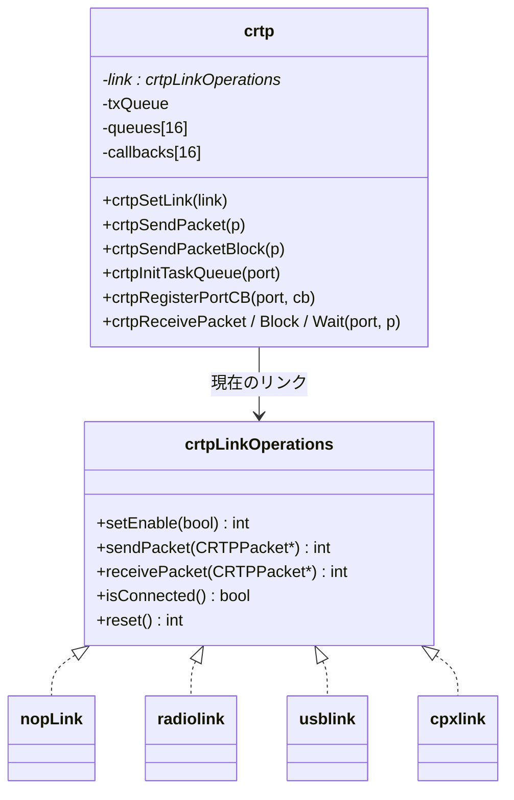

# 通信スタックの実装（CRTP ルータ・リンク・コンソール）

## 概要
本書は、通信の各層のモジュールの内部実装をまとめる。
経路の全体像（syslink、無線・USB・CPX、CRTP のポート）は [../02_dataflow/communication.md](../02_dataflow/communication.md) に、タスクとキューの構成は [../01_runtime/tasks.md](../01_runtime/tasks.md) にある。

## 構成ファイル
| 層 | ファイル | 役割 |
|---|---|---|
| ルータ | `src/modules/src/crtp.c` | リンクの抽象化、ポートへの振り分け、送信キュー、統計 |
| リンク | `src/hal/src/radiolink.c`, `usblink.c`, `src/modules/src/cpx/cpxlink.c` | `struct crtpLinkOperations` の実装 |
| syslink | `src/hal/src/syslink.c`, `src/drivers/src/uart_syslink.c` | nRF51 との UART 通信 |
| サービス | `src/modules/src/crtpservice.c`, `platformservice.c`, `console.c` | link / platform / console ポート |
| デバッグ出力 | `src/utils/interface/debug.h`, `src/utils/src/eprintf.c` | `DEBUG_PRINT` の出力先の切り替え |

## リンクの抽象化

根拠: `src/modules/interface/crtp.h:166`〜`175`、`src/modules/src/crtp.c:50`〜`56`

- 初期状態のリンクは何もしない `nopLink`。`CRTP-TX` / `CRTP-RX` タスクは、リンクが `nopLink` の間は 10 ms ごとに待つ（`crtp.c:149`〜`166`, `:176`〜`198`）。
- `commInit()` で radiolink が設定される（`src/modules/src/comm.c:59`）。

## ポートの受信方式
各ポートには、キュー（`crtpInitTaskQueue`）とコールバック（`crtpRegisterPortCB`）の片方または両方を登録できる。コールバックはポートごとに 1 つだけで、後から登録したものが有効になる（`crtp.h:103` の注記）。

| 方式 | 実行される文脈 | 向いている処理 | 使っているポート |
|---|---|---|---|
| コールバック | `CRTP-RX` タスク | 短く、遅延させたくない処理 | 3, 6, 7, 9（コマンド） |
| キュー | 各ポートのタスク | 時間がかかる処理、応答を返す処理 | 2, 4, 5, 8, 9（情報）, 13, 15 |

## 送信
| API | キューが満杯のとき | 使っているモジュール |
|---|---|---|
| `crtpSendPacket()` | 待たずに失敗を返す | console、localization、supervisor、lighthouse の送信、log、param、platform |
| `crtpSendPacketBlock()` | 空くまで待つ | high-level commander、localization、mem、link サービス、log、param、platform |

根拠: `crtp.c:210`〜`223`、各モジュールでの呼び出し

- 送信キュー（長さ 200）は全ポートで共有され、**優先度の区別はない**。log のデータが大量に溜まると、param の応答なども待たされる **（推測）**。

## 統計
- 受信数と送信数から、1 秒ごとに受信率と送信率 [パケット/秒] を計算し、log の `crtp.rxRate` / `crtp.txRate` で見られる（`crtp.c:263`〜`283`）。

## コンソール（port 0）
- `DEBUG_PRINT` は、既定では `consolePrintf()` を経由して CRTP の console ポートに出力される（`src/utils/interface/debug.h:66`）。Kconfig などで UART1、SWO、Segger RTT に切り替えられる（`:33`〜`64`）。
- `consolePutchar()` は 1 文字ずつバッファ（30 バイト = 1 パケット分）に溜め、改行かバッファが満杯になったらパケットとして送る（`src/modules/src/console.c:92`〜`133`）。
- CRTP の送信キューの空きが 1 個だけのときは、`<F>` の印を付けて送り、以後の出力が失われたことを示す（`:120`〜`123`, `:49`）。
- ISR からも出力できる（`consolePutcharFromISR`）。
- `consoleInit()` は `systemInit()` の早い段階で呼ばれるが、実際に送られるのはリンクが設定されてからになる **（推測: それまでは送信キューに溜まる）**。

## link サービス / platform サービス
[../02_dataflow/communication.md](../02_dataflow/communication.md) を参照。

## 未解決事項
- `crtpReset()`（`crtp.c:226`〜`232`）の呼び出し元と、リセットの契機は未確認。
- 送信キューに優先度がない点が、実際に param の応答遅延などを起こすかは未評価。
- 各リンク（usblink、cpxlink）の `isConnected()` の判定方法は未確認。
