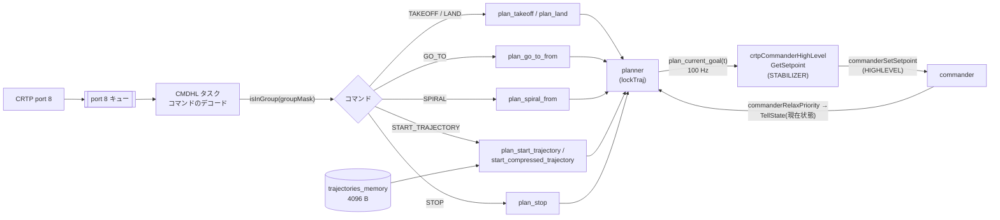
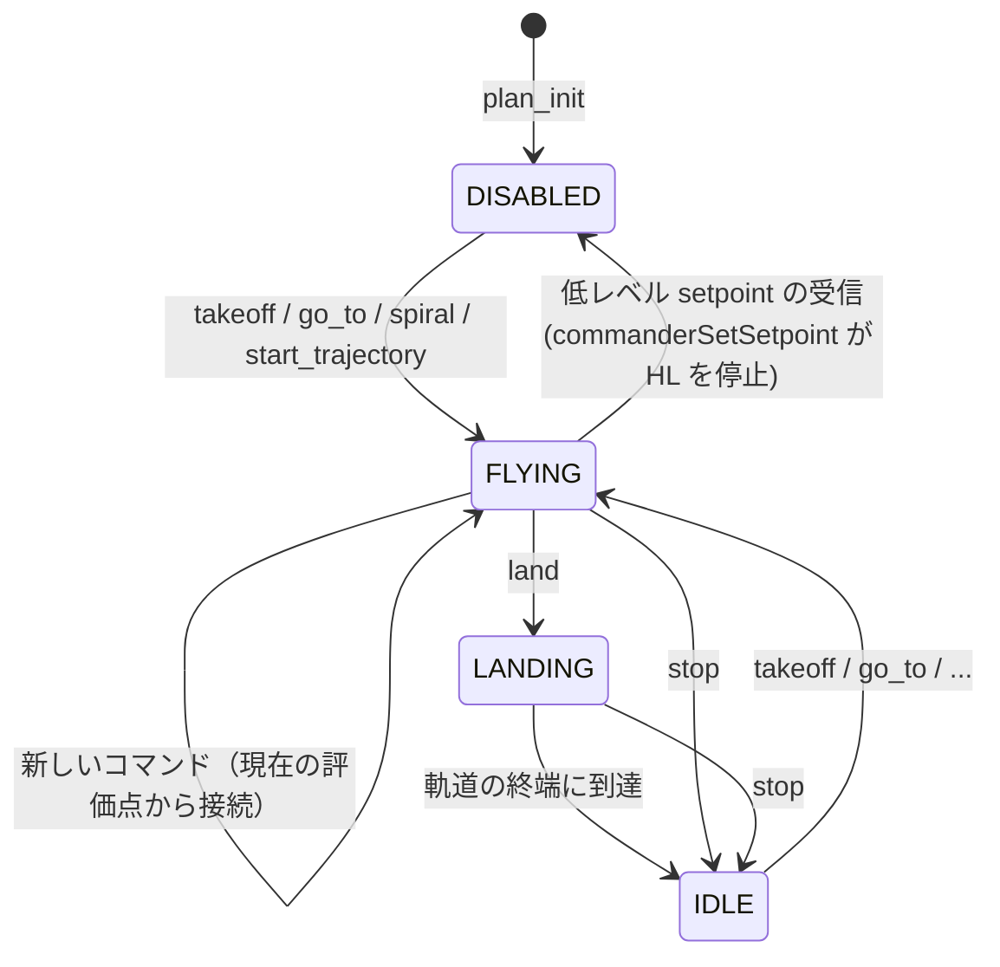

# コマンダ（commander / high-level commander / planner）

## 概要
コマンダは、setpoint を作って保持する機能群である。
- **commander**: 複数の入力元の setpoint を優先度つきで保持する。
- **低レベル commander**: CRTP の setpoint パケットをデコードする。
- **high-level commander（HL）**: 離陸・着陸・移動・軌道追従のコマンドを受け、planner で軌道を作り、100 Hz で setpoint を出す。
- **planner**: 7 次多項式の区間軌道を生成・評価する。

setpoint の経路と優先度の仕組みは [../02_dataflow/setpoint.md](../02_dataflow/setpoint.md) にまとめたので、本書では HL と planner の内部を中心に書く。

## 構成ファイル
| ファイル | 役割 |
|---|---|
| `src/modules/src/commander.c` | setpoint と優先度の保持 |
| `src/modules/src/crtp_commander.c`, `crtp_commander_rpyt.c`, `crtp_commander_generic.c` | 低レベル commander |
| `src/modules/src/crtp_commander_high_level.c` | HL のコマンド処理、軌道メモリ、setpoint の生成 |
| `src/modules/src/planner.c` | 軌道の状態管理と生成（離陸・着陸・移動・らせん・軌道の開始） |
| `src/modules/src/pptraj.c` | 区間多項式の軌道（`piecewise_traj`）の評価と生成 |
| `src/modules/src/pptraj_compressed.c` | 圧縮形式の軌道の評価 |

## ブロック図

## planner の状態

| 状態 | 値 | 意味 | HL の出力 |
|---|---|---|---|
| `TRAJECTORY_STATE_IDLE` | 0 | モータ停止 | ヌルの setpoint（モータ停止） |
| `TRAJECTORY_STATE_FLYING` | 1 | 軌道を追従し、終端でホバリング | 軌道の評価点 |
| `TRAJECTORY_STATE_LANDING` | 3 | 軌道を追従し、終端でモータ停止 | 軌道の評価点 → 終端で IDLE |
| `TRAJECTORY_STATE_DISABLED` | 4 | setpoint を出さないが、モータ停止も要求しない | なし（他の入力元に任せる） |

根拠: `src/modules/interface/planner.h`（`enum trajectory_state`）、`src/modules/src/planner.c:100`〜`152`、`crtp_commander_high_level.c:345`〜`412`

- `plan_stop()` は IDLE に、`plan_disable()` は DISABLED にする。`commanderSetSetpoint()` で HL より高い優先度の setpoint が入ると `crtpCommanderHighLevelStop()` が呼ばれる（`commander.c:86`〜`89`）。
- supervisor の情報ビットには、HL の状態（飛行中、軌道の終了、無効）が含まれる（`supervisor.c:570`〜`580`）。

## 軌道の生成
- 離陸・着陸（`plan_takeoff_or_landing`）と移動（`plan_go_to_from`）は、**現在の評価点（位置・速度・加速度）から目標点まで、ジャークなしの 7 次多項式 1 区間**で結ぶ（`planner.c:45`〜`55`, `:184`〜`206`）。飛行中にコマンドを受けても、軌道が滑らかにつながる。
- 軌道の開始（`plan_start_trajectory`）は、PC がアップロードした区間多項式の列を使う。反転・相対位置・相対ヨーの指定ができる（`planner.h:122`）。
- 軌道の形式は `TRAJECTORY_TYPE_PIECEWISE`（通常）と `TRAJECTORY_TYPE_PIECEWISE_COMPRESSED`（圧縮）の 2 種類（`planner.c:130`〜`145`）。

## HL の「現在位置」
- HL は、コマンドの起点として内部の `pos` / `yaw` を持つ（`crtp_commander_high_level.c:316`〜`401`）。
  - planner が動いている間は、直前の評価点（`ev.pos`）。
  - `commanderRelaxPriority()` で低レベルから戻るときは、`crtpCommanderHighLevelTellState()` で渡された推定状態（`:330`〜`333`）。
  - planner が止まっている間は、スタビライザから渡される推定状態（`:360`）**（推測）**。

## 設定・パラメータ

| 種別 | 名前 | 説明 |
|---|---|---|
| param | `hlCommander.vtoff` / `vland` | `TAKEOFF_WITH_VELOCITY` / `LAND_WITH_VELOCITY` の既定速度 |
| param | `hlCommander.groupmask` | 自機のグループマスク |
| param | `flightmode.*` | 低レベル commander（RPYT）の解釈（→ [setpoint.md](../02_dataflow/setpoint.md)） |
| メモリ | `MEM_TYPE_TRAJ` | 軌道メモリ（4096 バイト） |

## 公式ドキュメントとの差異
- `docs/functional-areas/trajectory_formats.md` との照合は未実施。

## 未解決事項
- `COMMAND_SPIRAL` の軌道生成の詳細は未確認。
- 軌道が 4096 バイトに収まらない場合の扱い（エラー応答の有無）は未確認。
