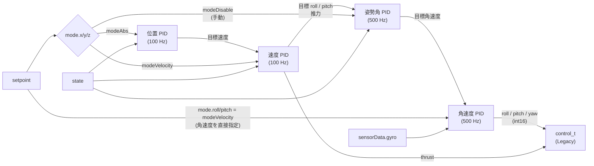

# 制御（controller）

## 概要
setpoint（目標）、state（推定状態）、sensorData（センサ値）から、制御出力 `control_t` を計算する。
コントローラは 5 種類と Out-of-tree の枠があり、関数ポインタのテーブルで切り替える。既定は PID。

| コントローラ | 出力モード | 構成 | 主なファイル |
|---|---|---|---|
| PID | `controlModeLegacy` | 位置 → 速度 → 姿勢角 → 角速度 のカスケード PID | `controller_pid.c`, `position_controller_pid.c`, `attitude_pid_controller.c` |
| Mellinger | `controlModeLegacy` | 微分平坦性に基づく幾何学的制御 | `controller_mellinger.c` |
| INDI | `controlModeLegacy` | 増分非線形動的逆変換（位置は `position_controller_indi.c`） | `controller_indi.c` |
| Brescianini | `controlModeForceTorque` | 姿勢の幾何学的制御 | `controller_brescianini.c` |
| Lee | `controlModeForceTorque` | SE(3) 上の幾何学的制御 | `controller_lee.c` |

根拠: 各ファイルの `control->controlMode = ...`（`controller_pid.c:79`, `controller_mellinger.c:133`, `controller_indi.c:150`, `controller_brescianini.c:404`, `controller_lee.c:179`）

## 構成ファイル
| ファイル | 役割 |
|---|---|
| `src/modules/src/controller/controller.c` | 選択テーブル `controllerFunctions[]`、`controllerInit` / `controller()` の振り分け |
| `src/modules/src/controller/controller_*.c` | 各コントローラ |
| `src/modules/src/controller/position_controller_pid.c` | PID の位置・速度制御 |
| `src/modules/src/controller/attitude_pid_controller.c` | PID の姿勢角・角速度制御 |
| `src/utils/src/pid.c` | PID の演算部品（積分制限、D 項のフィルタ、フィードフォワード） |

## 選択と切り替え
- `controllerFunctions[]` の各項目は `init`, `test`, `update`, `name` を持つ（`controller.c:26`〜`35`）。
- `controllerInit(ControllerTypeAutoSelect)` は、Kconfig（`CONFIG_CONTROLLER_PID` など）で指定されていればそれを、なければ既定の PID を選ぶ（`controller.c:39`〜`62`）。
- param `stabilizer.controller` が変わると、スタビライザのループの先頭で `controllerInit()` が呼び直される（`stabilizer.c:235`〜`238`）。

## PID コントローラ

### カスケード構成

根拠: `src/modules/src/controller/controller_pid.c:74`〜`175`, `position_controller_pid.c:193`〜`265`

### 1 周の処理（`controllerPid`）
1. setpoint のモードが変わったら、PID を再初期化する（制御のショックを防ぐ）（`controller_pid.c:81`〜`83`）。
2. **500 Hz**: ヨーの目標を更新する。ヨーが角速度指定なら目標角を積分し、現在角から `yawMaxDelta` 以上離れないよう制限する（`:85`〜`113`）。
3. **100 Hz**: `positionController()` で、位置 → 速度 → 目標 roll / pitch と推力を計算する（`:115`〜`117`）。
   - 位置 PID の出力（目標速度）は `xVelMax` / `zVelMax` で制限される（`position_controller_pid.c:196`〜`200`）。
   - 速度 PID の出力の推力は `thrustBase`（ホバリングに必要な推力の目安）に足し込み、`thrustMin` 以上にする（`:236`〜`265`）。
4. **500 Hz**: 手動モード（z が無効なら setpoint の推力、x/y が無効なら setpoint の roll / pitch）を反映する。姿勢角 PID → 角速度 PID で roll / pitch / yaw の出力を計算する（`controller_pid.c:119`〜`149`）。
   - 角速度 PID には `sensors->gyro` を直接使う。pitch は `-gyro.y`（旧座標系の反転）、yaw の出力は符号を反転する（`:142`, `:149`）。
5. 推力が 0 なら、roll / pitch / yaw も 0 にする（`:161`〜`168`）。

## 設定・パラメータ

| 種別 | 名前 | 説明 |
|---|---|---|
| param | `stabilizer.controller` | 0: 自動（PID）、1: PID、2: Mellinger、3: INDI、4: Brescianini、5: Lee |
| param | `pid_attitude.*`, `pid_rate.*` | PID の姿勢角・角速度のゲイン、フィルタ |
| param | `posCtlPid.*`, `velCtlPid.*` | PID の位置・速度のゲイン、`thrustBase` / `thrustMin`（永続化可） |
| param | `ctrlMel.*`, `ctrlINDI.*`, `posCtrlIndi.*`, `ctrlAtt.*`, `ctrlLee.*` | 各コントローラのゲイン |
| log | `controller.*` | PID の出力（`cmd_thrust`, `cmd_roll` など）と角速度 |
| log | `pid_attitude.*`, `pid_rate.*`, `posCtl.*` | PID の内部値 |
| log | `ctrlMel.*`, `ctrlINDI.*`, `posCtrlIndi.*`, `ctrlLee.*` | 各コントローラの内部値 |

## 公式ドキュメントとの差異
- `docs/functional-areas/sensor-to-control/controllers.md` では 3 種類（PID、INDI、Mellinger）とされるが、ソースには Brescianini と Lee もある。

## 未解決事項
- Mellinger と INDI は `controlModeLegacy`（int16 の roll/pitch/yaw）を出力しており、Force / Torque の出力を使っていない。物理量から int16 への換算の方法は未確認。
- Brescianini と Lee の制御則、INDI の位置制御の詳細は未確認。
- 各コントローラが setpoint のどのモード（`modeAbs` / `modeVelocity` / `modeDisable`）の組み合わせに対応しているかの一覧は未作成。
- `thrustBase` の既定値（`PID_VEL_THRUST_BASE`）と、気圧で高度を保持するときの値（`PID_VEL_THRUST_BASE_BARO_Z_HOLD`）の使い分けの条件は未確認（`position_controller_pid.c:158`〜`160`）。
