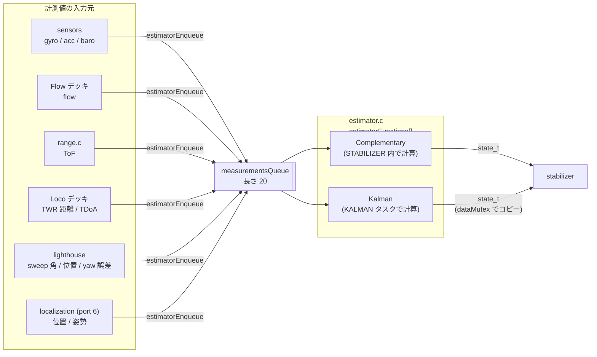
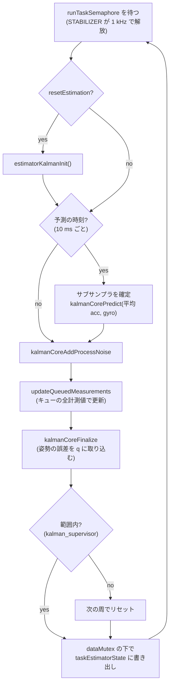

# 状態推定（estimator）

## 概要
センサとデッキの計測値から、機体の姿勢・位置・速度・加速度（`state_t`）を推定する。
推定器は切り替え可能な 4 種類（Complementary、Kalman、Error State UKF、Out-of-tree）で、共通のインタフェースと共通の計測値キューを持つ。

- **Complementary**: オンボードの IMU と気圧計（と ToF）だけで、姿勢と高度を推定する。軽量で、`STABILIZER` タスクの中で直接計算する。
- **Kalman（EKF）**: 位置・速度・姿勢の誤差を状態とする拡張カルマンフィルタ。Flow、Loco、Lighthouse、MoCap などの測位の計測値を統合する。計算は専用の `KALMAN` タスクで行う。
- **Error State UKF**: 実験的な実装。cf2 の既定ではビルドされない。

## 構成ファイル
| ファイル | 役割 |
|---|---|
| `src/modules/src/estimator/estimator.c` | 推定器の選択・切り替え、計測値キュー（`estimatorEnqueue` / `estimatorDequeue`） |
| `src/modules/src/estimator/estimator_complementary.c` | Complementary 推定器 |
| `src/modules/src/sensfusion6.c` | 姿勢の相補フィルタ（Mahony、`CONFIG_IMU_MAHONY_QUATERNION`） |
| `src/modules/src/estimator/position_estimator_altitude.c` | Complementary 用の高度推定 |
| `src/modules/src/estimator/estimator_kalman.c` | Kalman のタスク、計測値の振り分け、param / log |
| `src/modules/src/kalman_core/kalman_core.c` | EKF の本体（予測、更新、確定） |
| `src/modules/src/kalman_core/mm_*.c` | 計測モデル（12 種類） |
| `src/modules/src/outlierfilter/*.c` | TDoA と Lighthouse の外れ値フィルタ |
| `src/modules/src/kalman_supervisor.c` | 推定値が範囲外になったときのリセット判定 |
| `src/modules/src/axis3fSubSampler.c` | IMU の 1 kHz の値を予測周期（100 Hz）に平均する |

## ブロック図

## 推定器の選択
- `estimatorFunctions[]` に `init`, `deinit`, `test`, `update`, `name` を持つ項目が並ぶ（`estimator.c:59`〜`100`）。
- 選択の優先順位: デッキの要求 → Kconfig → 既定の Complementary（詳細は [../02_dataflow/control_loop.md](../02_dataflow/control_loop.md)）。
- `stateEstimatorSwitchTo()` は、新しい推定器を `init` してから古い推定器を `deinit` する（`estimator.c:108`〜`147`）。

## 計測値キュー
- `measurement_t` は種類（`MeasurementType*`）と共用体のデータを持つ。種類は TDoA、Position、Pose、Distance、TOF、AbsoluteHeight、Flow、YawError、SweepAngle、Gyroscope、Acceleration、Barometer の 12 種類（`src/modules/interface/estimator/estimator.h:47`〜`60`）。
- `estimatorEnqueue()` は ISR からも呼べる。実行中の割り込みがあるかを `SCB->ICSR` で判定し、`xQueueSendFromISR` と `xQueueSend(…, 0)` を使い分ける（`estimator.c:174`〜`189`）。
- キューが満杯なら**待たずに捨てる**。投入できた数と捨てた数の率を log の `estimator.rtApnd` / `estimator.rtRej` で見られる（`:191`〜`195`, `:265`〜`266`）。
- 投入のたびに、計測値の種類に応じた eventtrigger（`estTDOA` など）を発火する（`:197`〜`256`）。
- Complementary も Kalman も、毎周期 `estimatorDequeue()` でキューを空にする。

## Complementary 推定器
| 処理 | 周期 | 内容 | 根拠 |
|---|---|---|---|
| 計測値の取り出し | 1000 Hz | ジャイロ・加速度・気圧・ToF の最新値を保持 | `estimator_complementary.c:70`〜`88` |
| 姿勢 | 250 Hz | Mahony の相補フィルタ（`sensfusion6UpdateQ`）→ オイラー角とクォータニオン、重力を除いた z 加速度 | `:91`〜`110` |
| 高度 | 100 Hz | 気圧（と ToF）と z 加速度から高度と z 速度 | `:114`〜`115`, `position_estimator_altitude.c` |

- 水平位置と水平速度は推定しない **（推測: `positionEstimate` が z だけを扱うため）**。そのため、Complementary では位置制御は高度だけになる。

## Kalman 推定器（EKF）

### 状態ベクトル
| 添字 | 記号 | 内容 |
|---|---|---|
| 0〜2 | `KC_STATE_X`, `Y`, `Z` | 位置（ワールド座標）[m] |
| 3〜5 | `KC_STATE_PX`, `PY`, `PZ` | 速度（**機体座標**）[m/s] |
| 6〜8 | `KC_STATE_D0`, `D1`, `D2` | 姿勢の誤差（ベクトル）。確定時に基準のクォータニオン `q` に取り込み、0 に戻す |

根拠: `src/modules/interface/kalman_core/kalman_core.h`（`kalmanCoreStateIdx_t`）、`S[]`, `P[][]`, `R[3][3]`（`:80`〜`91`）

姿勢そのものはクォータニオン `q` と回転行列 `R` で持ち、状態ベクトルには誤差だけを入れる **error-state** 形式である。

### 1 周の処理（`KALMAN` タスク）

根拠: `src/modules/src/estimator/estimator_kalman.c:216`〜`287`

- **予測**は 100 Hz（`PREDICT_RATE`、`:119`）。その間の IMU の値（1 kHz）は `axis3fSubSampler` で平均される（`:351`〜`356`）。
- **更新**は計測値が届くたびに行う。予測より高い頻度で更新されることもある。
- **範囲外のリセット**: 位置が ±100 m、速度が ±10 m/s を超えたら、次の周で推定をリセットする（`src/modules/src/kalman_supervisor.c:34`〜`48`, `estimator_kalman.c:268`〜`275`）。
- 予測には「飛行中か」（`supervisorIsFlying()`）を渡す。**（推測）** 地上にいる間は、加速度による速度の積分を抑えるためと考えられる。

### 計測モデル
| 計測値 | 更新関数 | 計測モデルのファイル | 備考 |
|---|---|---|---|
| TDoA（Loco） | `kalmanCoreUpdateWithTdoa` / `RobustUpdateWithTdoa` | `mm_tdoa.c` / `mm_tdoa_robust.c` | 外れ値フィルタ `outlierFilterTdoa`。param `kalman.robustTdoa` でロバスト版 |
| 距離（Loco TWR） | `kalmanCoreUpdateWithDistance` / `RobustUpdateWithDistance` | `mm_distance.c` / `mm_distance_robust.c` | param `kalman.robustTwr` でロバスト版 |
| 位置（MoCap、Lighthouse の簡易法） | `kalmanCoreUpdateWithPosition` | `mm_position.c` | |
| 位置と姿勢（MoCap） | `kalmanCoreUpdateWithPose` | `mm_pose.c` | |
| ToF（高さ） | `kalmanCoreUpdateWithTof` | `mm_tof.c` | 機体の傾きを考慮 **（推測）** |
| 絶対高度 | `kalmanCoreUpdateWithAbsoluteHeight` | `mm_absolute_height.c` | |
| オプティカルフロー | `kalmanCoreUpdateWithFlow` | `mm_flow.c` | 最新のジャイロ値を使う |
| ヨー誤差（Lighthouse） | `kalmanCoreUpdateWithYawError` | `mm_yaw_error.c` | |
| スイープ角（Lighthouse） | `kalmanCoreUpdateWithSweepAngles` | `mm_sweep_angles.c` | 外れ値フィルタ `outlierFilterLighthouse` |
| 気圧 | `kalmanCoreUpdateWithBaro` | `kalman_core.c` | `useBaroUpdate` が真のときだけ |
| ジャイロ・加速度 | （サブサンプラに蓄積） | — | 予測の入力 |

根拠: `estimator_kalman.c:306`〜`363`

すべての更新は、最終的にスカラーの更新 `kalmanCoreScalarUpdate()` に帰着する（`kalman_core.h:192`）。

## 設定・パラメータ

| 種別 | 名前 | 説明 |
|---|---|---|
| Kconfig | `CONFIG_ESTIMATOR_KALMAN_ENABLE` | y（Kalman をビルド） |
| Kconfig | `CONFIG_ESTIMATOR_OUTLIER_FILTERS` | y |
| Kconfig | `CONFIG_ESTIMATOR_KALMAN_INITIAL_YAW_STD` | 10 |
| Kconfig | `CONFIG_IMU_MAHONY_QUATERNION` | y（Complementary の姿勢フィルタ。代わりに Madgwick も選べる） |
| param | `stabilizer.estimator` | 推定器の選択 |
| param | `kalman.resetEstimation` | 1 で推定をリセット |
| param | `kalman.robustTdoa`, `kalman.robustTwr` | ロバスト版の更新を使う |
| param | `kalman.pNAcc_xy` / `pNAcc_z` / `pNVel` / `pNPos` / `pNAtt` | プロセスノイズ（永続化可） |
| param | `kalman.mNBaro` / `mNGyro_rollpitch` / `mNGyro_yaw` | 計測ノイズ（永続化可） |
| param | `kalman.initialX` / `Y` / `Z` / `initialYaw` | 初期位置・ヨー |
| param | `kalman.dragB_x` / `y` / `z`, `kalman.cop_x` / `y` / `z` | 空気抵抗と圧力中心のモデル（永続化可） |
| log | `kalman.*` | 状態と分散 |
| log | `outlierf.*` | 外れ値フィルタの統計 |
| log | `estimator.rtApnd` / `estimator.rtRej` | 計測値キューへの投入と破棄の率 |
| log | `posEstAlt.*` | Complementary の高度推定 |

根拠: `estimator_kalman.c:410`〜`617`, `estimator.c:264`, `position_estimator_altitude.c:124`

## 公式ドキュメントとの差異
- `docs/functional-areas/sensor-to-control/state_estimators.md` では推定器は 2 種類とされるが、ソースには Error State UKF と Out-of-tree の枠がある（→ [../00_overview/architecture.md](../00_overview/architecture.md)）。

## 未解決事項
- `useBaroUpdate` を切り替える param（またはデッキ）の特定は未実施。
- 速度が機体座標である点（`PX`〜`PZ`）は Kalman の実装の一般的な形からの判断で、`kalman_core.c` の予測式での確認は未実施。
- Complementary が水平位置を扱わないことの確認（`position_estimator_altitude.c` の中身）は未実施。
- 計測値キューが満杯になる頻度（log `estimator.rtRej`）は、実機がないので未評価。IMU だけで 1 kHz × 2〜3 件が入るので、長さ 20 のキューは Kalman が約 7 ms 止まると溢れる計算になる **（推測）**。
