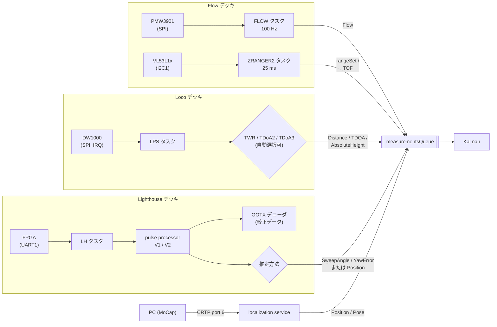

# 測位（Flow / Loco / Lighthouse / 外部測位）

## 概要
機体の位置を得る手段は 4 系統あり、いずれも計測値を推定器の計測値キュー（`estimatorEnqueue*`）に入れる形で統合される。
位置を扱える推定器は Kalman だけなので、Flow・Loco・Lighthouse のデッキは、ドライバの定義で Kalman を要求する（[estimator.md](estimator.md)）。

| 系統 | センサ | 計測値 | 推定器への入力 |
|---|---|---|---|
| Flow | オプティカルフロー（PMW3901）+ 下向き ToF | 画素の移動量、床までの距離 | `Flow`, `TOF` |
| Loco（LPS） | UWB（DW1000）とアンカー | 距離（TWR）、到達時間差（TDoA2 / TDoA3） | `Distance`, `TDOA`, `AbsoluteHeight` |
| Lighthouse | 赤外線受光（デッキの FPGA）とベースステーション | スイープ角、または交差ビームで求めた位置 | `SweepAngle`, `YawError`, `Position` |
| 外部測位 | モーションキャプチャなど（PC 経由） | 位置、位置と姿勢 | `Position`, `Pose` |

## 構成ファイル
| 系統 | ファイル |
|---|---|
| Flow | `src/deck/drivers/src/flowdeck_v1v2.c`, `src/drivers/src/pmw3901.c`, `src/modules/src/range.c`, `src/deck/drivers/src/zranger*.c` |
| Loco | `src/deck/drivers/src/locodeck.c`, `lpsTwrTag.c`, `lpsTdoa2Tag.c`, `lpsTdoa3Tag.c`, `src/utils/src/tdoa/*.c`, `src/modules/src/tdoaEngineInstance.c`, `vendor/libdw1000` |
| Lighthouse | `src/deck/drivers/src/lighthouse.c`, `src/modules/src/lighthouse/*.c`, `src/utils/src/lighthouse/*.c` |
| 外部測位 | `src/modules/src/crtp_localization_service.c`, `src/modules/src/peer_localization.c` |
| 共通 | `src/modules/src/outlierfilter/*.c`（TDoA と Lighthouse の外れ値除去） |

## ブロック図

## Flow
- `FLOW` タスクが 10 ms ごとに PMW3901 から移動量を読み、`flowMeasurement_t`（x / y の画素数、標準偏差、積算時間）を作る（`flowdeck_v1v2.c:82`〜`164`）。
- 画質のしきい値（`motion == 0xB0`）を満たし、param `motion.disable` が 0 のときだけ推定器に入れる（`:157`〜`158`）。
- 下向きの距離は ToF センサ（Flow v2 は VL53L1x）が `range.c` 経由で `TOF` として推定器に入れる。Kalman の Flow のモデルは、この高さを使って画素の移動量を速度に換算する **（推測）**。
- Flow v2 のドライバは、ToF センサを自分で扱わず、Z-ranger v2 のドライバを名前で検索して、その `init` / `test` を呼ぶ（`deckFindDriverByName("bcZRanger2")`、`flowdeck_v1v2.c:212`〜`240`）。そのため Flow v2 を付けると `ZRANGER2` タスクも動く。

## Loco（LPS）
- `LPS` タスクが DW1000 の割り込み（タスク通知）とタイムアウトで動き、選択中のアルゴリズムのイベント処理を呼ぶ（`locodeck.c:398`〜`441`）。
- アルゴリズムは TWR、TDoA2、TDoA3 の 3 種類。`lpsMode_auto` では、パケットを受信できるモードが見つかるまで、一定周期でモードを順に切り替えて探す（`locodeck.c:98`〜`120`, `:304`〜`354`）。cf2 の既定は `CONFIG_DECK_LOCO_ALGORITHM_AUTO`。
- アンカーの位置は、アンカーからの LPP パケット、または PC から CRTP port 6 の `LPS_SHORT_LPP_PACKET` で得る。
- TDoA の計測値は外れ値フィルタ（`outlierFilterTdoa`）を通して Kalman に入る。param `kalman.robustTdoa` でロバスト版の更新を使える。

## Lighthouse
- `LH` タスクが UART1（230400 bps）でデッキの FPGA からフレーム（受光センサごとのパルスの幅とタイミング）を受け取る（`lighthouse_core.c:572`〜`631`）。
- pulse processor がパルスからベースステーションごとの角度を求める。V1（Vive）と V2 の 2 系統があり、param `lighthouse.systemType` で切り替える（`:139`, `:228`〜`238`）。
- OOTX デコーダが、ベースステーションが送る較正データを復号する（`:484`〜`500`）。
- 推定方法は param `lighthouse.method` で選ぶ（`:371`〜`373`, `:460`）。
  - **1（既定）: スイープ角**。角度を直接 Kalman に入れる（`lighthousePositionEstimatePoseSweeps`）。
  - **0: 交差ビーム**。2 台のベースステーションの角度から機体内で位置を計算して `Position` として入れる（`lighthousePositionEstimatePoseCrossingBeams`）。`CONFIG_DECK_LIGHTHOUSE_AS_GROUNDTRUTH` のときの既定。
- ベースステーションの位置（ジオメトリ）と較正データは、永続ストレージ（EEPROM）にキー付きで保存され、起動時に読み込まれる（`lighthouse_storage.c:65`〜`152`）。PC からは mem（`MEM_TYPE_LH`）と CRTP port 6 の `LH_PERSIST_DATA` で書き込む。保存は `WORKER` タスクで非同期に行う。

## 外部測位（localization service、CRTP port 6）
| 種類 | 内容 | 推定器への入力 |
|---|---|---|
| `EXT_POSITION`（チャネル 0） | 位置 | `Position`（標準偏差は param `locSrv.extPosStdDev`、既定 0.01 m） |
| `EXT_POSITION_PACKED` | 複数機の位置をまとめたもの。自機の ID 以外は `peerLocalization` に渡す | `Position` |
| `EXT_POSE` / `EXT_POSE_PACKED` | 位置と姿勢（クォータニオン） | `Pose` |
| `LPS_SHORT_LPP_PACKET` | Loco のアンカーへの LPP の中継 | — |
| `EMERGENCY_STOP` / `EMERGENCY_STOP_WATCHDOG` | 緊急停止、緊急停止ウォッチドッグの通知 | — （supervisor へ） |
| `LH_PERSIST_DATA` | Lighthouse のデータの永続化 | — |
| `RANGE_STREAM_*` / `LH_ANGLE_STREAM` など | 機体から PC への計測値のストリーム | — |

根拠: `src/modules/interface/crtp_localization_service.h`、`src/modules/src/crtp_localization_service.c:181`〜`366`

- 他の機体の位置は、周辺機体の位置テーブル（`peer_localization.c`）に保存され、衝突回避（`collision_avoidance.c`）が使う。このテーブルは最大 10 機分の位置と受信時刻を保管するだけで、位置の推定はしない（`peer_localization.c:20`〜`35`、`peer_localization.h:16`）。

## 設定・パラメータ

| 種別 | 名前 | 説明 |
|---|---|---|
| Kconfig | `CONFIG_DECK_FLOW`, `CONFIG_DECK_LOCO`, `CONFIG_DECK_LIGHTHOUSE` | y |
| Kconfig | `CONFIG_DECK_LOCO_ALGORITHM_AUTO`, `CONFIG_DECK_LOCO_NR_OF_ANCHORS`（8） | Loco |
| Kconfig | `CONFIG_DECK_LIGHTHOUSE_MAX_N_BS`（4） | Lighthouse のベースステーション数 |
| param | `motion.disable`, `motion.flowStdFixed` | Flow（`flowdeck_v1v2.c:309`〜`321`） |
| param | `loco.mode`, `loco.fwdToEstimator` | Loco のモードと、推定器への転送の有効化（`locodeck.c:791`〜`812`） |
| param | `locSrv.extPosStdDev` | 外部位置の標準偏差 |
| param | `deck.bcLoco`, `deck.bcDWM1000` など | デッキの検出状態（読み取り専用、`locodeck.c:690`〜`702`。各デッキのドライバが `deck` グループに追加する） |
| log | `motion.*`, `range.*`, `loco.*`, `ranging.*`, `lighthouse.*`, `ext_pos.*`, `locSrv.*` | 各系統の計測値と状態 |
| param | `lighthouse.method`, `lighthouse.systemType`, `lighthouse.bsCalibReset`, `lighthouse.bsAvailable` | Lighthouse |
| param | `locSrv.enRangeStreamFP32`, `locSrv.enLhAngleStream` ほか | 計測値のストリーム |

## 公式ドキュメントとの差異
- `docs/functional-areas/lighthouse/`、`loco-positioning-system/` との照合は未実施。

## 未解決事項
- Loco の各アルゴリズム（TWR、TDoA2、TDoA3）のメッセージの流れは未整理。
- Lighthouse のジオメトリ推定（ベースステーションの位置の求め方）は PC 側の処理と推測しており、ファームウェア内に推定処理があるかは未確認。
- `loco.fwdToEstimator` を 0 にしたときに Loco の計測値がどこへ行くか（ログのみか）は未確認。
