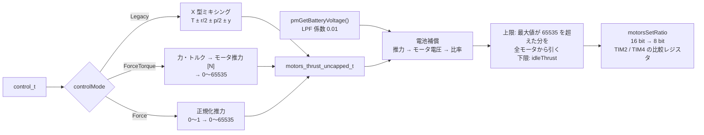

# 出力分配とモータ（power distribution / motors）

## 概要
コントローラの出力 `control_t` を 4 つのモータの PWM 比率に変換し、タイマの PWM で出力する。
処理は 4 段階: 分配（ミキシング）→ 電池電圧の補償 → 上限・下限の処理 → PWM 出力。
ループ内での位置づけは [../02_dataflow/control_loop.md](../02_dataflow/control_loop.md) を参照。

## 構成ファイル
| ファイル | 役割 |
|---|---|
| `src/modules/src/power_distribution_quadrotor.c` | クアッドロータの分配と上限処理（cf2 は `CONFIG_POWER_DISTRIBUTION_QUADROTOR`） |
| `src/modules/src/power_distribution_flapper.c` | 羽ばたき機用（cf2 ではビルドされない） |
| `src/modules/src/stabilizer.c` | 電池電圧のフィルタと、補償の呼び出し（`batteryCompensation`） |
| `src/drivers/src/motors.c` | 電池補償の計算、PWM 出力、ESC 関連（DShot、ビープ音） |
| `src/drivers/src/motors_def.c` | モータごとのピンとタイマの定義、機種ごとのモータの割り当て |
| `src/platform/interface/platform_defaults_cf2.h` | 推力モデルの定数（プロペラの種類ごと） |

## 処理の流れ

根拠: `src/modules/src/power_distribution_quadrotor.c:84`〜`190`、`src/modules/src/stabilizer.c:208`〜`261`、`src/drivers/src/motors.c:180`〜`222`, `:702`〜`753`

## 分配（ミキシング）
Legacy モード（PID、Mellinger、INDI）の式（`power_distribution_quadrotor.c:84`〜`93`）:

| モータ | 式 |
|---|---|
| M1 | `thrust - roll/2 + pitch/2 + yaw` |
| M2 | `thrust - roll/2 - pitch/2 - yaw` |
| M3 | `thrust + roll/2 - pitch/2 + yaw` |
| M4 | `thrust + roll/2 + pitch/2 - yaw` |

ForceTorque モード（Brescianini、Lee）では、アーム長 `ARM_LENGTH`（cf2: 0.046 m）と推力トルク比 `THRUST2TORQUE` を使って、各モータの力 [N] を求め、`THRUST_MAX` で正規化する。負の力は 0 にする（`:95`〜`117`）。

## 電池電圧の補償
- 電池電圧（`pmGetBatteryVoltage()`）に 1 次のローパスフィルタ（係数 0.01、1 kHz）をかける（`stabilizer.c:211`〜`213`）。
- モータごとに `motorsCompensateBatteryVoltage()` を呼ぶ（`motors.c:180`〜`222`）:
  1. 0〜65535 の推力指令を、推力 [N] に換算する（`× THRUST_MAX / 65535`）。
  2. `THRUST_MIN` 未満、または電池電圧が 2 V 未満なら 0 を返す。
  3. 「モータ電圧 → 推力」の 3 次多項式（係数 `VMOTOR2THRUST0`〜`3`）を逆に解いて、必要なモータ電圧を求める。
  4. 比率 = モータ電圧 ÷ 電池電圧 を 0〜65535 で返す。
- `CONFIG_ENABLE_THRUST_BAT_COMPENSATED` が無効なら、入力をそのまま返す。

### 推力モデルの定数（cf2）
プロペラの種類ごとに定数が切り替わる（`src/platform/interface/platform_defaults_cf2.h:56`〜`95`）。

| Kconfig | 用途 | `THRUST_MAX` | `THRUST_MIN` |
|---|---|---|---|
| `CONFIG_CRAZYFLIE_21_PLUS`（**cf2 の既定**） | 2.1+ のプロペラ | 0.12 N | 0.0128 N |
| `CONFIG_CRAZYFLIE_THRUST_UPGRADE_KIT` | 推力アップグレードキット | 0.18 N | 0.0192 N |
| `CONFIG_CRAZYFLIE_LEGACY_PROPELLERS` | 旧プロペラ | 0.12 N | 0.0128 N |

## 上限・下限の処理
- 4 モータの最大値が 65535 を超えたら、超過分を**全モータから同じだけ引く**（`power_distribution_quadrotor.c:160`〜`190`）。モータ間の差（= 姿勢を保つトルク）を保ち、総推力を犠牲にする。上限に当たったことは `CONFIG_LOG_MOTOR_CAP_WARNING` のとき警告される（`stabilizer.c:241`〜`253`）。
- 下限は `idleThrust`（cf2 の既定は 0）。0 より大きくするには、アームの仕組み（`CONFIG_MOTORS_REQUIRE_ARMING`）が必須（`:39`〜`46`）。

## PWM 出力（cf2: ブラシモータ）

| モータ | ピン | タイマ / チャネル | 根拠 |
|---|---|---|---|
| M1 | PA1 | TIM2 CH2 | `src/drivers/src/motors_def.c:29`, `:735`〜`741` |
| M2 | PB11 | TIM2 CH4 | `:51` |
| M3 | PA15 | TIM2 CH1 | `:73` |
| M4 | PB9 | TIM4 CH4 | `:95` |

- タイマのクロック 84 MHz、分解能 8 ビット（周期 255）、プリスケーラ 0。PWM 周波数は **約 328 kHz** **（推測: 84 MHz / 256 の計算値）**（`src/drivers/interface/motors.h:47`〜`50`）。
- `motorsSetRatio()` は 16 ビットの比率を 8 ビットに変換して比較レジスタに書く（`motors.c:146`, `:753`）。ブラシレスの場合は別の変換（`motorsBLConv16ToBits`）を使う（`:140`, `:748`）。
- 機種ごとのモータの割り当ては、`platform_cf2.c` の `motorMap`（`motorMapDefaultBrushed`）で決まる。

## モータの停止と試験
- `motorsStop()`: 全モータを `powerDistributionStopRatio()`（ブラシモータでは 0）にする（`motors.c:378`〜`391`）。supervisor がモータを許可しないとき、スタビライザが毎周期呼ぶ。
- `motorsTest()`: 起動時の自己テストで、各モータを短く回す（`motors.c:353`〜`376`）。
- `motorsBeep()` / `motorsPlayMelody()`: モータを音源として使う（`:837`〜`913`）。
- DShot（`CONFIG_MOTORS_ESC_PROTOCOL_DSHOT`）はブラシレスの機種用で、cf2 の既定では無効。

## motorPowerSet による上書き
`motorsSetRatio()` は、param `motorPowerSet.enable` が 0 以外のとき、引数の比率を無視して param の値を出力する（`motors.c:702`〜`738`, `:1028`〜`1056`）。

| `enable` | 動作 |
|---|---|
| 0 | 通常（上書きなし） |
| 1 | `motorPowerSet.m1`〜`m4` をそれぞれのモータに出力 |
| 2 | `m1` の値を全モータに出力 |
| 3 | `m1` の値を全モータに出力し、電池電圧の補償をかける（補償の試験用） |

**安全上の注意**: `motorsStop()` も内部で `motorsSetRatio()` を呼ぶ（`motors.c:378`〜`382`）。そのため、上書きが有効な間は、**supervisor がモータを禁止している状態（ロック、クラッシュなど）でも、param の値でモータが回る**。試験用の機能として意図的と考えられる **（推測）** が、PC から param 1 つでモータを回せる経路である。

## 設定・パラメータ

| 種別 | 名前 | 説明 |
|---|---|---|
| Kconfig | `CONFIG_POWER_DISTRIBUTION_QUADROTOR` | y |
| Kconfig | `CONFIG_ENABLE_THRUST_BAT_COMPENSATED` | y |
| Kconfig | `CONFIG_CRAZYFLIE_21_PLUS` | y（推力モデルの定数を選ぶ） |
| Kconfig | `CONFIG_MOTORS_ESC_PROTOCOL_ONESHOT125` | y（ブラシモータでは使われない **（推測）**） |
| param | `powerDist.idleThrust` | 下限（永続化可） |
| param | `motorPowerSet.enable`, `motorPowerSet.m1`〜`m4` | モータを直接駆動する試験用の上書き（下記「motorPowerSet による上書き」） |
| log | `motor.m1`〜`m4` | 出力した比率（`stabilizer.c:891`） |

## 公式ドキュメントとの差異
- `docs/functional-areas/pwm-to-thrust.md` と `battery_compensation.md` との数値の照合は未実施。

## 未解決事項
- `motorPowerSet` の上書きが supervisor の停止より優先される点（上記）が、意図された仕様かどうかは、ソースのコメントからは判断できない。
- ONESHOT125 の設定がブラシモータの出力に影響しないことの確認は未実施。
- M1〜M4 の機体上の位置と回転方向（ミキシングの符号との対応）は、ソースだけでは確認できない。
