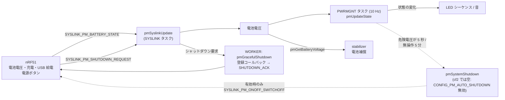
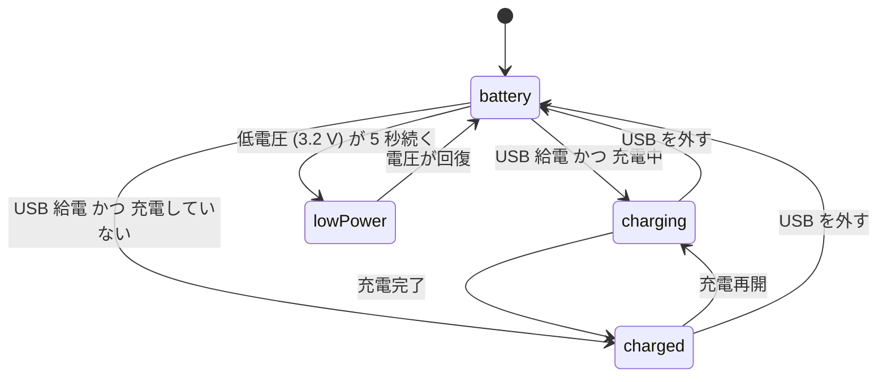

# 電源管理（pm）

## 概要
電池の電圧・充電状態は nRF51 が測定し、syslink で STM32 に送ってくる。
STM32 の `PWRMGNT` タスク（10 Hz）は、それをもとに電源状態（battery / charging / charged / lowPower）を判定し、LED と音で知らせる。
電池電圧は、スタビライザの電池補償（[power_distribution.md](power_distribution.md)）にも使われる。

**cf2 では、STM32 側からの自動電源オフ（危険電圧・無操作）は無効である。** `pmSystemShutdown()` の中身は `CONFIG_PM_AUTO_SHUTDOWN` が有効なときだけビルドされ、cf2 の既定では無効（`default n`）のため、判定の処理は動いても何もしない（`pm_stm32f4.c` の `pmSystemShutdown`、`src/hal/src/Kconfig` の `PM_AUTO_SHUTDOWN`）。電源を切るのは nRF51 の側（電源ボタンなど）である。

## 構成ファイル
| ファイル | 役割 |
|---|---|
| `src/hal/src/pm_stm32f4.c` | 電源状態の管理、`PWRMGNT` タスク、syslink の PM グループの受信、シャットダウン |
| `src/hal/interface/pm.h` | 状態（`PMStates`）と API |
| `src/platform/interface/platform_defaults_cf2.h` | 電圧のしきい値とタイムアウトの既定値 |
| `src/modules/src/system.c` | nRF51 への電源オフ要求（`systemRequestShutdown`） |

## ブロック図

## 電源状態

根拠: `src/hal/src/pm_stm32f4.c`（`pmUpdateState()`, `pmTask()` の `:402`〜`506`）、`platform_defaults_cf2.h:37`〜`43`

`PMStates` には `shutDown` も定義されているが、`pmUpdateState()` はこの状態に遷移しない。

| 状態 | LED / 音 | 継続中の処理 |
|---|---|---|
| `charging` | 充電中のシーケンス、USB 接続音 | 充電レベルを LED に表示 |
| `charged` | 充電完了のシーケンス、満充電音 | — |
| `lowPower` | 低電圧のシーケンス、低電圧音 | 危険電圧が 5 秒続いたら `pmSystemShutdown()` を呼ぶ（cf2 では何もしない） |
| `battery` | 充電シーケンスを止める、USB 切断音 | commander の無操作が 5 分続いたら `pmSystemShutdown()` を呼ぶ（cf2 では何もしない） |

- USB 給電中は低電圧でも `lowPower` にならない（`pmUpdateState()` のコメント）。
- API `pmIgnoreChargedState()` で、充電の状態を無視して常に `battery` として扱える（param ではない。呼び出し元は未確認）。

## シャットダウン
- **自発的なシャットダウン**（`pmSystemShutdown()`）: `CONFIG_PM_AUTO_SHUTDOWN` が有効なときだけ、`systemRequestShutdown()` で nRF51 に `SYSLINK_PM_ONOFF_SWITCHOFF` を送り、nRF51 が電源を切る。**cf2 の既定では無効**。
- **nRF51 からの要求**（電源ボタンなど）: `SYSLINK_PM_SHUTDOWN_REQUEST` を受けると、`WORKER` タスクで `pmGracefulShutdown()` を実行する。登録済みのコールバック（最大 5 個、`pmRegisterGracefulShutdownCallback`）を順に呼んでから `SYSLINK_PM_SHUTDOWN_ACK` を返す（`pm_stm32f4.c:291`、`pmGracefulShutdown`）。
  - **（推測）** SD カードのログのファイルを閉じるなど、電源断の前に必要な後処理のための仕組みと考えられる。

## 設定・パラメータ

| 種別 | 名前 | 既定値（cf2） | 説明 |
|---|---|---|---|
| param | `pm.lowVoltage` | 3.2 V | 低電圧のしきい値（永続化可） |
| param | `pm.criticalLowVoltage` | 3.0 V | 危険電圧のしきい値（永続化可） |
| 定数 | `DEFAULT_BAT_LOW_DURATION_TO_TRIGGER_SEC` | 5 秒 | 低電圧・危険電圧の継続時間 |
| 定数 | `DEFAULT_SYSTEM_SHUTDOWN_TIMEOUT_MIN` | 5 分 | 無操作での電源オフ（`CONFIG_PM_AUTO_SHUTDOWN` のときだけ有効） |
| Kconfig | `CONFIG_PM_AUTO_SHUTDOWN` | 無効 | STM32 側からの自動電源オフ |
| log | `pm.vbat` / `vbatMV`, `pm.state`, `pm.batteryLevel`, `pm.chargeCurrent`, `pm.temp`, `pm.extVbat` / `extVbatMV` / `extCurr` | — | 電池の状態、外部電池の電圧・電流 |

根拠: `pm_stm32f4.c:49`〜`51`, `:511`, `:563`〜`571`

## 未解決事項
- `CONFIG_PM_AUTO_SHUTDOWN` を有効にした場合、無操作の判定は `commanderGetInactivityTime()`（最後の setpoint からの時間）で行う。地上で PC から param / log だけを使っていると 5 分で電源が切れる **（推測）**。
- 危険電圧でも STM32 側から電源を切らない cf2 で、nRF51 側に独自の低電圧遮断があるかは、nRF51 のファームウェア（別リポジトリ）を見ないとわからない。
- `PM_BAT_LOW_TIMEOUT` の値と、`batteryLowTimeStamp` の更新条件（`pm_stm32f4.c:430`〜`436`）の正確な関係は未確認。
- 外部電池の電圧・電流の測定（`pmEnableExtBatteryVoltMeasuring` など）の使い方は未確認。
