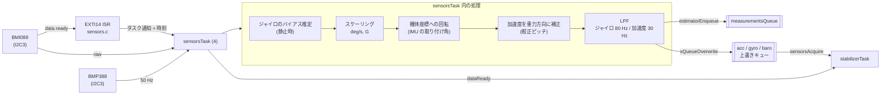

# センサ（IMU・気圧計）

## 概要
オンボードの IMU（加速度・角速度）と気圧計を、IMU の data-ready 割り込みに同期して 1 kHz で読み出す。
読み出した値に、バイアス補正、機体座標への回転、ローパスフィルタをかけてから、次の 2 か所に渡す。
- **スタビライザ**: 上書きキュー（長さ 1）経由で最新値を渡す。
- **推定器**: 計測値キュー（`estimatorEnqueue`）に投入する。

センサの実装は機種ごとに異なり、関数ポインタのテーブルから 1 つが選ばれる。

## 構成ファイル
| ファイル | 役割 |
|---|---|
| `src/hal/src/sensors.c` | 実装の選択と、共通 API（`sensorsInit` / `Acquire` / `WaitDataReady` ほか）の振り分け、EXTI14 の割り込みの受け口 |
| `src/hal/src/sensors_bmi088_bmp3xx.c` | CF2.1: BMI088（加速度 + ジャイロ）+ BMP388（気圧）。I2C 版と SPI 版の 2 種類の初期化 |
| `src/hal/src/sensors_mpu9250_lps25h.c` | CF2.0: MPU9250 + LPS25H |
| `src/hal/src/sensors_bmi088_i2c.c` | BMI088 の I2C アクセス |
| `src/drivers/bosch/src/bmi088_*.c`, `bmp3.c` | Bosch のデバイスドライバ |
| `src/utils/src/filter.c` | 2 次のローパスフィルタ（`lpf2p`） |

## ブロック図

## 実装の選択
- `sensorImplementations[]` に 4 種類の実装がある: `bmi088_bmp3xx`（I2C）、`bmi088_spi_bmp3xx`、`mpu9250_lps25h`、`bosch`（`src/hal/src/sensors.c:74`〜`134`）。
- 起動時に、機種の設定（`platformConfigGetSensorImplementation()`）で 1 つを選ぶ。`SENSORS_FORCE` で固定することもできる（`sensors.c:150`〜`167`）。
- 各実装は `init`, `test`, `areCalibrated`, `manufacturingTest`, `acquire`, `waitDataReady`, `readGyro` / `Acc` / `Mag` / `Baro`, `setAccMode`, `dataAvailableCallback` などを提供する（**（推測）** テーブルの項目名から）。
- cf2 では、CF2.0 用（`CONFIG_SENSORS_MPU9250_LPS25H`）と CF2.1 用（`CONFIG_SENSORS_BMI088_BMP3XX`、`CONFIG_SENSORS_BMI088_I2C`）の両方がビルドされ、OTP の機種で選ばれる。

## 処理の詳細（BMI088 + BMP388）

| 項目 | 設定 | 根拠 |
|---|---|---|
| 読み出し周期 | 1000 Hz（IMU の割り込み） | `sensors_bmi088_bmp3xx.c:61` |
| ジャイロ | ±2000 deg/s、ODR 1000 Hz、帯域 116 Hz | `:68`〜`69`, `:411`〜`413` |
| 加速度 | ±24 G、ODR 1600 Hz | `:71`〜`74`, `:452` |
| 気圧計 | 50 Hz（IMU の周期を 20 回に 1 回に間引く）、気圧 8 倍オーバーサンプリング、IIR 係数 3 | `:63`〜`65`, `:500`〜`503`, `:349`〜`365` |
| ローパスフィルタ | 2 次、ジャイロ 80 Hz、加速度 30 Hz（サンプリング 1000 Hz） | `:140`〜`141`, `:546`〜`547` |
| ジャイロのバイアス | 512 サンプルの分散が各軸 100 以下になったら、その平均をバイアスとする | `:83`〜`89`, `:316`〜`318` |
| 加速度のスケール | バイアスが求まった後、200 サンプルで 1 G になるようにスケールを求める | `:91`, `:320`〜`322` |
| 取り付け角 | `IMU_PHI` / `IMU_THETA` で機体座標に回転 | `:150`〜`151`, `:903`〜`906` |
| 重力方向の補正 | 設定ブロックの較正ピッチで加速度を回転 | `:550`〜`551`, `:941`〜`943` |

処理の順序（`sensorsTask`、`:292`〜`377`）:
1. タスク通知を待つ（`ulTaskNotifyTake`）。割り込み時刻を `sensorData.interruptTimestamp` に記録する。
2. ジャイロと加速度の生の値を読み出す。
3. ジャイロのバイアスを推定する。求まった後は、加速度のスケールを推定する。
4. ジャイロ: バイアスを引き、deg/s に変換し、機体座標に回転し、LPF をかけ、推定器に投入する。
5. 加速度: G に変換してスケールで割り、機体座標に回転し、重力方向を補正し、LPF をかけ、推定器に投入する。
6. 20 回に 1 回、気圧と温度を読み、海抜高度に換算して推定器に投入する。
7. 上書きキューに最新値を置き、`dataReady` を解放する。

## 較正の完了
- `sensorsAreCalibrated()` はジャイロのバイアスが求まったかどうかを返す（`:287`〜`289`）。
- スタビライザはこれが真になるまで制御ループを始めない（[../01_runtime/startup.md](../01_runtime/startup.md)）。
- 機体が動いていると分散がしきい値を超えるので、**静止させるまで較正が終わらない**。

## 他の機能との関係

| 相手 | 受け渡し | 内容 |
|---|---|---|
| stabilizer | `sensorsWaitDataReady()` / `sensorsAcquire()` | 1 kHz の同期と最新値 |
| estimator | `estimatorEnqueue()` | ジャイロ、加速度、気圧の計測値 |
| supervisor | `sensorData_t`（スタビライザ経由） | 転倒の判定などに加速度を使う **（推測）** |
| health | `sensorsSetAccMode()` など | プロペラ試験で加速度の分散を測る **（推測）** |
| configblock | `configblockGetCalibPitch()` / `Roll()` | 較正角 |

## 設定・パラメータ

| 種別 | 名前 | 説明 |
|---|---|---|
| Kconfig | `CONFIG_SENSORS_BMI088_BMP3XX`, `CONFIG_SENSORS_BMI088_I2C`, `CONFIG_SENSORS_MPU9250_LPS25H` | ビルドするセンサの実装 |
| param | `imu_sensors.*`, `imu_tests.*` | センサの有無、製造試験 |
| log | `acc.*`, `gyro.*`, `baro.*`, `mag.*` | センサ値（`stabilizer.c:617`〜`708`） |

## 未解決事項
- `sensors_mpu9250_lps25h.c`（CF2.0）の処理の詳細は、BMI088 版と同様と推測しているが、未確認。
- `sensorsTask` が I2C3 の読み出しに要する時間と、1 ms の周期に対する余裕は未評価。
- `isSensorsSuspended()`（`stabilizer.c:276`）でセンサをサスペンドする契機（**（推測）** DFU や電源オフの前）は未確認。
