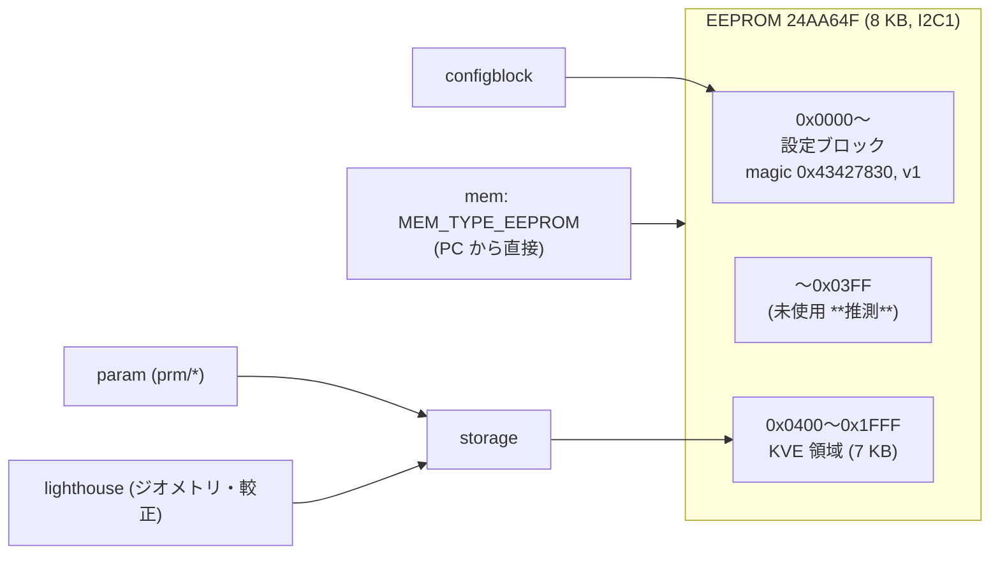

# 永続ストレージとメモリサブシステム

## 概要
データの保存と、PC からのメモリアクセスの仕組みは 3 つある。

| 仕組み | 用途 | 実体 |
|---|---|---|
| **設定ブロック（configblock）** | 無線のチャネル・速度・アドレス、IMU の較正角 | EEPROM の先頭（固定レイアウトの構造体） |
| **永続ストレージ（storage / KVE）** | param の永続化、Lighthouse のジオメトリと較正データなど | EEPROM の 1 KB 目から 7 KB（キーと値の形式） |
| **メモリサブシステム（mem）** | PC から CRTP port 4 で、EEPROM、デッキのメモリ、軌道、LED、Loco のアンカー位置などを読み書きする | 各モジュールが登録するメモリハンドラ |

## 構成ファイル
| ファイル | 役割 |
|---|---|
| `src/drivers/src/eeprom.c` | 24AA64F（8 KB）EEPROM のドライバ（I2C1）。`MEM_TYPE_EEPROM` としても登録 |
| `src/utils/src/configblockeeprom.c` | 設定ブロックの読み書き |
| `src/hal/src/storage.c` | 永続ストレージの API（`storageStore` / `Fetch` / `Delete` / `Foreach`） |
| `src/utils/src/kve/kve.c`, `kve_storage.c` | キーと値のストア（KVE）の実装 |
| `src/modules/src/param_logic.c` | param の永続化（キー `prm/<group>.<name>`） |
| `src/modules/src/mem.c` | メモリハンドラの登録と振り分け |
| `src/modules/src/crtp_mem.c` | CRTP port 4 のプロトコル |

## EEPROM のレイアウト

根拠: `src/hal/src/storage.c:54`〜`55`, `src/utils/src/configblockeeprom.c:41`〜`85`, `src/drivers/interface/eeprom.h:25`〜`34`

## 設定ブロック
- 構造体（v1）: magic、version、無線のチャネル、無線の速度、較正ピッチ、較正ロール、無線のアドレス（上位 1 バイト + 下位 4 バイト）（`configblockeeprom.c:60`〜`77`）。
- 起動時に `configblockInit()` で読む。magic やバージョンが一致しなければ既定値を使う **（推測: 既定値の構造体 `configblockDefault` の存在から）**。
- 無線の設定は radiolink が、較正角はセンサが使う（[../02_dataflow/communication.md](../02_dataflow/communication.md)、[sensors.md](sensors.md)）。
- PC からは mem の `MEM_TYPE_EEPROM` で書き換える（cfclient の設定画面）**（推測）**。

## 永続ストレージ（KVE）
- 可変長のキーと値の項目を、EEPROM の KVE 領域に追記していく形式（`kve_storage.h` の項目ヘッダと終端タグ `0xFFFF`）。
- 起動時に `storageInit()` で、`CONFIG_DEFRAG_STORAGE_ON_STARTUP`（cf2 は有効）なら断片化を解消する（`storage.c:59`〜`60`, `:133`〜`141`）。
- アクセスは `storageMutex` で排他する。
- `flush` は何もしない（「EEPROM の書き込みを先に直す」とのコメント、`storage.c:117`〜`120`）。

### 使っているキー
| キーの形式 | 書き込むモジュール | 内容 |
|---|---|---|
| `prm/<group>.<name>` | `param_logic.c` | 永続化フラグ（`PARAM_PERSISTENT`）付きの param の値 |
| Lighthouse のキー（ベースステーションごと） | `lighthouse_storage.c` | ジオメトリ、較正データ、システムの種類、保存形式のバージョン |

### param の永続化
- PC が param の CRTP コマンドで「保存」を要求すると、`paramPersistentStore()` が `prm/<group>.<name>` のキーで値を保存する（`param_logic.c:693`〜`733`）。永続化フラグのない param は保存できない。
- 起動時の `paramLogicInit()` で、`storageForeach("prm/")` によって保存済みの値を読み出し、対応する param に書き戻す（`:875`〜`892`）。
- 保存済みかどうかの問い合わせ（`paramPersistentGetState`）と、削除（`MISC_PERSISTENT_CLEAR`）もある。

## メモリサブシステム（mem、CRTP port 4）

### プロトコル
| チャネル | 名前 | 内容 |
|---|---|---|
| 0 | `MEM_SETTINGS_CH` | `MEM_CMD_GET_NBR`（メモリの数）、`MEM_CMD_GET_INFO`（種類、サイズ、ID） |
| 1 | `MEM_READ_CH` | アドレスと長さを指定して読む（1 パケット最大 30 バイト） |
| 2 | `MEM_WRITE_CH` | アドレスとデータを指定して書く |

根拠: `src/modules/src/crtp_mem.c:59`〜`66`, `:121`〜`159`

### 登録されているメモリ（cf2）
| 種類 | 値 | 登録元 | 内容 |
|---|---|---|---|
| `MEM_TYPE_EEPROM` | 0x00 | `drivers/src/eeprom.c:50` | EEPROM 全体 |
| `MEM_TYPE_OW` | 0x01 | `deck/backends/deck_backend_onewire.c:237` | 1-Wire のデッキのメモリ |
| `MEM_TYPE_LED12` | 0x10 | `deck/drivers/src/ledring12.c:81` | LED リングの色 |
| `MEM_TYPE_LOCO2` | 0x13 | `deck/drivers/src/locodeck.c:178` | Loco のアンカーの位置 |
| `MEM_TYPE_TRAJ` | 0x12 | `modules/src/crtp_commander_high_level.c:120` | 軌道メモリ（4096 バイト） |
| `MEM_TYPE_LH` | 0x14 | `modules/src/lighthouse/lighthouse_position_est.c:67` | Lighthouse のジオメトリと較正 |
| `MEM_TYPE_TESTER` | 0x15 | `modules/src/mem.c:43` | 通信試験用 |
| `MEM_TYPE_USD` | 0x16 | `deck/drivers/src/usddeck.c:253` | SD カードのログ |
| `MEM_TYPE_LEDMEM` | 0x17 | `ledring12.c:92` | LED リングのメモリ |
| `MEM_TYPE_DECK_MEM` | 0x19 | `deck/core/deck_memory.c:44` | デッキのメモリ（ファームウェア更新など） |
| `MEM_TYPE_DECKCTRL_DFU` | 0x20 | `deck/core/deckctrl_dfu_memory.c:56` | DeckCtrl の DFU |
| `MEM_TYPE_DECKCTRL` | 0x21 | `deck/backends/deck_backend_deckctrl.c:303` | DeckCtrl のデッキのメモリ |

種類の一覧: `src/modules/interface/mem.h`（`MemoryType_t`）

## 公式ドキュメントとの差異
- `docs/functional-areas/persistent_storage.md`、`memory-subsystem/` との照合は未実施。

## 未解決事項
- EEPROM の 0x0000〜0x03FF のうち、設定ブロックが使う範囲以外の用途は未確認。
- `flushEeprom` が何もしない件（書き込みの完了を待たない）による、電源断時のデータ破損のリスクは未評価。
- 設定ブロックの読み出しに失敗したときの既定値の内容は未確認。
