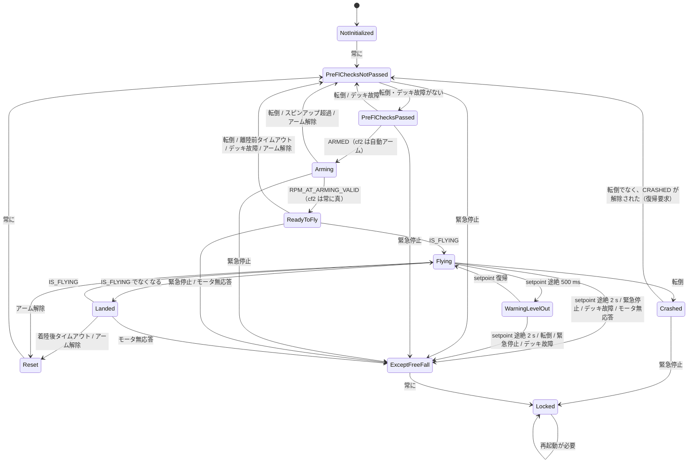

# スーパーバイザ（supervisor）

## 概要
supervisor は機体の安全状態を管理する。25 Hz で条件（アーム、飛行中、転倒、setpoint の途絶、緊急停止など）を集め、状態機械を遷移させる。
状態に応じて、次の 3 つを制御する。
- **飛行を許可するか**（`supervisorCanFly()`）: 許可しない間、スタビライザは CRTP の setpoint の受け付けを止め、setpoint を 0 にする。
- **setpoint を上書きするか**（`supervisorOverrideSetpoint()`）: 水平に保つか、ヌルの setpoint にする。
- **モータを回してよいか**（`supervisorAreMotorsAllowedToRun()`）: 回してはいけない状態なら、スタビライザが `motorsStop()` を呼ぶ。

状態遷移は、状態ごとの遷移リスト（トリガとブロッカのビットマスク）で**データとして定義**されている。

## 構成ファイル
| ファイル | 役割 |
|---|---|
| `src/modules/src/supervisor.c` | 条件の収集、状態遷移後の動作、setpoint の上書き、param / log |
| `src/modules/src/supervisor_state_machine.c` | 状態・条件の定義と、遷移リスト（テーブル） |
| `src/modules/src/crtp_supervisor.c` | CRTP port 9（アーム、緊急停止、情報の取得） |
| `src/modules/src/platformservice.c` | CRTP port 13 の旧形式のアーム / 復帰コマンド |

## 条件ビット

| ビット | 条件 | 判定方法 | 根拠 |
|---|---|---|---|
| `ARMED` | アームされている | `isArmingActivated`（自動アームまたは CRTP の要求） | `supervisor.c:464`〜`466` |
| `IS_FLYING` | 飛行中 | いずれかのモータの出力がアイドル推力を超えてから 2 秒以内 | `:278`〜`300`, `:56` |
| `IS_TUMBLED` | 転倒 | 加速度の z が 0.5 G 未満（約 60° 以上の傾き）が 1 秒、または -0.2 G 未満（逆さま）が 0.1 秒続く。自由落下中は判定しない。param で無効化できる | `:311`〜`358`, `platform_defaults.h:152`〜`171` |
| `COMMANDER_WDT_WARNING` | setpoint の途絶（警告） | setpoint のタイムスタンプから 500 ms 超 | `:481`〜`484` |
| `COMMANDER_WDT_TIMEOUT` | setpoint の途絶 | 2000 ms 超 | `:485`〜`487` |
| `EMERGENCY_STOP` | 緊急停止 | CRTP の緊急停止要求、緊急停止ウォッチドッグの期限切れ、param `stabilizer.stop` | `:489`〜`499` |
| `CRASHED` | クラッシュ状態 | `supervisorIsCrashed()` | `:501`〜`503` |
| `PREFLIGHT_TIMEOUT` | アーム後に離陸しない | 既定 30 秒 | `:505`〜`507`, `platform_defaults.h:176` |
| `LANDING_TIMEOUT` | 着陸後に次の離陸がない | 既定 3 秒 | `:509`〜`511`, `platform_defaults.h:181` |
| `DECK_FAULT` | デッキの故障 | `deckSupervisorHasFault()`（`CONFIG_DECK_SUPERVISOR`） | `:513`〜`517` |
| `RPM_AT_ARMING_VALID` | アーム時の回転数が正常 | 双方向 DShot のときだけ判定。cf2 では常に真 | `:519`〜`529` |
| `SPINUP_TIMEOUT` | アーム時の回転数の確認がタイムアウト | | `:531`〜`535` |
| `MOTORS_NOT_RESPONDING` | モータが応答しない | 双方向 DShot のときだけ | `:524`〜`526` |

クラッシュ検出（加速度のノルムと 1 G の差がしきい値を超えると転倒扱い）は `crashDetectionGs > 0` のときだけ有効で、cf2 では `CONFIG_SUPERVISOR_CRASH_DETECTION_G=0` のため無効（`supervisor.c:321`〜`327`）。

## 状態遷移

根拠: `src/modules/src/supervisor_state_machine.c:73`〜`356`

要点:
- **Locked は終端状態**で、抜ける遷移がない。再起動が必要（`supervisor_state_machine.c:326`〜`334`, `supervisor.c:434`〜`435`）。緊急停止やモータの無応答は、すべて ExceptFreeFall を経て Locked に至る。
- **Crashed は復帰可能**。転倒が解消され、クラッシュからの復帰要求（`supervisorRequestCrashRecovery`、CRTP から）があると PreFlChecksNotPassed に戻る（`:337`〜`346`, `supervisor.c:192`〜`206`）。
- **setpoint の途絶**は 2 段階: 500 ms で WarningLevelOut（水平を保ってその場で高度を維持）、2 s で ExceptFreeFall → Locked。
- 遷移は、状態ごとのリストを**先頭から評価し、最初に成立したもの**を採用する（`findTransition()`、`supervisor_state_machine.c:414`〜`429`）。成立の条件は「トリガが成立し、かつブロッカが成立しない」。どのリストでも緊急停止が先頭にあるので、最優先になる。
- 1 回の `supervisorUpdate()`（25 Hz）で遷移するのは 1 段だけである。たとえば ExceptFreeFall → Locked は次の周期（40 ms 後）になる。

## 状態ごとの動作

| 状態 | 飛行許可 `canFly` | モータ許可 | setpoint の上書き |
|---|---|---|---|
| NotInitialized / PreFlChecksNotPassed / PreFlChecksPassed | × | × | ヌル |
| Arming | × | ○ | なし |
| ReadyToFly | ○ | ○ | なし |
| Flying | ○ | ○ | なし |
| WarningLevelOut | ○ | ○ | 水平（roll = pitch = 0、yaw 角速度 = 0、x/y 無効、z は維持） |
| Landed | ○ | ○ | なし |
| Reset / ExceptFreeFall / Locked / Crashed | × | × | ヌル |

根拠: `supervisor.c:132`〜`140`（`canFly`）, `:612`〜`642`（上書き）, `:644`〜`651`（モータ）

## アーム
- `CONFIG_MOTORS_REQUIRE_ARMING` が未定義（cf2 のブラシモータ）なら**自動アーム**: PreFlChecksPassed に入った時点で `supervisorRequestArming(true)` を呼ぶ（`supervisor.c:59`〜`64`, `:451`〜`456`）。
- 飛行系の状態（Arming, ReadyToFly, Flying, WarningLevelOut, Landed）以外に遷移すると、アームは解除される（`:442`〜`449`）。
- アームが必要な機種（ブラシレス）では、CRTP port 9 または port 13 のアームコマンドで要求する。

## 他の機能との関係

| 相手 | 受け渡し | 内容 |
|---|---|---|
| stabilizer | `supervisorUpdate()`, `supervisorCanFly()`, `supervisorOverrideSetpoint()`, `supervisorAreMotorsAllowedToRun()` | [../02_dataflow/control_loop.md](../02_dataflow/control_loop.md) |
| crtp_commander | `crtpCommanderBlock(!canFly)` | 飛行不可の間、低レベル setpoint を受け付けない |
| estimator (Kalman) | `supervisorIsFlying()` | 予測の挙動を切り替える |
| high-level commander | `crtpCommanderHighLevelGetPlannerState()` | 情報ビットに HL の状態を含める |
| deck supervisor | `deckSupervisorHasFault()` | デッキの故障 |
| motors | `motorsGetRatio()` | 飛行中の判定 |

## 設定・パラメータ

| 種別 | 名前 | 説明 |
|---|---|---|
| param | `stabilizer.stop` | 0 以外で緊急停止（→ Locked） |
| param | `supervisor.infdmp` | 0 以外で状態をコンソールに出力 |
| param | `supervisor.prefltTimeout` | アーム後の離陸待ちの時間（永続化可） |
| param | `supervisor.landedTimeout` | 着陸後の待ち時間（永続化可） |
| param | `supervisor.tmblChckEn` | 転倒の判定の有効化（永続化可） |
| param | `supervisor.spinupTimeout` | アーム時のスピンアップの時間（永続化可） |
| param | `supervisor.crashDetectGs` | クラッシュ検出のしきい値（永続化可） |
| log | `supervisor.info` など | 情報ビット（アーム可、アーム済み、自動アーム、飛行可、飛行中、転倒、ロック、クラッシュ、HL の状態、デッキ故障） |
| log | `sys.canfly`, `sys.isFlying`, `sys.isTumbled` | 旧形式の状態（`supervisor.c:673`〜`690`） |

根拠: `supervisor.c:545`〜`586`（情報ビット）, `:673`〜`766`

## 公式ドキュメントとの差異
- `docs/functional-areas/supervisor/states.md`、`transitions.md` との照合は未実施。状態遷移図は本書ではソースの遷移リストから直接起こした。

## 未解決事項
- 緊急停止ウォッチドッグは、CRTP で一度でも通知を受けると有効になり、以後 1000 ms 通知がないと緊急停止になる（`supervisor.c:361`〜`370`）。通知は port 9 の `CMD_EMERGENCY_STOP_WATCHDOG`（0x04）と port 6 の `EMERGENCY_STOP_WATCHDOG` の 2 経路がある（[../04_interfaces/crtp_ports.md](../04_interfaces/crtp_ports.md)）。一度有効にしたウォッチドッグを無効に戻す方法があるかは未確認。
