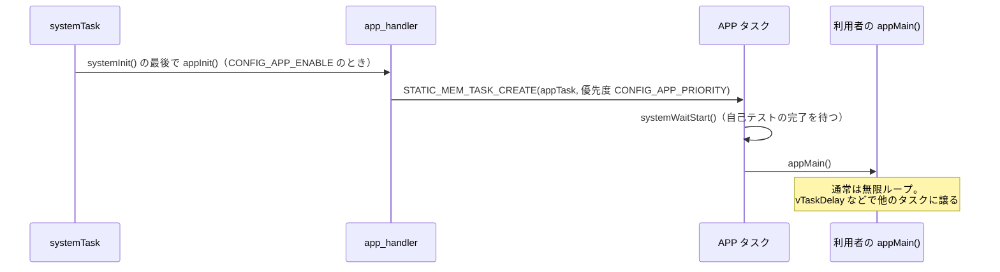

# アプリ層 API

## 概要
アプリ層は、ファームウェア本体を変更せずに独自の処理を追加するための仕組みである。
利用者はファームウェアのソースツリーの**外（out-of-tree、OOT）**に `appMain()` を書き、ファームウェア本体と一緒にビルドする。`appMain()` は専用の `APP` タスクで実行される。

- cf2 の既定の設定では、アプリ層は無効（`CONFIG_APP_ENABLE` が未設定）。
- アプリから呼んでよい関数（公式の API）は、`app_api/src/app_main.c` が参照する関数として管理されている。CI はこのアプリをビルドするだけで、実行はしない（`app_api/README.md`）。

## 構成ファイル
| ファイル | 役割 |
|---|---|
| `src/modules/src/app_handler.c` | `APP` タスクの生成と `appMain()` の呼び出し |
| `src/modules/interface/app.h` | `appInit()` / `appMain()` の宣言 |
| `src/modules/src/app_channel.c` | アプリと PC の間の任意データの通信（CRTP port 13 の `appChannel`） |
| `app_api/` | API の一覧を兼ねたビルド確認用アプリ |
| `tools/make/oot.mk` | OOT ビルドの仕組み |
| `examples/app_*` | サンプルアプリ（10 種類） |

## 起動の流れ

根拠: `src/modules/src/system.c:148`〜`150`, `src/modules/src/app_handler.c:39`〜`57`

| 設定 | 既定値 | 説明 |
|---|---|---|
| `CONFIG_APP_ENABLE` | n | アプリ層の有効化 |
| `CONFIG_APP_STACKSIZE` | 300 ワード（1.2 KB） | `APP` タスクのスタック |
| `CONFIG_APP_PRIORITY` | 0（アイドルと同じ） | `APP` タスクの優先度（0〜5） |

根拠: `Kconfig:221`〜`240`

- `appInit()` は weak 定義なので、アプリが独自に定義し直すこともできる（`app_handler.c:43`）。
- 優先度を 5 にすると、スタビライザと同じ優先度になる。制御ループへの影響に注意が必要 **（推測）**。

## 公式 API の一覧
`app_api/src/app_main.c` が参照している関数を分類したもの。

| 分類 | ヘッダ | 関数 |
|---|---|---|
| high-level commander | `crtp_commander_high_level.h` | `crtpCommanderHighLevelTakeoff` / `TakeoffYaw` / `TakeoffWithVelocity`, `Land` / `LandYaw` / `LandWithVelocity`, `GoTo`, `Stop`, `StartTrajectory`, `DefineTrajectory`, `WriteTrajectory` / `ReadTrajectory`, `TrajectoryMemSize`, `IsTrajectoryFinished` |
| param | `param.h` | `paramGetVarId`, `paramGetInt` / `Uint` / `Float`, `paramSetInt` / `Float`, `paramPersistentStoreByVarId` |
| log | `log.h` | `logGetVarId`, `logGetInt` / `Uint` / `Float` |
| アプリチャネル | `app_channel.h` | `appchannelSendPacket`, `appchannelSendDataPacket` / `Block`, `appchannelReceivePacket`, `appchannelReceiveDataPacket`, `appchannelHasOverflowOccurred` |
| メモリ | `mem.h` | `memoryRegisterHandler`（PC からアクセスできるメモリを追加） |
| LED | `ledseq.h` | `ledseqRegisterSequence`, `ledseqRun` / `RunBlocking`, `ledseqStop` / `StopBlocking` |
| 電源 | `pm.h` | `pmIsBatteryLow`, `pmIsChargerConnected`, `pmIsCharging`, `pmIsDischarging` |
| システム | `system.h` | `systemRequestShutdown` |
| Loco | `locodeck.h` | `locoDeckGetAnchorIdList`, `locoDeckGetActiveAnchorIdList`, `locoDeckGetAnchorPosition` |
| デバッグ・OS | `debug.h`, `FreeRTOS.h`, `task.h` | `DEBUG_PRINT`, FreeRTOS の API |

注: `appchannelHasOverflowOccured`（綴り違い）と `appchannelHasOverflowOccurred` の両方が参照されている。旧名を互換のために残していると考えられる **（推測）**。

## 拡張の方法（アプリ以外）
アプリ層のほかに、OOT で次のものを差し込める。

| 拡張点 | 仕組み | 例 |
|---|---|---|
| コントローラ | `CONFIG_CONTROLLER_OOT` で `controllerOutOfTree*()` を実装 | `examples/app_out_of_tree_controller` |
| 推定器 | `CONFIG_ESTIMATOR_OOT` で `estimatorOutOfTree*()` を実装 | — |
| デッキドライバ | `DECK_DRIVER()` マクロで登録 | — |
| param / log | 各マクロで登録（アプリのソースにも書ける） | `examples/app_internal_param_log`, `app_persistent_param` |
| ヘッダの差し替え | OOT の `overrides/` フォルダのヘッダが優先される（`platform_defaults.h` など） | `Makefile:46`〜`55` |

## サンプルアプリ（`examples/`）
`app_hello_world`, `app_hello_file_tree`, `app_appchannel_test`, `app_internal_param_log`, `app_persistent_param`, `app_out_of_tree_controller`, `app_peer_to_peer`, `app_p2p_DTR`, `app_state_stream_aideck`, `app_stm_gap8_cpx`

## 公式ドキュメントとの差異
- `docs/userguides/app_layer.md` との照合は未実施。

## 未解決事項
- アプリから `commanderSetSetpoint()` を直接呼ぶことは公式 API に含まれていない。低レベルの setpoint をアプリから出す正式な方法（サンプルの有無）は未確認。
- `app_api` に含まれない関数をアプリが呼んだ場合の互換性の扱い（`docs/development/apis_versions_deprecation.md`）は未確認。
