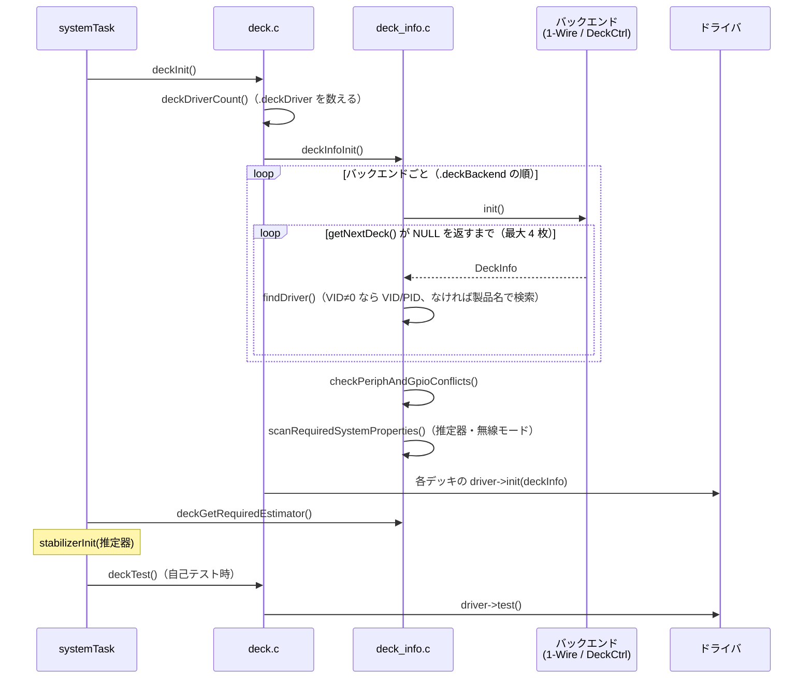

# デッキ API（検出・ドライバ・周辺機能）

## 概要
デッキの仕組みは 3 つの要素からなる。
1. **検出バックエンド**: 取り付けられたデッキを列挙し、デッキの情報（VID / PID、名前、使用ピンなど）を返す。1-Wire（nRF51 経由）と DeckCtrl（I2C）の 2 種類。
2. **ドライバ**: VID / PID（または名前）で照合され、`init` / `test` が呼ばれる。
3. **デッキ用の周辺機能の API**: Arduino 風の GPIO、アナログ入力、SPI の API。デッキのピン名（`DECK_GPIO_IO1` など）で指定する。

検出バックエンドとドライバは、どちらもリンカセクションに登録される（`.deckBackend` / `.deckDriver`）。
cf2 で使えるデッキの一覧は [../03_functions/decks.md](../03_functions/decks.md) を参照。

## 構成ファイル
| ファイル | 役割 |
|---|---|
| `src/deck/interface/deck_core.h` | `DeckDriver` / `DeckInfo` の定義、`DECK_DRIVER()` マクロ |
| `src/deck/interface/deck_discovery.h`, `src/deck/core/deck_discovery.c` | 検出バックエンドのインタフェースと登録（`DECK_DISCOVERY_BACKEND()`） |
| `src/deck/core/deck_info.c` | 列挙、ドライバの照合、競合の検査、推定器の要求の集約 |
| `src/deck/core/deck_drivers.c` | ドライバの検索（VID / PID、名前） |
| `src/deck/core/deck.c` | `deckInit()` / `deckTest()` |
| `src/deck/backends/deck_backend_onewire.c` | 1-Wire バックエンド（nRF51 の `ow_syslink` 経由） |
| `src/deck/backends/deck_backend_deckctrl.c` | DeckCtrl バックエンド（I2C1 上のマイコン） |
| `src/deck/api/*.c`, `src/deck/interface/deck_*.h` | GPIO、アナログ、SPI、SPI3、DeckCtrl の GPIO |

## データ構造

### `DeckDriver`（ドライバが定義する）
| 項目 | 内容 |
|---|---|
| `vid`, `pid` | 照合に使う ID（Bitcraze のデッキは VID 0xBC） |
| `name` | ドライバ名（`bcFlow2` など）。名前での検索と、param `deck.<name>` に使う **（推測）** |
| `usedPeriph` | 使う周辺機能のビットマスク（`DECK_USING_UART1` / `SPI` / `I2C` / `TIMER*` など） |
| `usedGpio` | 使うピンのビットマスク（`DECK_USING_IO_1` など） |
| `requiredEstimator` | 必要な推定器 |
| `requiredLowInterferenceRadioMode` | 無線の低干渉モードが必要か |
| `requiredKalmanEstimatorAttitudeReversionOff` | Kalman の姿勢の回帰を止める必要があるか |
| `memoryDef`, `memoryDefSecondary` | デッキのメモリ（ファームウェア更新など）の定義 |
| `init(DeckInfo*)`, `test()`, `status()` | 初期化、試験、状態 |

根拠: `src/deck/interface/deck_core.h`（`typedef struct deck_driver`）

### `DeckInfo`（バックエンドが返す）
- 1-Wire のメモリの内容（ヘッダ、使用ピン、VID、PID、CRC、TLV 領域 104 バイト）と、TLV から取り出した製品名、ボードのリビジョン、製造日など。
- 照合したドライバと、検出したバックエンドへの参照も持つ。

## 検出と初期化の流れ

根拠: `src/deck/core/deck.c:44`〜`90`, `src/deck/core/deck_info.c:69`〜`267`

### ドライバの照合（`findDriver`、`deck_info.c:99`〜`112`）
- VID が 0 でなければ VID / PID で、0 なら製品名で検索する。見つからなければ何もしないダミーのドライバを割り当てる。
- `CONFIG_DECK_FORCE` に名前を指定すると、検出に関係なくそのドライバを初期化する（`deck/backends/Kbuild` で `deck_backend_forced.c` をビルド。cf2 は `"none"` なので無効）。

### 競合の検査（`checkPeriphAndGpioConflicts`、`deck_info.c:187`〜`225`）
- 各ドライバの `usedPeriph` と `usedGpio` を順に OR していき、重なりがあればエラーとする。ただし I2C と SPI はバスなので、重なっても許される。
- **1 つでも競合があると、全デッキを初期化しない**（`count = 0`）。「No decks will be initialized!」とコンソールに出力される。

### 推定器の要求（`scanRequiredSystemProperties`、`deck_info.c:227`〜`267`）
- 各ドライバの要求する推定器を集約する。別々の推定器を要求するデッキが混在すると、**これも全デッキを初期化しない**（`count = 0`）。

### その他
- 1 台に取り付けられるデッキは最大 4 枚（`DECK_MAX_COUNT`、`deck_core.h:41`）。
- デッキ同士の依存は、ドライバが別のドライバを名前で検索して `init` / `test` を呼ぶ形で実装される（例: Flow v2 → Z-ranger v2、`flowdeck_v1v2.c:173`〜`239`）。

## 検出バックエンド

| バックエンド | 物理層 | 仕組み | 根拠 |
|---|---|---|---|
| 1-Wire | デッキ上の 1-Wire メモリ → nRF51 → syslink の OW グループ | `SYSLINK_OW_SCAN` / `GETINFO` / `READ` で nRF51 に読み出しを依頼する | `deck_backend_onewire.c`, `src/hal/src/ow_syslink.c` |
| DeckCtrl | デッキ上のマイコン（I2C1） | 既定のアドレスにいるデッキに順番にアドレスを割り当て（リセット → リッスン）、メモリ（0x1900 からシリアル番号など）を読む | `deck_backend_deckctrl.c:117`〜`200` |

バックエンドのインタフェース（`deck_discovery.h:53`〜`55`）: `name`, `init()`, `getNextDeck()`。

## 周辺機能の API（ドライバ向け）

| 分類 | 関数 | 備考 |
|---|---|---|
| GPIO | `pinMode(pin, mode)`, `digitalWrite(pin, val)`, `digitalRead(pin)` | `INPUT` / `OUTPUT` / `INPUT_PULLUP` / `INPUT_PULLDOWN` |
| アナログ | `adcInit()`, `analogRead(pin)`, `analogReadVoltage(pin)`, `analogReference()`, `analogReadResolution()` | |
| SPI | `spiBegin()`, `spiBeginTransaction(prescaler)`, `spiExchange(len, tx, rx)`, `spiEndTransaction()` | `spiMutex` で排他、DMA 転送（`deck_spi.c:100`〜`102`） |
| SPI3 | `spi3Begin()` ほか同様 | 2 本目の SPI |
| DeckCtrl の GPIO | `deckctrl_gpio.c` | DeckCtrl のマイコン経由の GPIO |

デッキのピン名: `DECK_GPIO_RX1`, `TX1`, `SDA`, `SCL`, `IO1`〜`IO4`, `TX2`, `RX2`, `SCK`, `MISO`, `MOSI`（`src/deck/interface/deck_constants.h:52`〜`64`）。MCU のピンとの対応は [../05_hardware/pin_map.md](../05_hardware/pin_map.md)。

## 公式ドキュメントとの差異
- `docs/userguides/deck.md`、`docs/functional-areas/deckctrl_protocol.md`、`deck_memory_format.md` との照合は未実施。

## 未解決事項
- 競合や推定器の不一致で全デッキが無効になったとき、自己テスト（`deckTest()`）が失敗扱いになるか（= 機体が起動しないか）は未確認。
- DeckCtrl のアドレス割り当てのプロトコルの詳細は未確認（→ `docs/functional-areas/deckctrl_protocol.md`）。
- バックエンドの列挙の順序（1-Wire と DeckCtrl のどちらが先か）はリンカの配置順で決まる。
