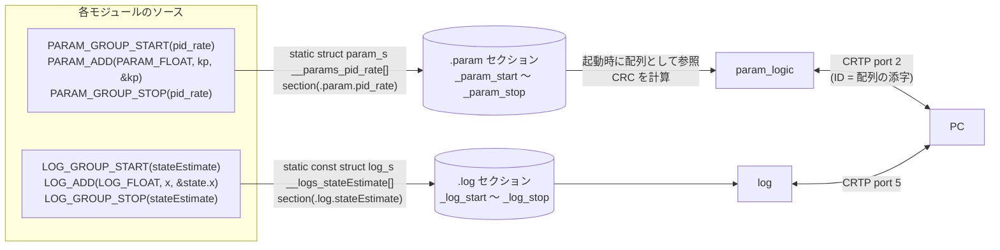
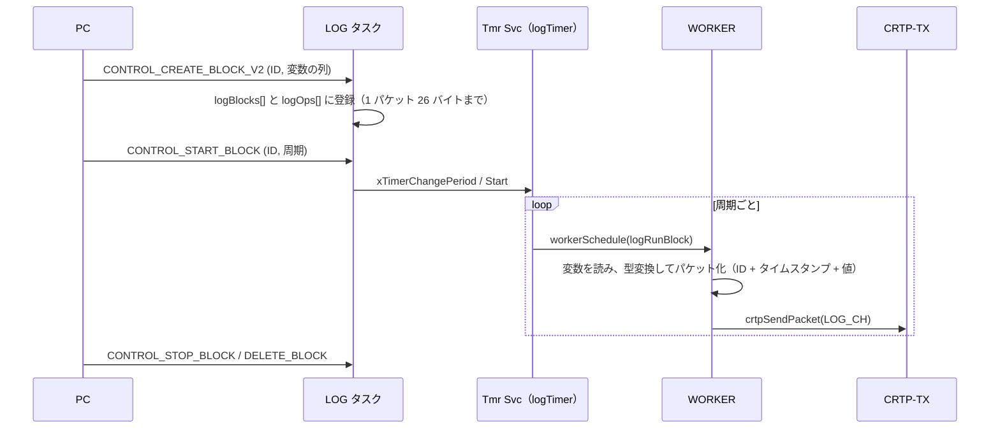

# param / log

## 概要
**param** は機体の設定値を PC から読み書きする仕組み、**log** は機体の変数を PC に周期的に送る仕組みである。
どちらも、各モジュールがソースの中でマクロで変数を宣言するだけで登録される。マクロは構造体をリンカセクション（`.param.<group>` / `.log.<group>`）に配置し、起動時に param / log のモジュールがセクション全体を 1 つの配列として扱う。

| 項目 | param | log |
|---|---|---|
| cf2 のグループ（ブロック） | 74（ユニーク 51） | 70（ユニーク 61） |
| cf2 の変数 | 351 | 586 |
| うち CORE（安定 API） | 140 | 82 |
| うち永続化可 | 136 | — |

集計: `python tools/list_param_log.py`（テキストで数えているので、グループ内の `#ifdef` は評価していない。上限値）

## 構成ファイル
| ファイル | 役割 |
|---|---|
| `src/modules/interface/param.h` | param の型フラグと登録マクロ |
| `src/modules/src/param_logic.c` | TOC、読み書き、永続化、コールバック |
| `src/modules/src/param_task.c` | `PARAM` タスク（CRTP port 2 の処理） |
| `src/modules/interface/log.h` | log の型と登録マクロ |
| `src/modules/src/log.c` | TOC、ログブロック、タイマ、送信 |
| `tools/make/F405/linker/sections_FLASH.ld:51`〜`60` | `.param` / `.log` セクション |

## 登録の仕組み

根拠: `src/modules/interface/param.h:146`〜`147`, `src/modules/interface/log.h:182`

- 変数の **ID は配列の添字**である。グループの開始と終了も配列の要素（`PARAM_GROUP` / `LOG_GROUP` フラグ付き）として入る。
- param の TOC からは CRC32 を計算し、PC に知らせる（`param_logic.c:237`〜`260`）。**（推測）** PC は CRC が同じなら、キャッシュした TOC を再利用して、接続時間を短縮する。log も同様。
- ビルドの構成（有効なデッキなど）が変わると ID が変わるので、PC は名前（グループ名.変数名）で扱う必要がある。

## param

### 型とフラグ（`param_s.type` の 8 ビット + 拡張型）
| ビット | 意味 | 値 |
|---|---|---|
| 0〜1 | サイズ | 1 / 2 / 4 / 8 バイト |
| 2 | 整数 / 浮動小数 | `PARAM_TYPE_INT` / `PARAM_TYPE_FLOAT` |
| 3 | 符号 | `PARAM_SIGNED` / `PARAM_UNSIGNED` |
| 4 | 拡張型あり | `PARAM_EXTENDED` |
| 5 | CORE（安定 API として公開） | `PARAM_CORE` |
| 6 | 読み取り専用 | `PARAM_RONLY` |
| 7 | グループの区切り | `PARAM_GROUP` |
| 拡張 bit 0（= `1 << 8`） | 永続化可 | `PARAM_PERSISTENT` |

根拠: `src/modules/interface/param.h:35`〜`78`

### 登録マクロ
| マクロ | 用途 |
|---|---|
| `PARAM_ADD` / `PARAM_ADD_CORE` | 変数の登録 |
| `PARAM_ADD_WITH_CALLBACK` / `PARAM_ADD_CORE_WITH_CALLBACK` | 書き込まれたときにコールバックを呼ぶ（`param_logic.c:359`） |
| `PARAM_ADD_FULL` | コールバックと既定値の取得関数（getter）を指定 |

### 書き込みの流れ
1. PC が port 2 の `WRITE_CH`（ID 指定）または `MISC_SETBYNAME`（名前指定）で書き込む。
2. `PARAM` タスクが、読み取り専用でないことを確認して変数に書き込み、コールバックがあれば呼ぶ。
3. 値の変更は、変数を使うモジュールが次に読んだときに反映される。**排他制御はない**（例: スタビライザは `stabilizer.controller` を毎周期読んで変化を検出する）。

### 永続化
- 永続化可の param は、PC の要求で EEPROM に保存でき、起動時に復元される（[../03_functions/storage_mem.md](../03_functions/storage_mem.md)）。

## log

### 型
`LOG_UINT8`(1), `LOG_UINT16`(2), `LOG_UINT32`(3), `LOG_INT8`(4), `LOG_INT16`(5), `LOG_INT32`(6), `LOG_FLOAT`(7), `LOG_FP16`(8)。フラグは `LOG_CORE`(0x20)、`LOG_BY_FUNCTION`(0x40: 変数ではなく関数の戻り値)、`LOG_GROUP`(0x80)。

根拠: `src/modules/interface/log.h:119`〜`162`

### ログブロック
PC は、送ってほしい変数の組（ログブロック）を作り、周期を指定して開始する。

| 制限 | 値 | 根拠 |
|---|---|---|
| ブロック数 | 16 | `log.c:92` |
| 全ブロックの変数（操作）の合計 | 128 | `log.c:91` |
| 1 ブロックのデータ長 | 26 バイト（30 − ブロック ID 1 − タイムスタンプ 3） | `log.c:87`〜`88`, `:421` |

- ブロックごとに FreeRTOS のソフトウェアタイマがあり、周期でコールバックが呼ばれる（`log.c:377`, `:514`）。実際の読み出しと送信は `WORKER` タスクで行う（[../01_runtime/tasks.md](../01_runtime/tasks.md)）。
- 変数の読み出しに排他制御はないので、1 ブロック内の値が同じ制御周期のものとは限らない **（推測）**。ただしスタビライザは、ログ用に圧縮した状態（`stateEstimateZ` など）をループの最後にまとめて作っている（`stabilizer.c:370`〜`371`）。

## 主なグループ（cf2）

### param
| 分類 | グループ |
|---|---|
| 制御 | `stabilizer`, `pid_attitude`, `pid_rate`, `posCtlPid`, `velCtlPid`, `ctrlMel`, `ctrlINDI`, `posCtrlIndi`, `ctrlAtt`, `ctrlLee`, `powerDist`, `motorPowerSet` |
| 推定 | `kalman`, `sensfusion6`, `posEstAlt`, `imu_sensors`, `imu_tests` |
| コマンダ | `commander`, `flightmode`, `hlCommander`, `colAv` |
| 安全・電源 | `supervisor`, `health`, `pm`, `system`, `cpu` |
| 通信 | `syslink`, `crtpsrv`, `locSrv` |
| 測位・デッキ | `deck`, `motion`, `flowdeck`, `loco`, `tdoa2`, `tdoa3`, `tdoaEngine`, `lighthouse`, `multiranger`, `usd`, `ring`, `activeMarker`, `colorLedBot`, `colorLedTop`, `led_deck_ctrl` |
| その他 | `led`, `sound`, `usec`, `memTst`, `cppm`, `deckTest`, `radiotest` |

### log
| 分類 | グループ |
|---|---|
| センサ | `acc`, `accSec`, `gyro`, `gyroSec`, `mag`, `baro` |
| 状態・目標 | `stateEstimate`, `stateEstimateZ`, `ctrltarget`, `ctrltargetZ`, `stabilizer` |
| 制御 | `controller`, `pid_attitude`, `pid_rate`, `posCtl`, `ctrlMel`, `ctrlINDI`, `posCtrlIndi`, `ctrlLee`, `motor` |
| 推定 | `kalman`, `kalman_pred`, `outlierf`, `estimator`, `posEstAlt`, `sensfusion6` |
| 安全・電源・システム | `supervisor`, `sys`, `health`, `pm` |
| 通信 | `radio`, `crtp`, `locSrv`, `locSrvZ`, `ext_pos` |
| 測位・デッキ | `motion`, `range`, `loco`, `ranging`, `twr`, `tdoa2`, `tdoa3`, `tdoaEngine`, `lighthouse`, `oa`, `usd`, `ring`, `deckStatus`, `activeMarker`, `bcCam`, `colorLedBot`, `colorLedTop`, `rpm` |
| その他 | `colAv`, `CkCorrection`, `memTst`, `DTR_P2P`, `extrx`, `extrx_raw`, `maxSonar`, `proximity` |

変数の全一覧は `python tools/list_param_log.py` で出力できる。

## 公式ドキュメントとの差異
- `docs/api/params.md` / `logs.md` は、ソースのコメント（`@brief`）から自動生成されたものと推測される。本書では照合していない。

## 未解決事項
- TOC の ID の並び順を決めるのはリンカ（`KEEP(*(.param.*))`）で、ソート指定がない。ビルドごとにグループの順序が変わりうるかは未確認。
- `LOG_BY_FUNCTION` の変数（関数の戻り値）が、`WORKER` タスクの文脈で呼ばれることによる副作用の有無は未確認。
