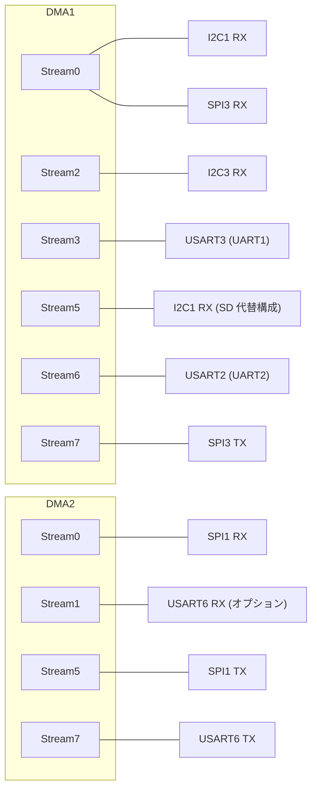

# MCU ペリフェラルの割り当て（cf2）

## 概要
cf2 の MCU は STM32F405（Cortex-M4F、フラッシュ 1 MB、RAM 128 KB + CCM 64 KB）である。
本書は、ファームウェアが各ペリフェラル（UART、I2C、SPI、タイマ、DMA、EXTI など）を何に使っているかをまとめる。
ピン単位の割り当ては [pin_map.md](pin_map.md) を参照。

## クロック
| 項目 | 値 | 根拠 |
|---|---|---|
| 外部発振子（HSE） | 8 MHz | Makefile の `-DHSE_VALUE=8000000` |
| PLL | M = 8、N = 336、P = 2、Q = 7 → **SYSCLK 168 MHz**、USB 用 48 MHz **（計算値）** | `src/lib/CMSIS/STM32F4xx/Source/system_stm32f4xx.c:254`〜`261` |
| タイマのクロック | 84 MHz（モータの PWM の計算に使用） | `src/drivers/interface/motors.h:47` |
| FreeRTOS の tick | 1 kHz | [../01_runtime/tasks.md](../01_runtime/tasks.md) |

## 割り当て一覧

| ペリフェラル | 用途 | ピン | DMA | 根拠 |
|---|---|---|---|---|
| **USART6** | syslink（nRF51）、1 Mbps | PC6 (TX), PC7 (RX), PA4 (送信許可のフロー制御) | TX: DMA2 Stream7 Ch5 / RX: DMA2 Stream1 Ch5（`CONFIG_SYSLINK_RX_DMA` のとき） | `src/drivers/interface/uart_syslink.h:35`〜`63` |
| **USART3**（ドライバ上の名前は UART1） | デッキの TX1 / RX1（Lighthouse の FPGA、bcCam など） | PC10 (TX), PC11 (RX) | DMA1 Stream3 Ch4 | `src/drivers/interface/uart1.h:38`〜`52` |
| **USART2**（UART2） | デッキの TX2 / RX2（AI deck の CPX など） | PA2 (TX), PA3 (RX) | DMA1 Stream6 Ch4 | `src/drivers/interface/uart2.h:35`〜`50` |
| **I2C3** | オンボードのセンサ（IMU、気圧計）、400 kHz | PA8 (SCL), PC9 (SDA) | RX: DMA1 Stream2 | `src/drivers/src/i2c_drv.c:129`〜`145`, `:60` |
| **I2C1** | デッキの I2C と EEPROM、DeckCtrl、400 kHz | PB6 (SCL), PB7 (SDA) | RX: DMA1 Stream0（SD デッキの代替ピン構成では Stream5） | `i2c_drv.c:158`〜`184`, `:63` |
| **SPI1** | デッキの SPI（Loco、Flow、SD など） | PA5 (SCK), PA6 (MISO), PA7 (MOSI) | TX: DMA2 Stream5 Ch3 / RX: DMA2 Stream0 Ch3 | `src/deck/api/deck_spi.c:40`〜`76` |
| **SPI3** | デッキの 2 本目の SPI（`deck_spi3`） | PC10 (SCK), PC11 (MISO), PC12 (MOSI) | TX: DMA1 Stream7 Ch0 / RX: DMA1 Stream0 Ch0 | `src/deck/api/deck_spi3.c:43`〜`79` |
| **SPI2** | SWD（デッキのマイコンへの書き込み **（推測）**） | PB13 (SCK), PB15 (MISO) | — | `src/drivers/src/swd.c:38`〜`49` |
| **TIM2** | モータ M1〜M3 の PWM | PA1, PB11, PA15 | — | `src/drivers/src/motors_def.c:29`〜`95`, `:735`〜`741` |
| **TIM4** | モータ M4 の PWM | PB9 | — | 同上 |
| **TIM3** | LED リング（WS2812）の信号 | PB5（デッキ IO2） | （DMA 使用 **（推測）**） | `src/drivers/src/ws2812_cf2.c:71`〜`88` |
| **TIM5** | Buzzer デッキの圧電ブザー | （デッキ TX2 / RX2 側 **（推測）**） | — | `src/drivers/src/piezo.c:42` |
| **TIM7** | マイクロ秒タイマ（`usecTimestamp()`） | — | — | `src/hal/src/usec_time.c:51`〜`63` |
| **TIM3 / TIM9 / TIM10 / TIM14** | CPPM の入力キャプチャ（cf2 では使われない） | — | — | `src/drivers/src/cppm.c:91`〜`109` |
| **USB OTG FS** | CRTP、DFU、仮想 COM ポート | PA11, PA12 **（推測: OTG FS の標準ピン）** | — | `src/hal/src/usb.c` |
| **ADC1** | デッキのアナログ入力（`analogRead`） | TX2, RX2, SCK, MISO, MOSI のピン（ADC Ch2, 3, 5, 6, 7） | — | `src/deck/api/deck_constants.c` |
| **EXTI14** | IMU の data-ready 割り込み | PC14 | — | `src/hal/src/sensors_bmi088_bmp3xx.c:581`〜`589` |
| **EXTI5 / EXTI11** | Loco デッキ（DW1000）の割り込み（通常 / 代替ピン） | PB5 (IO2) / PC11 (RX1) | — | `src/deck/drivers/src/locodeck.c:66`〜`82` |
| **IWDG** | 独立ウォッチドッグ（約 100 ms） | — | — | `src/drivers/src/watchdog.c:51`〜`72` |
| **OTP** | 機種の文字列 | — | — | `src/platform/src/platform_stm32f4.c:42`〜`53` |

## DMA ストリームの使用状況

## 共有・競合に注意が必要な資源
| 資源 | 共有しているもの | 影響 |
|---|---|---|
| PC10 / PC11 | USART3（UART1）の TX / RX と、SPI3 の SCK / MISO | デッキの TX1 / RX1 ピンの機能を、UART と SPI3 で切り替えて使う **（推測）**。同時には使えない |
| DMA1 Stream0 | I2C1 の RX と SPI3 の RX | I2C1 と SPI3 を同時に使うと競合する **（推測）**。SD デッキの代替構成では I2C1 の RX を Stream5 に移す（`i2c_drv.c:173`〜`184`） |
| TIM3 | LED リングと CPPM（の候補の 1 つ） | cf2 では CPPM は使われない |
| PB5（IO2） | LED リングの信号（TIM3）と Loco の割り込み（EXTI5） | 両デッキは `usedGpio` の検査で同時に使えない（[../04_interfaces/deck_api.md](../04_interfaces/deck_api.md)） |

## 公式ドキュメントとの差異
- 公式ドキュメントにペリフェラルの割り当て表はない（回路図は別途公開）。

## 未解決事項
- 割り込みの優先度（NVIC の設定、`src/drivers/src/nvic.c` と各ドライバ）の一覧は未作成。FreeRTOS の API を呼ぶ割り込みは `configMAX_SYSCALL_INTERRUPT_PRIORITY` 以下である必要がある。
- USB のピン、LED のピン以外の GPIO（nRF51 との制御線など）の一覧は未作成。
- SPI3 と I2C1 の DMA 競合が、実際に同時使用されうる構成（デッキの組み合わせ）があるかは未確認。
