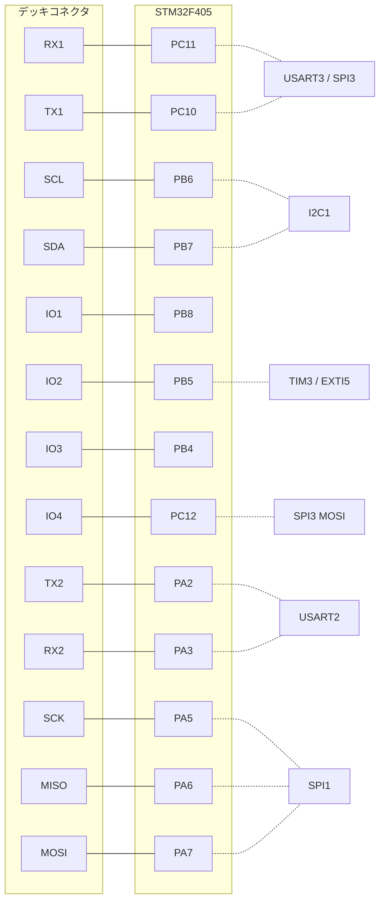

# ピン割り当て（cf2）

## 概要
cf2 のピンは、**デッキコネクタに出ているピン**（13 本）と、**オンボードで使うピン**に分けられる。
デッキのピンは、ドライバからはデッキのピン名（`DECK_GPIO_IO1` など）で指定し、`deck_constants.c` の表で MCU のピンに変換される。
ペリフェラルの用途は [peripherals.md](peripherals.md) を参照。

## デッキコネクタのピン

| デッキのピン名 | MCU のピン | 代替機能 | ADC | 使うデッキ（cf2） |
|---|---|---|---|---|
| `RX1` | PC11 | USART3 RX（UART1）/ SPI3 MISO | — | Lighthouse、bcCam（UART1）、Loco（代替構成の割り込み） |
| `TX1` | PC10 | USART3 TX（UART1）/ SPI3 SCK | — | Lighthouse、bcCam（UART1）、Loco（代替構成のリセット） |
| `SDA` | PB7 | I2C1 SDA | — | I2C のデッキ全般、EEPROM、DeckCtrl |
| `SCL` | PB6 | I2C1 SCL | — | 同上 |
| `IO1` | PB8 | — | — | Loco、AI deck |
| `IO2` | PB5 | TIM3（LED リング） | — | Loco（割り込み EXTI5）、LED リング、RPM |
| `IO3` | PB4 | — | — | Loco（リセット）、Flow（PMW3901 の SPI の CS: `flowdeck_v1v2.c` の `NCS_PIN`）、LED リング、RPM |
| `IO4` | PC12 | SPI3 MOSI | — | micro-SD、AI deck、Loco（代替リセット） |
| `TX2` | PA2 | USART2 TX（UART2） | Ch2 | AI deck、Buzzer（UART2 として予約）、RPM（PA2） |
| `RX2` | PA3 | USART2 RX（UART2） | Ch3 | 同上、RPM（PA3） |
| `SCK` | PA5 | SPI1 SCK | Ch5 | SPI のデッキ（Loco、Flow、micro-SD） |
| `MISO` | PA6 | SPI1 MISO | Ch6 | 同上 |
| `MOSI` | PA7 | SPI1 MOSI | Ch7 | 同上 |

根拠: `src/deck/api/deck_constants.c`（ピンの表）、`src/deck/interface/deck_constants.h:52`〜`64`、各ドライバの `usedGpio` / `usedPeriph`（[../03_functions/decks.md](../03_functions/decks.md)）

## オンボードのピン

| 機能 | MCU のピン | 備考 | 根拠 |
|---|---|---|---|
| モータ M1 | PA1 | TIM2 CH2 | `src/drivers/src/motors_def.c:29` |
| モータ M2 | PB11 | TIM2 CH4 | `:51` |
| モータ M3 | PA15 | TIM2 CH1 | `:73` |
| モータ M4 | PB9 | TIM4 CH4 | `:95` |
| syslink TX / RX | PC6 / PC7 | USART6 | `src/drivers/interface/uart_syslink.h:53`〜`55` |
| syslink 送信許可（フロー制御） | PA4 | nRF51 からの送信可否 **（推測）** | `uart_syslink.h:62`〜`63` |
| センサ I2C3 SCL / SDA | PA8 / PC9 | I2C3 | `src/drivers/src/i2c_drv.c:135`〜`140` |
| IMU の割り込み | PC14 | EXTI14 | `src/hal/src/sensors_bmi088_bmp3xx.c:581` |
| 青 LED（左） | PD2 | 正論理 | `src/drivers/interface/led.h:37`〜`39` |
| 緑 LED（左） | PC1 | 負論理 | `led.h:41`〜`42` |
| 赤 LED（左） | PC0 | 負論理 | `led.h:43`〜`44` |
| 緑 LED（右） | PC2 | 負論理 | `led.h:45`〜`46` |
| 赤 LED（右） | PC3 | 負論理 | `led.h:47`〜`48` |
| SWD（SPI2） | PB13 / PB15 | デッキのマイコンへの書き込み **（推測）** | `src/drivers/src/swd.c:42`〜`49` |
| USB | PA11 / PA12 | **（推測: OTG FS の標準ピン）** | — |

LED の役割（`src/drivers/interface/led.h:50`〜`57`）:

| 役割 | LED |
|---|---|
| `LINK_LED`（無線の受信 **（推測: radiolink の `seq_linkUp` から）**） | 緑（左） |
| `LINK_DOWN_LED`（無線の送信 **（推測: `seq_linkDown` から）**） | 赤（左） |
| `CHG_LED`（充電・起動中） | 青（左） |
| `SYS_LED` / `LOWBAT_LED` | 赤（右） |
| `ERR_LED1` / `ERR_LED2` | 赤（左）/ 赤（右） |
| `USER_NOTF_LED`（ユーザ通知） | 緑（右） |

## 未解決事項
- 表に挙げていないピン（nRF51 のリセット・ブートの制御線、デッキの 1-Wire など）の有無は未確認。1-Wire は nRF51 側に接続されているため、STM32 のピンは使わない **（推測）**。
- LED リング（IO2, IO3）と Loco（IO1〜IO3）、Flow（IO3）は IO ピンが重なるので、同時に付けると競合の検査で全デッキが無効になる（[../04_interfaces/deck_api.md](../04_interfaces/deck_api.md)）。Loco の代替ピン構成（`CONFIG_LOCODECK_ALT_PIN_RESET` など）はこの競合を避けるためと考えられる **（推測）**。
