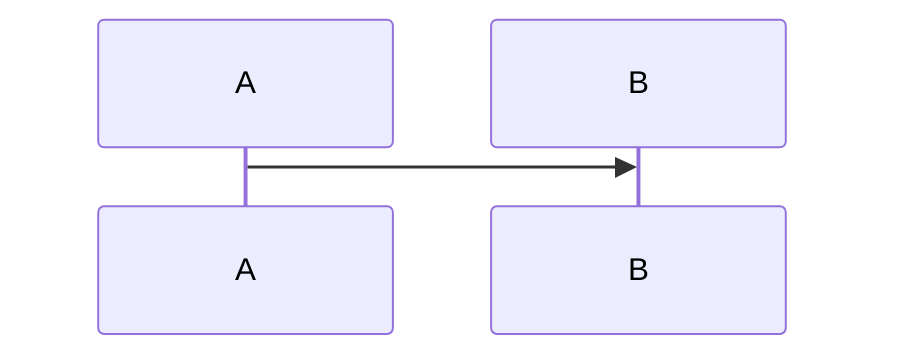

# <機能名>

## 概要
<この機能の責務を1〜3文で>

## 構成ファイル
| ファイル | 役割 |
|---|---|
| `src/...` | |

## ブロック図

## データフロー
| 入力/出力 | 相手 | 手段（関数呼び出し / キュー / CRTP / param・log） | データ型 | 周期・契機 | 根拠 |
|---|---|---|---|---|---|
| 入力 | | | | | `src/...:行` |

## 処理の流れ

## 状態遷移（該当する場合）

## 設定・パラメータ
| 種別 | 名前 | 既定値（cf2） | 説明 |
|---|---|---|---|
| Kconfig | `CONFIG_...` | | |
| param | `group.name` | | |
| log | `group.name` | | |

## 公式ドキュメントとの差異

## 未解決事項
- 
